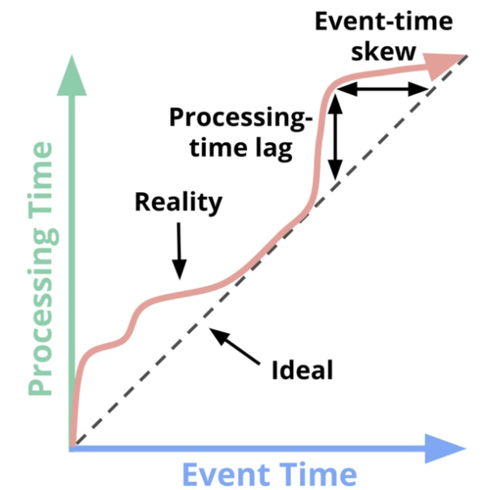
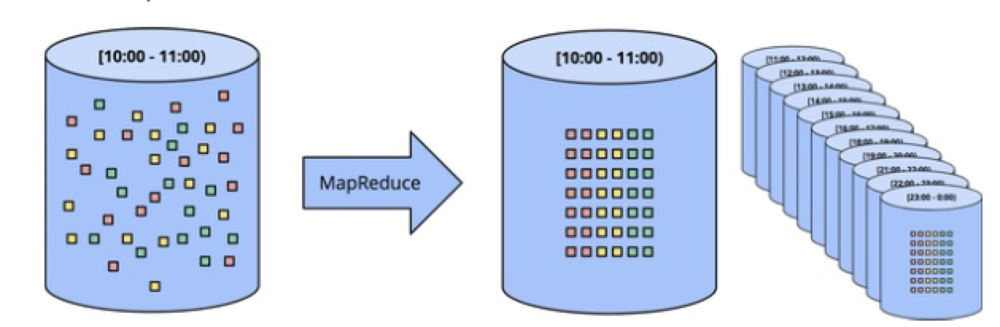
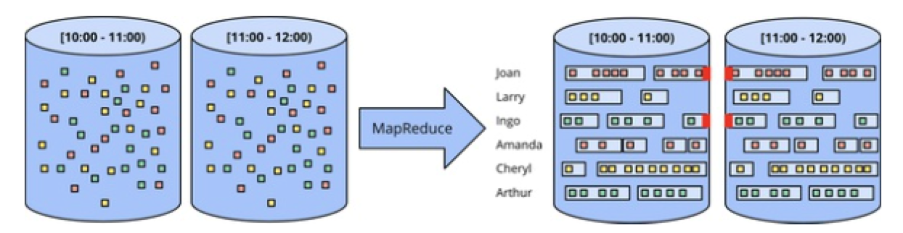
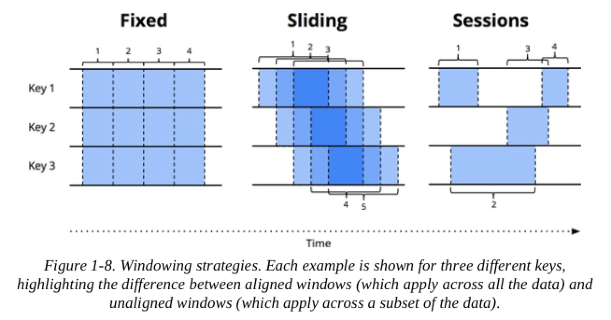
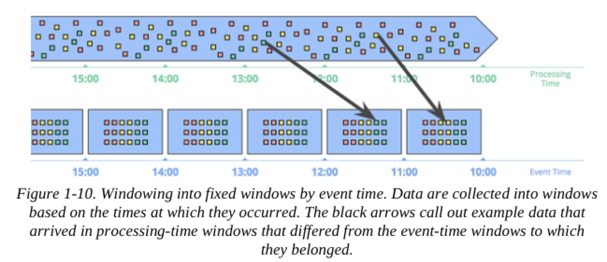
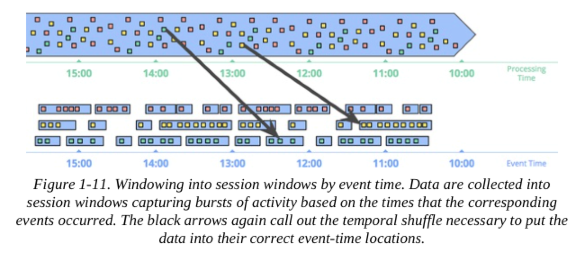
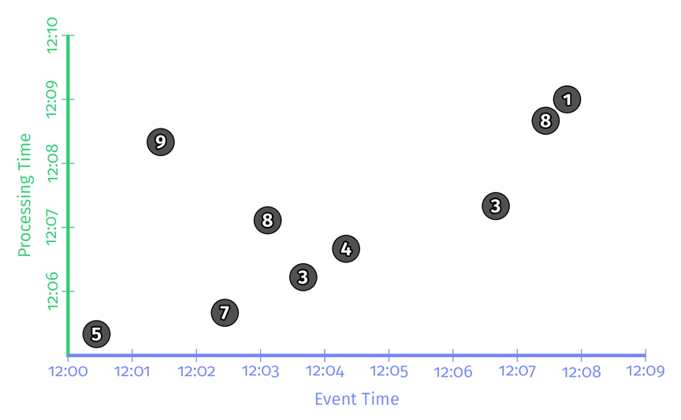
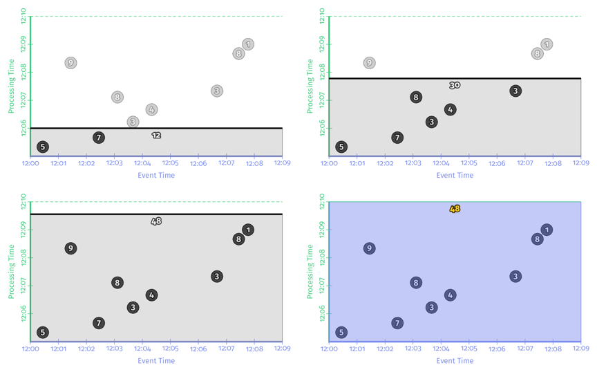
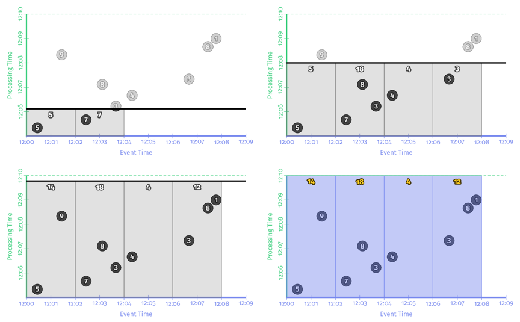

# Streaming System

* [大数据凉了？不，流式计算浪潮才刚刚开始](https://www.infoq.cn/article/the-evolution-of-large-scale-data-processing)
* [流式计算的时间窗口问题](https://zhuanlan.zhihu.com/p/50276136)

## Chapter1 Streaming 101

### 定义

streaming system 定义：一种数据处理引擎，设计有无限的数据集

作者认为如果想讨论**低延迟（low-latency），近似（approximate）或推测性的结果（speculative results）**，会使用这些具体的词，而不是模糊的称为 streaming。

面对这些不同类型的，有两个正交的维度去定义给定的数据集：*cardinality*（基数） ，*constitution*（构成）。

* 基数：决定数据集尺寸，分为有限和无限。（无限意味着会给处理框架带来额外的负担）
* 构成：构成表明物理表现形式。构成定义了与数据交互的方式（第6，8，9章详细介绍）。分为
  * table：数据集在特定时间点的整体视图。 SQL系统传统上是在表中处理的
  * Stream：数据集在随时间变化的 element-by-element view。 MapReduce lineage 传统上是在流中处理的。

### Streaming 限制

从历史上看，流处理系统一直局限于提供**低延迟，不准确或推测性结果**的小众市场，通常将其与功能更强大的批处理系统结合使用，以提供最终正确的结果。换句话说，就是 [Lambda 架构](https://www.cnblogs.com/cciejh/p/lambda-architecture.html)。

> ⚠️ **关于 Lambda**：Lambda 体系结构的基本思想是将流系统与批处理系统一起运行，两者都执行基本相同的计算。流式系统为您提供了低延迟，不准确的结果（由于使用了近似算法，或者因为流式系统本身不提供正确性），一段时间后，批处理系统开始运行并为您提供正确的输出。它最初是由 Twitter 的 Nathan Marz（Storm的创建者）提出的，最终获得了相当大的成功，因为它在当时是一个绝妙的主意。流引擎对于正确性来说有点令人失望，而批处理引擎本来就像期望的那样笨拙。不幸的是，维护 Lambda 系统很麻烦：需要构建，配置和维护管道的两个独立版本，然后以某种方式最后合并来自两个 pipeline 的结果。

> ⚠️ **批处理和流处理效率差异**：批处理和流处理之间的效率差异主要是由于批处理系统中增加的 bundling 和有效的混洗传输所致。现代批处理系统竭尽全力实现复杂的优化，这些优化实现了惊人的吞吐量。
>
> 没有任何理由不讲高效率的批处理并入为无限制数据而设计的系统中，从而为用户提供了我们通常认为的高延迟和高效率之间的灵活选择——高延迟高效率的批处理和低延迟，低效率的“流”处理。
>
> 通过在相同的统一模型下提供批处理和流式运行程序，这实际上是 Cloud Dataflow 所做的事情。在我们的案例中，我们使用单独的运行器，因为我们碰巧有两个针对其特定用例进行了优化的独立设计的系统。从工程角度来看，从长远来看，我很乐意看到我们将两者合并为一个系统，该系统结合了两者的最佳部分，同时仍保持选择适当效率水平的灵活性。

所有这一切的必然结果是，流传输系统的广泛成熟以及用于无边界数据处理的强大框架相结合，使 Lambda 体系结构及时降级到它所属的大数据历史的上古时代。

 因为这样做实际上只需要两件事：

**Correctness**

核心在于，correctness 实际上归结为一致的存储。流系统需要一种**随时间检查持久状态**的方法，并且必须设计得足够好以在发生机器故障时保持一致。

这一点很重要：**一次处理（exactly-once processing）就需要强大的一致性**，正确性是必须的，这是任何有机会满足或超过批处理系统能力的要求。

> 这里使用的 exactly-once processing 名称是指在管道生成的输出中观察到的有效语义，而不是数据处理的次数

**Tools for reasoning about time**（时间推理工具）

良好的时间推理工具对于**处理事件时间偏差不同的无界无序数据**至关重要。 越来越多的现代数据集表现出这些特征，并且现有的批处理系统（以及许多流系统）缺乏必要的工具来应对它们带来的困难。

### Event Time Versus Processing Time

对于无界数据处理，需要了解两个时间域：

* 事件时间：事件实际发生的时间；
* 处理时间：系统看到该事件的时间。

在理想情况下，事件时间和处理时间将始终相等，事件发生时将立即进行处理。但是，现实并非如此，事件时间与处理时间之间的偏差不仅非零，而且通常是基础输入源，执行引擎和硬件的特性的高度可变的函数。可能影响偏差程度的因素包括：

* 共享资源限制，例如网络拥塞，网络分区或非专用环境中的共享CPU
* 软件原因，例如分布式系统逻辑，争用等
* 数据本身的特征，例如 key 的分布，吞吐量差异或无序差异（即一架载满人的手机，在整个飞行过程中都将手机离线使用后，将其从飞机模式中移出）



不幸的是，在按活动时间进行窗口浏览时，图片也不完全是红线。在数据不受限制的情况下，混乱和不同的偏差会引发事件时间窗口的完整性问题：在处理时间和事件时间之间缺乏可预测的映射，如何确定在给定事件时间 X 内观察到所有数据？对于许多现实世界的数据源，根本无法做到。但是，当今使用的绝大多数数据处理系统都依赖于完整性的某种概念，这在将它们应用于无界数据集时会处于严重的劣势。

**与其尝试将无边界的数据整理成最终完成的有限信息批次，不如设计能够使我们生活在这些复杂数据集所带来的不确定性世界中的工具。新数据将到达，旧数据可能会被收回或更新，我们构建的任何系统都应能够独自应对这些事实，完整性的概念是针对特定和适当用例的便捷优化，而不是跨语义的要求全部都达成 correctness。**

### Unbounded Data: Batch

批处理引擎虽然没有明确考虑到无边界数据的设计，**但自从最初想到批处理系统以来，就一直使用批处理引擎来处理无边界数据集**。 这种方法将无边界数据切成适合批处理的有边界数据集组成。

#### Fixed windows

最常见方法是将输入数据窗口化为固定大小的窗口，然后将这些窗口中的每一个作为独立的有界数据源（有时也称为 *tumbling windows* ）进行处理，如下图。特别是对于诸如日志之类的输入源，事件可以写入其名称对应于其所对应的窗口的目录和文件层次结构中。

但是，实际上，大多数系统仍然要处理完整性问题（如果由于网络分区而导致某些事件在发送到日志的过程中被延迟，该怎么办？如果事件是全局收集的并且在处理之前必须转移到一个公共位置，该怎么办？如果您的事件来自移动设备该怎么办？），这意味着有必要采取某种缓解措施（例如，延迟处理，直到确定所有事件已被收集，或者在数据到达时重新处理给定窗口的整个 batch）。



#### Session

使用批处理引擎将无边界的数据处理为更复杂的窗口化策略（例如会话）时，这种方法会更加崩溃。 会话通常被定义为由于不活动间隙而终止的活动时间段（例如，针对特定用户）。 使用典型的批处理引擎计算会话时，通常会遇到将会话拆分为多个批次的情况，如图红色标记所示。 我们可以通过增加批量大小来减少拆分数量，但要以增加延迟为代价。 另一个选择是添加其他逻辑以拼接来自先前运行的会话，但是以进一步复杂为代价。



无论哪种方式，使用经典的批处理引擎来计算会话都不理想。 更好的方法是以流方式建立会话。

### Unbounded Data: Streaming

对于许多实际的分布式输入源，不仅发现自己正在处理无边界的数据，而且还处理以下情况：

* 事件时间高度无序，这意味着如果要在发生数据的上下文中分析数据，则需要在管道中进行某种基于时间的混洗。
* 事件时间偏差的变化程度不同，这意味着不能仅仅假设始终在时间Y的恒定ε内看到给定事件时间X的大部分数据。

处理具有这些特征的数据时，可以采用几种方法：time-agnostic，approximation，windowing by processing time 和 windowing by event time。

#### Time-agnostic

Time-agnostic 用于时间基本上无关紧要的情况； 也就是说，**所有相关逻辑都是数据驱动的**。 也就是说除了基本数据传递之外，流引擎确实不需要支持任何特殊功能。 考虑到处理时间不可知的处理的直接性（至少从时间的角度来看），将不会在此上花费更多的时间。

#### Approximation algorithms

方法的第二大类是近似算法，例如近似 Top-N，streaming k-means 等。它们采用无限的输入源并提供输出数据。

近似算法的优点是，根据设计，它们的开销很低，并且设计用于无限制的数据。

缺点是它们的数量有限，算法本身通常很复杂（这使得很难构想出新算法），并且它们的近似性质限制了其实用性。

值得注意的是，这些算法通常在设计中确实需要一定的时间（例如某种内置的衰减）。并且由于它们在到达元素时对其进行处理，因此该时间元素通常基于处理时间。这对于在近似值上提供某种可证明的误差范围的算法尤其重要。

逼近算法本身是一个引人入胜的主题，但是由于它们本质上是时间不可知处理的另一个示例（以算法本身的时间特征为模），因此使用起来非常简单，因此鉴于我们当前的关注重点，因此不值得进一步关注。

#### Windowing

窗口化只是简单的概念，即获取一个数据源（无界或有界），并沿时间边界将其切成有限的块进行处理。 图1-8显示了三种不同的窗口模式。



**Fixed windows (aka tumbling windows)**

我们之前讨论了 Fixed windows。 固定的窗口将时间切成具有固定大小的时间长度的段。将固定窗口的段均匀地应用于整个数据集，这是对齐窗口的一个示例。 在某些情况下，最好对数据的不同子集（例如，每个键）进行窗口移相，以使窗口完成负载随着时间的推移更均匀地分布，这是未对齐窗口的一个示例，因为窗口针对不同的数据子集。

**Sliding windows (aka hopping windows)**

滑动窗口的一般化由固定长度和固定周期定义。 如果周期小于长度，则窗口重叠。 如果周期等于长度，则 Fixed windows。周期大于长度，那么将拥有一种奇怪的采样窗口，该采样窗口只能查看一段时间内数据的子集。 与 Fixed windows 一样，滑动窗口通常是对齐的，尽管在某些用例中它们可以作为性能优化而未对齐。 注意，上图滑动窗口提供滑动运动的感觉。 实际上，所有五个窗口将应用于整个数据集。

**Session**
动态窗口的一个示例是 seesion 由事件序列组成，当产生大于某个超时的不活动间隔，session 终止。 Session （例如，一个坐着观看的视频序列）组合在一起来分析一段时间内的用户行为。 Session 很有趣，因为它们的长度不能事先定义。 它们取决于所涉及的实际数据。 它们也是未对齐窗口（为对其指代针对专有的 key）的典型示例，因为 Session 实际上在不同数据子集（例如，不同用户）之间永远不会完全相同。

##### *Windowing by processing time*

当按 processing time 进行处理时，系统实质上会将传入的数据缓冲到窗口中，直到经过了一定数量的处理时间为止。 例如，对于五分钟的固定窗口，系统将缓冲数据五分钟的处理时间，然后将其在这五分钟内观察到的所有数据视为一个窗口，并将其发送到下游进行处理 。

 Processing-time windowing 的好处：

* 这很简单。 该实现非常简单，因为不必担心会在时间上乱码数据。 只需在事物到达时缓冲它们，然后在窗口关闭时将它们发送到下游。
* 判断窗口的完整性很简单。 因为系统具有关于是否已经看到窗口的所有输入的完美知识，所以它可以对给定窗口是否完整做出完美的决策。 
* 如果想推断有关来源的信息，那么 processing-time windowing 就是解决方案。 许多监视方案都属于此类。 想象一下，跟踪每秒发送到全局Web服务的请求数。 为检测中断而计算这些请求的比率是对 processing-time windowing 的完美利用。

除了好处，处理时间窗口化还有一个很大的缺点：如果所讨论的数据具有与事件时间相关联的事件时间，则这些数据必须以事件时间顺序到达，处理时间窗口要反映出何时这些事件实际发生。 不幸的是，事件时间排序的数据在许多实际的分布式输入源中并不常见。

举一个简单的例子，想象一下任何收集使用情况统计信息以供以后处理的移动应用程序。对于给定移动设备离线任何时间（短暂的连接中断，在全国范围内飞行时的飞行模式等）的情况，在此期间记录的数据只有在该设备再次联机后才会上传。这意味着数据可能以几分钟，几小时，几天，几周或更长时间的事件时间偏差到达。在按处理时间窗口化时，从这样的数据集中绘制任何有用的推断基本上是不可能的。

再举一个例子，当整个系统运行良好时，许多分布式输入源似乎可以提供事件时间排序（或几乎如此）的数据。不幸的是，健康时输入源的事件时间偏斜较低，但这并不意味着它将一直保持这种状态。考虑一个全球服务，该服务处理在多个大洲收集的数据。如果跨带宽受限的跨大陆线路（不幸的是，这很常见）的网络问题进一步降低了带宽和/或增加了延迟，那么突然会有一部分输入数据开始比以前更大的偏移。如果按处理时间对这些数据进行窗口化处理，则窗口将不再代表实际发生在其中的数据。

在这两种情况下，我们真正想要的是按照事件的时间对数据进行窗口化，从而对事件的到达顺序具有鲁棒性。我们真正想要的是事件时间窗口。

##### *Windowing by event time*

当需要以有限的块观察数据源时，可以使用事件时间窗口来反映那些事件实际发生的时间。



每个事件到达的处理时间窗口与每个数据位所属的事件时间窗口不匹配。还可以配合 Session：



当然，强大的语义很少免费提供， event-time windows 也不例外。 event-time windows 有两个明显的缺点，这是因为窗口（在处理时间中）必须经常比窗口本身的实际长度更长：

**Buffering**

由于延长了窗口寿命，因此需要更多的数据缓冲。幸运的是，持久存储通常是大多数数据处理系统所依赖的资源类型中最便宜的（其他主要是CPU，网络带宽和RAM）。因此，与使用任何设计良好，具有高度一致的持久性状态和良好的内存缓存层的数据处理系统相比，此问题要少得多。

而且，许多有用的聚合不需要缓冲整个输入集（例如，求和或平均），而是可以增量地执行，其中较小的中间聚合以持久状态存储。

**Completeness**

鉴于我们通常没有很好的方法来知道何时看到给定窗口的所有数据，那么如何知道何时可以实现窗口的结果呢？实际上，我们根本不这样做。对于许多类型的输入，系统可以通过诸如 MillWheel，Cloud Dataflow 和 Flink（在第3章和第4章中将进一步讨论）来给出窗口完成的合理准确的启发式估计。

但是，对于绝对正确性至高无上的情况（再次考虑帐单），唯一的真实选择是为管道构建器提供一种方式，使其表达**何时希望实现窗口结果以及如何随着时间的推移完善这些结果**。处理窗口完整性是一个引人入胜的话题，后面会进一步介绍它。

## Chapter 2. The What, Where, When, and How of Data Processing

### Roadmap

除了 processing time ，event time 以及 windowing，本文还将介绍三个概念：

- 触发器（Triggers）：触发器是决定某个窗口何时输出的一种机制。作用跟照相机的快门相同，按下去，就能拿到某个时间点计算结果的快照。通过触发器，也能多次看到某个窗口的输出结果。因此可以实现迟到数据（late event）的处理。
- Watermark（水位标记）：Watermark 是描述事件时间上数据完整性的概念。时间点 X 上的 Watermark 表示了所有时间点X前的输入数据都到齐了。本节会粗浅的介绍一下 watermark，第三章中会对 watermark 做深入解释。
- Accumulation（累积）：累积模式表示了同一个窗口不同输出间的关系。这些结果间可能完全无关，比如该窗口不同时间的增量，也可能有重叠。不同的累积模式在语义和成本上都不同，要根据具体场景来选择合适的累积方式。

我抛出4个在无界数据处理过程中，最为关键的问题：

- 计算什么结果（__What__ results are calculated?）？这是用户在代码（SQL/pipline code）中定义的，比如求和，算直方图或训练机器学习模型等。这也是批处理解决的经典问题。
- 在事件时间的哪个地方计算结果（__Where__ in event time are results calculated）？这是用户在代码中定义的**基于事件时间的窗口**中定义的。可是使用上一章中介绍的滚窗/划窗/会话等窗口，也可以使用跟窗口无关的算子，或者更复杂的窗口，比如限时拍卖。
- 在什么处理时间点，可以输出结果（__When__ in processing time are results materialized）？触发器和 watermark 会解决这个问题。这个主题有很多个变种，但是最常见的是重复更新场景（比如，物化视图语义），其使用 watermark 来指示窗口的输入数据已经完整，看到 watermark 后，这个窗口才唯一输出一次数据。
- 如何更新结果（__How__ do refinements of results relate）？三种方式可以解决这个问题：discarding，accumulating 和 accumulating and retracting。下文会对这三种模式做更详细介绍。

### Batch Foundations: What and Where

#### What: Transformations（变换）

看下面这个例子：

```
------------------------------------------------
| Name | Team | Score | EventTime | ProcTime | 
------------------------------------------------
| Julie | TeamX |   5 |  12:00:26 | 12:05:19 |
| Frank | TeamX |   9 |  12:01:26 | 12:08:19 |
| Ed    | TeamX |   7 |  12:02:26 | 12:05:39 |
| Julie | TeamX |   8 |  12:03:06 | 12:07:06 |
| Amy   | TeamX |   3 |  12:03:39 | 12:06:13 |
| Fred  | TeamX |   4 |  12:04:19 | 12:06:39 |
| Naomi | TeamX |   3 |  12:06:39 | 12:07:19 |
| Becky | TeamX |   8 |  12:07:26 | 12:08:39 |
| Naomi | TeamX |   1 |  12:07:46 | 12:09:00 |
------------------------------------------------
```

请注意，此示例中的所有分数均来自同一团队的用户； 鉴于下面的图表中的维数有限，这是为了简化示例。 而且由于我们是按团队分组，因此我们实际上只关心最后三列。



下面的例子会使用 Apache Beam Java 的例子，Beam 中有两个基本原语：

* PCollection：这些代表可以执行并行转换的数据集（类似 map）；
* PTransforms： PTransform可以执行逐元素的转换，它们可以将多个元素分组/聚合在一起，也可以是其他PTransform的组合（类似 reduce）。

```java
PCollection<String> raw = IO.read(...);  //读入原始数据
//将原始数据解析成格式划数据，其中Team为String类型，是主键。score是整型。
PCollection<KV<Team, Integer>> scores =
input.apply(Sum.integersPerKey()); // 在每个主键上，对score做求和操作
```



这就是整个经典批处理的处理过程。由于数据是有界的，因此在process time上处理完所有数据后，就能得到正确结果。但是如果数据集是无界数据的话，这样处理就有问题。接下来我们讨论"Where in event time are results calculated?"这个问题。

#### Where: Windowing

以下是用在Beam中，代码中用窗口如何实现之前整数求和的例子：

```java
PCollection<KV<Team, Integer>> scores = input
  .apply(Window.into(FixedWindows.of(TWO_MINUTES))) 
  .apply(Sum.integersPerKey());
```

理论上批数据是流数据的子集，因此Beam在模型层面对批流做了统一。我们通过时序图看一下在传统批处理引擎中，以上代码是如何执行的：



从时序图上可以看出，在事件时间上，以2分钟为步长，将数据切分到不同的窗口。然后每个窗口的输出进行累加就得到最终结果。
以上我们回顾了时间域（事件时间和处理时间的关系）和窗口的相关知识，接下来看一下触发器，watermark和accumulation这三个概念。

### Going Streaming: When and How

#### When: The Wonderful Thing About Triggers Is Triggers Are Wonderful Things!

剩余部分见 [Streaming System 第二章：The What- Where- When- and How of Data Processing](https://developer.aliyun.com/article/674450?spm=a2c6h.13262185.0.0.314f8a3bMn2rBt)

## Chapter 3 Watermark

* [Streaming System 第三章：Watermarks](https://developer.aliyun.com/article/682873?spm=a2c6h.13262185.0.0.314f8a3bMn2rBt)
* [《Streaming Systems》读书笔记（三）：Watermark](https://juejin.im/post/6844904195120693262)