# CLP: Efficient and Scalable Search on Compressed Text Logs

CLP，全称 Compressed Log Processor，这篇文章的主要贡献是：

* CLP 能够无损压缩非结构化的日志文件，且压缩比率比通用的压缩工具要高；
* CLP 能够高效的在已经压缩的日志上进行搜索，而无需解压。

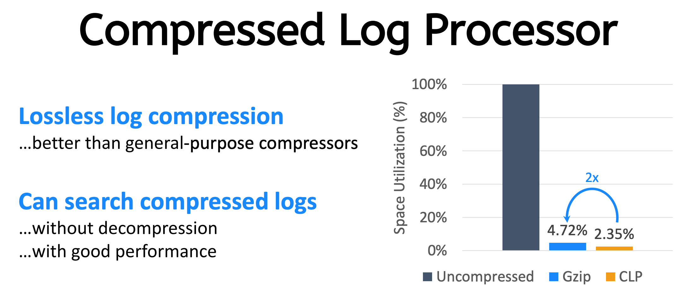

## Background

通常来说，技术公司很容易产生 PB 级别的日志数据，比如 eBay 报告 2018 年每天产生 1.2 PB 的日志，出于 Debugging，安全取证，业务分析，行业趋势分析，瓶颈分析，机器学习等目的，这些日志通常不会删除，而是要求尽可能保留时间越长越好。但是，存储和分析日志会有大量成本，比如 eBay 存储一年生产的日志需要花费 5000 多万美元。

诸如 ELK，Splunk 这样的日志搜索产品，他们为了能够进行快速的日志查询，通常使用对日志建立索引来加快查询效率的。然而建议索引需要造成额外的存储负担，比如，Elasticsearch 是围绕搜索引擎 Lucene 建立的，这种方法的代价是大量的存储空间和内存使用。尽管这些工具对日志进行了轻微的压缩，但索引加上压缩后的日志所消耗的空间往往与原始日志的大小是同一数量级的。而如果想要索引充分发挥作用，需要将其放置在内存中。因此，对于拥有大量日志的情况来说，日志通常只能 retain 几周。

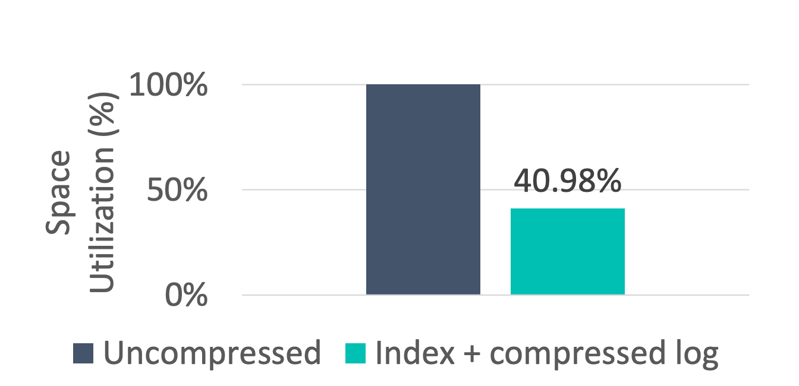

为了存储“过期”的日志，又希望减少存储的消耗，通常会压缩一下日志进行存档（比如 Gzip），可以降低大约 95% 的存储开销，比如 [LZ77](https://cloud.tencent.com/developer/news/279864) 压缩算法，但是这些通用的压缩工具在设计的时候并没有考虑<u>搜索压缩数据</u>的情况，这导致在 archived 数据上进行搜索是非常痛苦的，基本上需要解压整个数据集在进行扫描。这导致了一个不幸的现状，**日志分析**和**日志归档**通常是互斥的。

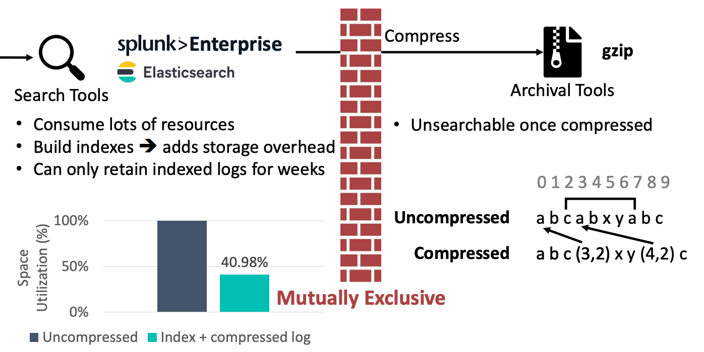

## CLP Overview

为了同时高效的**日志分析**和**日志归档**，论文提出了一个专门针对 log 的压缩算法和搜索算法，辅以一个<u>轻量级</u>的通用压缩算法。前者使 CLP 能够在**不牺牲搜索性能**的情况下实现适度的压缩，后者则能在对压缩和解压性能影响不大的情况下大大增加总体压缩率。

通常来说，我们的日志包含以下几部分：

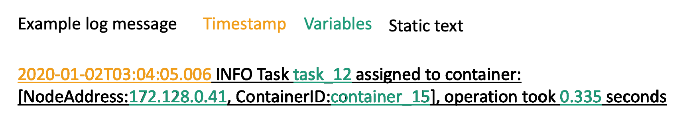

CLP 基于一个简单的观察，现今的软件日志中包含**大量的重复性静态文本**，这是 CLP 日志压缩算法的关键。

根据论文评测，CLP 在压缩率上是 Gzip 的 2 倍，同时能够在压缩数据上高效搜索，CLP 的搜索速度是压缩数据上常用的顺序搜索工具的 8 倍，即使是基于 index 的 Splunk Enterprise 和 Elasticsearch，CLP 也分别比它们高出 4.2 倍和 1.3 倍。

§第2节描述了CLP的压缩和搜索设计的核心要素。§第3节详细介绍了CLP如何处理通配符和变量模式的各种错综复杂的问题。§第4节描述了我们对变量模式的语法。§第5节解释了CLP如何以可重复使用的方式缓存查询，以提高性能。§第6节描述了CLP压缩格式的一个特点，可以用于隐私控制。§第7节讨论了CLP与其他工具相比的评估结果。最后，第8节讨论了相关工作，然后我们在第9节总结。

## Design Overview

从设计上来说，CLP 是一个完整的日志分析系统，包括获取日志，归档（压缩），搜索和分析日志信息。下图为整体设计：

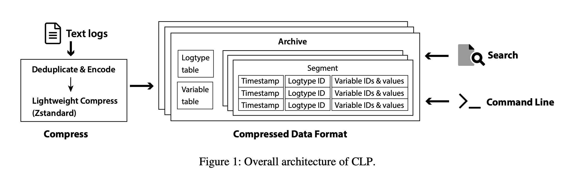

日志可以通过实时 digest 引擎（比如说，rsyslog，FluentD，Logstash 这些）获取，或者是直接从本地或 S3 那边获取，压缩节点将获得的日志进行压缩形成一组归档文件，用户可以通过终端或者是 CLP 的交互界面直接去访问这些日志归档文件。

CLP 设计的目标有三个：

* 日志应当是无损压缩的，这样子用户就可以放心的删除原始数据而不用担心压缩对数据造成了影响（比如说影响了浮点数的精度）；
* 和 `grep` 这样的指令不同，基于索引的 `ElasticSearch` 通常只允许基于索引值的日志搜索，并且会忽略一些标点符合和助词等，CLP 希望用户可以搜索日志中的任意内容；
* CLP 应该是高性能和可扩展的，这样用户就可以用它来存储和搜索大量的日志数据，同时节省成本。

## Compression

CLP 的压缩分两步，首先将日志数据中大量重复的部分提出来，编码成一个特殊的格式，然后对编码后的数据应用一个轻量级压缩算法，进一步减少总体大小，本节主要介绍第一步。

CLP 将每条日志分成三块：

1. **log type**：通常就是哪些高度重复的固定文本；
2. **variable values**：日志中的变量，后文称为 *变量值*；
3. **timestamp**：如果有则包含。

CLP 将 **variable values** 进一步分成两类：一类是会重复的，比如各种变量标识符（如用户名，商品名），一类是不重复的，比如说完成某项工作花费的时间。前者 CLP 称为 **字典变量值**，因为 CLP 会将这一类变量值提取出来并存储在字典中，后者称为**非字典变量值**。下图表明了一条日志是如何被转化为 CLP 的编码形式的：

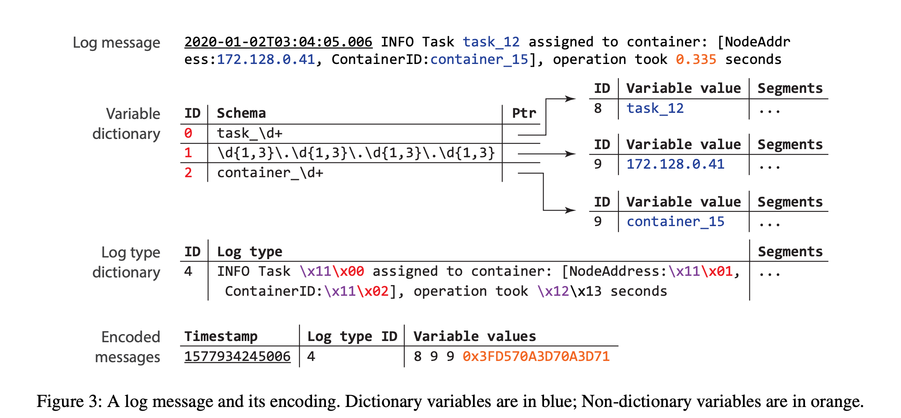

总的来说，CLP 需要对日志消息进行解析从而提取上述内容，然后使用压缩算法进行压缩。

### Parsing Messages

CLP 使用用户定义的变量匹配规则来解析日志，比如下图列出了一组可以用于解析图 3 示例日志信息的规则：

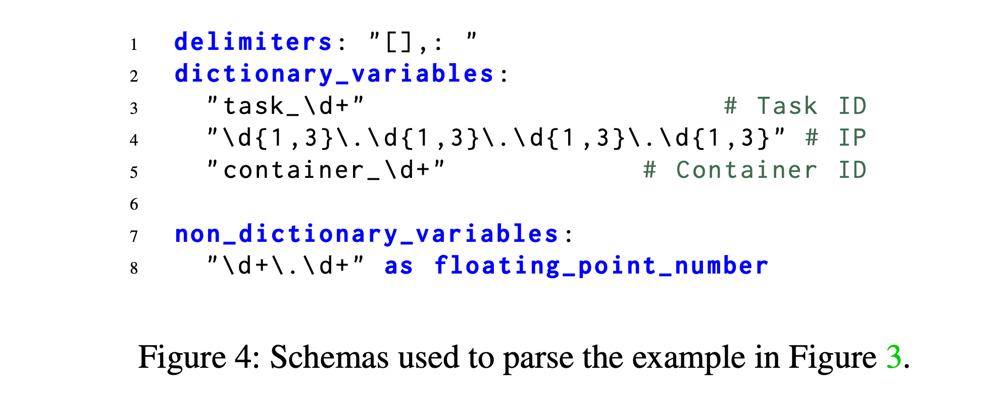

第 3-5 行包含三个字典变量值 schema，第 8 行包含一个非字典变量值 schema。这与 Elasticsearch 和 Splunk Enterprise 等工具类似，它们要么提供特定于应用程序的解析规则，要么要求用户自己编写。CLP 提供了一套默认的 shcema，可以普遍应用于所有的日志格式，或者用户可以对其进行定制化，从而实现更好的压缩和更快的搜索。

使用变量值 schema的一个挑战是，一个变量值可以匹配多种 schema，比如 “172.128.0.41” 既可以匹配一个 ip 地址的 schema，又可以匹配两个浮点数 schema，用一个句号连接。然而，本文观察到，开发人员通常会使用 1 到多个**分隔符**（delimiter character）来分隔不同的变量值，此外，一些开发人员还会使用分隔符将变量值和日志中的静态文本区分开，这个称之为 tokenization rule，它表明一个 token 是不可分割的。也就是说，一个 token 要么是**一个变量值**，要么是 log type 中的一部分，在这种情况下， “172.128.0.41” 这个 token 就被看待为一个变量值。CLP 允许用户指定一组分隔符，从而保证日志 schema 解析以 tokenization rule 的方式去匹配变量值。

比如图 3 中的例子：

```text
2020-01-02T03:04:05.006 INFO Task task_12 assigned to container: [NodeAddress:172.128.0.41, ContainerID:container_15], operation took 0.335 seconds
```

图 4 中的分割符为：`[` ，`]`，`,`，`:` 和 `space`。CLP 在 parse 这条日志的时候，首先会将时间提取出来，然后使用用户指定的分隔符对消息进行 token 化，对于解析后的每一个 token，CLP 将它和变量值的 schema 进行比较，判断是否为一个变量值，比如在图 3 中，CLP 识别出了三个字典变量值和一个非字典变量值。

###  Compressing Messages

一旦解析完成后，字典变量值就存储在一个 2 级变量值字典中，论文称为 vDict。第一层就是就字典变量值 schema map 到一个唯一的 ID 上，每个 schema 还关联一个指针，那个指针指向了 vDict 的第二层，那里存储着实际的变量值。还是以图 3 为例子：


> CLP 使用 `\x11` 来表示一个字典变量值，`\x00, \x01, \x02` 来表示 schema 索引；`\x12` 表示非字典变量值，`\x13` 表示该浮点数小数点前有一位，小数点后有 3 位。`\x11, \x12` 可以是任何字节，只是说它们是不可打印的 ASCLL 自负，不太可能出现在日志中。

通常来说，非字典变量值会直接存储在编码后的日志信息中，比如 “0.335” 使用 IEEE-754 进行编码然后日志信息中存储一个 64 位的值。如果这个非字典变量值无法用 64 位精确编码（比如溢出），就会被转而存储到字典变量值中。日志的剩余部分被视为日志的一部分，其中变量值就被替换为特殊的占位符，然后存储到一个 lgDict（log type dictionary）。注意这里采用了固定长度编码非环境变量值，并非不可以使用变长编码手段，但是它们都以牺牲搜索性能为代价，因此最后没有采用。

### On-disk Format

日志在 encode 后会先存储在内存中，超过一定阈值就会落盘，CLP 在落盘前会进行二次压缩（使用 Zstandard），形成一个 segment，多个 segment 再被存储为一份归档文件。

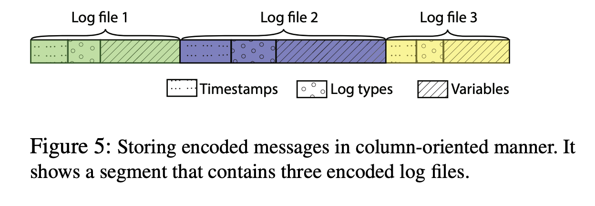

注意，CLP 将消息以面向列的方式进行存储，这有两个好处：

* 同一列的数据具有趋同性，压缩算法可以更高比率的进行压缩；
* 搜索时列式数据具有更高性能，比如如果用户搜索特定时间段的消息，CLP 只需要扫描 timestamp 即可。

为了加快查询速度和避免解压缩全部的数据，CLP 会在 segment 上建立索引帮助查询，同时每份归档文件也会有一些 metadata 帮助过滤。因此根据这个存储方式，我们可以看到对于这样的额数据结构，log type 这类信息给的越充分搜索速度越快。

## Search

给定一个搜索短语，CLP 首先使用和压缩日志类似的方式处理它：token 化给定的短语，提取变量值，并构建 log type。然后，CLP 就在归档文件中搜索 log type 和字典变量值。为了使用户更方便的使用，日志搜索通常需要支持通配符，CLP 支持两种类型的通配符，一个是 `*`，用以匹配 0 到多个字符，一个是 `?` ，用以匹配任意单个字符。这里会存在以下几个挑战：

* token 化一个含通配符的字符串是不容易的，比如 `Task*assigned` 既可以表示一个 token 也可以表示两个 token，即 `Task*` 和 `*assigned`；
* 要确定一个带有通配符的 token 是否和一个变量值 schema 相匹配是不容易的；
* 如果没有通配符，一个 token 会被明确的归类为 log type，字典变量值或者非字典变量值之一，但是如果有通配符，一个 token 可能属于多个不同的类别。

考虑下图这种查询语句：

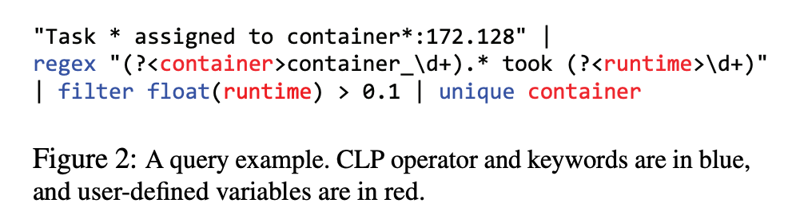

> `container` 和 `runtime` 为用户定义的变量名，`filter, float, unique` 为 CLP 的一些操作符，整体语法类似 linux pipe 处理

要处理这么一个查询语句，CLP 首先在查询语句头尾添加一个 `*`，用来表示是一个“子串搜索”，然后进行 Token 化，在上述这个例子中，我们会得到 `*Task`，`assigned`，`to`，`container*`，`172.128*`，然后将它们和所有对变量值 schema 进行比较， `*Task`，`assigned`，`to` 不属于任何 schema，因此就被归为这个 log type，其他两个存在模糊性。`172.128*` 可能是一个 IP，也可能是一个浮点数；`container*` 可能是一个 log type，也可能属于一个变量值 schema，这样就产生 6 种组合，怎么办？CLP 的解法很直接，为每种可能都生产一个子查询：

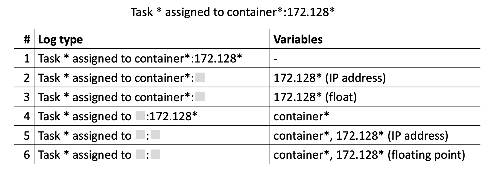

CLP 的查询分三步：

* 首先去查询 ltDict，当至少有一个 match，进入第二步；
* 在 vDict 进行查询，当每个字典变量值在 vDict 中都至少有一个 match，进入第三步；
* 返回匹配值。

## Evaluation

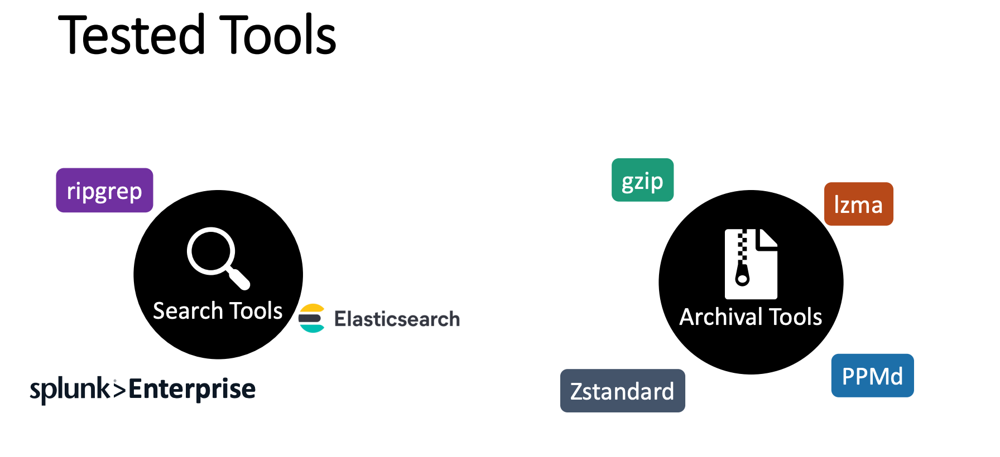

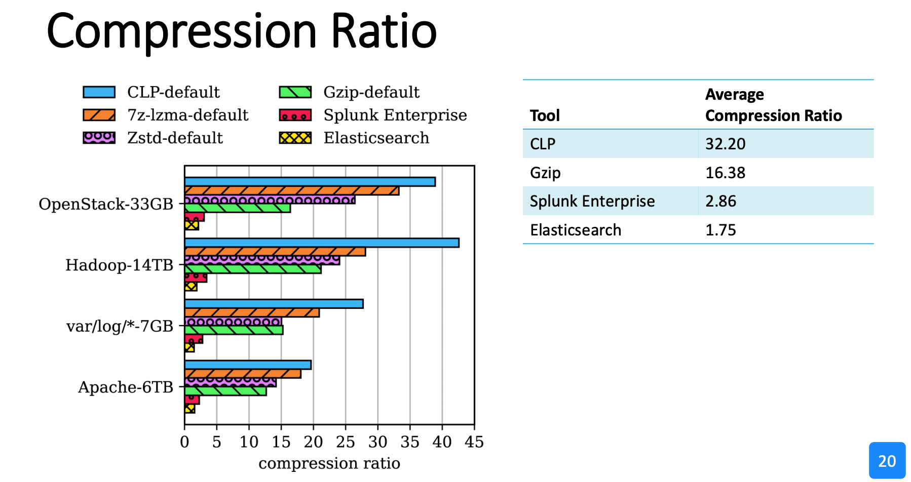

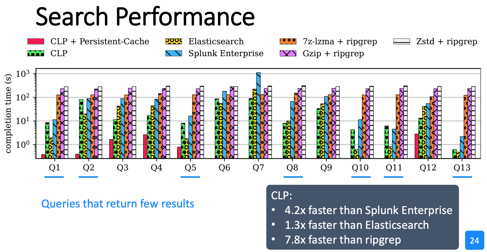