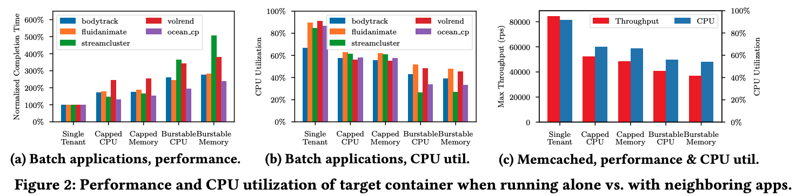
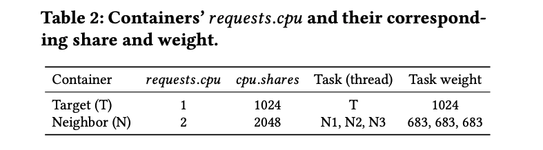
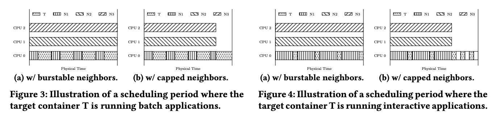

# Mind the Gap: Broken Promises of CPU Reservations in Containerized Multi-tenant Clouds

## Background

开发者分配给容器的资源是根据经验配置的，在多租户环境下，运行的容器性能差异会很大，并且很难预测。[Fixing cpu limits in the cloud](https://engineering.indeedblog.com/blog/2019/12/unthrottled-fixing-cpu-limits-in-the-cloud/) 指出**容器并置**可能会导致超过 66 倍的尾延迟。这种性能降级可能会导致更严重的批处理落后者情况和端到端 QoS 违反。

在多租户环境下，我们一般认为性能变化和降级主要来自于 noisy neighbors，但是变化的来源和机制并没有仔细分析过，一般认为上下文切换的开销和硬件层面的竞争（如缓存、总线、IO 设备）是主要原因。这篇文章的工作证明了，**对于容器环境而言，性能变化和降级主要和 OS，特别是 OS 的 CPU 调度机制，它的设计目标和容器环境对 CPU 的目标有根本上的冲突**。

在多租户环境下，多个容器会共置在一个 VM 中并共享资源。Linux 使用 cgroup 进行资源限制，CPU 的 request 和 limit 设置主要使用以下参数：`cpu.shares`、`cpu.cfs_period_us` 和 `cpu.cfs_quoto_us`。在 k8s 中，假设一个用户设置为某一个容器设置一定的 cpu 需求（$c_i.requests.cpu$），k8s 接下来会做两件事：

* 选择一个 CPU 资源充足的主机 $n_k$，即满足如下公式，$C_k$ 代表一组要部署的容器，$n_k.allocatable$ 代表该主机可分配的 CPU 资源：

$$
\sum_{c_i \in C_k} c_i.requests.cpu ≤ n_k.allocatable
$$

* Kubernetes 将 CPU request $c_i.requests.cpu$ 翻译成 cgroup，cgroup 使用一个整数值 $g_i.cpu.shares$ 来表明资源组 $g_i$ 下可以使用的 CPU 资源，转换过程为：

$$
g_i.cpu.shares=c_i.requests.cpu \times 1024
$$

在这里特别要说明的一点是，$cpu.shares$ 的值是指给该资源组分配 CPU 的相对权重，而不是指给对应的资源组固定数量的 CPU 核，这就有可能导致主机如果过度分配资源时会违背自身设定的资源分配承诺，这就是为什么 kubernetes 会首先先检查一个节点的可用资源再进行分配。然而，即便如此，一个节点下共置的容器仍没有办法享受它 request 的全部 CPU 资源。

## Motivation

这篇文章的实验是它的主要贡献之一，实验证明了多租户的容器化环境中存在明显的性能下降。简而言之，实验结果表明：

* 显著的性能下降是由于 noisy neighbors；
* 硬件争用可能不是造成性能下降的最主要因素；
* Surprising low CPU allocation 是性能下降的一个主要原因。

交代一下实验环境和方法，每个主机有 24 个 CPU，其中 2 个被 kubernetes 和 OS 系统占用，剩下 22 个 CPU 可用，每个 Pod 均只配置一个容器。研究重点放在数据中心两种主要类型的应用上，批处理服务和交互式服务。批处理服务可以使用应用的 *completion time* 和 *CPU utilization* 来评估；交互式服务可以用 *throughput* 和 *latancy* 来评估。此外，本文中将 cpu limit 大于 cpu request 的容器称为 <u>burstable 容器</u>，将 limit 等于 request 的容器称为 <u>capped 容器</u>。在实验中，一个节点被部署多个容器时称为多租户节点，并将要评估性能容器称为<u>目标容器</u>，其他容器称为<u>邻居容器</u>。

### Neighbors Impact

首先量化了多租户环境中的 neighbors 的影响。多租户环境的影响。图 a 显示了批处理程序的完成时间，这几个应用均为 capped 容器，但是可以观察到在多租户环境下，性能下降很严重。例如，bodytrack 和 streamcluster 在多租户环境下完成的时间几乎是单租户 3 倍到 5 倍。

类似的性能下降也可以在 b 中观察到，当 Memcached与其他应用共置时，第 99 百分位数尾延迟要高得多。如图，最大吞吐量从 85k rps（单租户）下降到 37k rps（多租户）；在相同的吞吐量（如 37k rps）下，99% 尾延迟从 383 微秒增加到 8479 微秒，增加了 22 倍。

**IMPLICATION**：严重的性能变化使得预测应用性能和准确估计应用资源需求变得极为困难。

### Hardware contention is not the sole cause

人们可能会认为硬件资源争用是否是罪魁祸首。

为了验证这一点，本文通过改变邻居应用程序的行为来量化目标应用程序的性能下降。文章使用 stress-ng 作为邻居应用，使用了四种配置：capped & CPU 密集、capped & 内存密集、burstable &  CPU 密集和 bustable & 内存密集。显然，它刻意在 CPU 和内存上创造资源争用。

如图 2 a 和 2 c 所示，与单租户的情况相比，burstable & 内存密集的邻居容器对目标容器造成最明显的性能下降。文章还观察到，在 capped & CPU 密集的邻居容器中性能降级也非常显著，尽管此时硬件争用理论上是没有的。这表明，硬件资源争用可能不是导致性能大幅下降的主要原因。

**IMPLICATION**：性能下降不止是由硬件争用造成的。

### CPU capping and low CPU utilization

接下来，研究 CPU capping 对目标容器性能的影响，理论上我们可能会认为，一个设置了 capped 的容器不能从目标容器中“偷”走任何 CPU 资源，然而，图 2 a 和 2 c 均表明当把一个 burstable 邻居容器切换到 capped 邻居容器时，性能下降（尽管被减缓了）仍然存在。

为了进一步研究这个反直觉的现象，测量了目标容器的 CPU 利用率。CPU 利用率是由程序在实验期间所消耗的 CPU 时间的百分比来计算的：
$$
CPU _{utilization} = CPU _{consumption}/requests.cpu
$$
如图 2 b 和 2 c 所示，对于批处理和交互式应用，CPU 利用率随着邻居的争用的增加而下降。这与图 2 a 和 2 c 中显示的目标容器的性能下降是一致的，这表明造成的性能下降和目标容器所消耗的 CPU 不足高度相关。请注意，这种现象应该与上下文切换开销和硬件争用造成的性能下降区分开来，这两种情况容器通常有很高的 CPU 利用率，但做的实际工作较少。

考虑到在 kubernetes 中，我们已经确保：

1. 一个节点没有 over-commited，即每个容器理论上能得到它 request 的所有 CPU；
2. 容器 CPU 有上限，即没有容器可以使用超过自己申请的 CPU 数；
3. 没有硬件资源争用；
4. 如单租户对比图所示，每个测试用例显然有足够的工作负载要完成。

为什么容器获得的 CPU 不足就是一个值得研究的事情。

**IMPLICATION**：编排系统（Kubernetes）和主机 OS 未能满足容器的 CPU request，而这是反直觉的。

##  ROOT CAUSE ANALYSIS

这篇文章分析得到 FRS（Forced Runqueue Sharing）和 PCT（Phantom CPU Time）对 CPU 利用率问题有重大影响，并反映了现代调度设计与容器化环境需求之间的根本冲突。

### CFS

首先回顾一下 CPU 的进程调度算法——完全公平调度 CFS（Completely Fair Scheduler）的主要设计：

完全公平调度算法体现在对待每个进程都是公平的，那么怎么才能做到完全公平呢？有一个比较简单的方法就是：让每个进程都运行一段相同的时间片，这就是<u>基于时间片轮询调度算法</u>。由于每个时间片都是相等的，所以理论上每个进程都能获得相同的 CPU 运行时间。这个算法看起来很不错，然而它不能按权重分配不同的运行时间，例如有些进程权重大的应该获得更多的运行时间。因此有了 CFS 算法，为了实现 CFS，它为每个进程定义了两个时间：

1. 实际运行时间 execution time：$execution\ time = 调度周期\times 进程权重/所有进程权重之和$。例如，调度周期为 30ms，进程 A 的权重为 1，而进程 B 的权重为 2。那么，进程 A 的实际运行时间为 `30ms*1/(1+2)=10ms`，进程 B 的实际运行时间为 `30ms*2/(1+2)=20ms `；
2. 虚拟运行时间 vruntime：$vruntime=execution\ time*1024/进程权重=调度周期\times1024/所有进程权重之和$。因此，在一个调度周期里，所有进程的 vruntime 是相同的。所以在进程调度时，只需要找到 vruntime 最小的进程调度运行即可。

在 linux 中，进程的优先级用 nice 表示，nice 范围从 -20 到 +19，数值较低的 nice 值表示较高的相对优先级。因此，低 nice 值的任务与高 nice 任务相比，会得到更高比例的 execution time。默认 nice 值为 0。

> 为什么叫 nice？当一个任务增加了它的 nice，说明它的优先级降低了，进而对其他任务变得 nice。

假设有两个任务，它们具有相同的 nice 值。一个任务是 IO 密集而另一个为 CPU 密集。通常，IO 密集任务在运行很短时间后就会阻塞以便等待更多的 IO；而 CPU 密集任务只要有在 CPU 上运行的机会，就会用完它的时间片。因此，IO 密集任务的 vruntime 最终将会小于 CPU 密集任务的 vruntime，从而使得 IO 密集任务具有更高的优先级。这时，如果 CPU 密集任务在运行，而 IO 密集任务可运行（如该任务所等待的 IO 已完成)，那么 IO 密集任务就会抢占 CPU 密集任务。

### Forced Runqueue Sharing

对于只有一个 CPU 的系统来说，CFS 是相当简单的，然而，当涉及到多核系统时，调度决策就成为一个更复杂的优化过程。在一个多核系统中，每个 CPU 核都有独立的 [runqueue](https://docs.bmc.com/docs/PATROL4Linux/12/length-of-run-queue-runqueuesize-679178295.html)。进程首先被分配到一个 runqueue，然后在该 CPU 上运行。理想情况下，当用户为容器 request X 个 CPU 时，容器内产生的所有进程应该被专门安排到这 X 个 CPU 的 runqueue 中。然而，由于 CFS 的负载均衡，情况可能并非如此，一个容器可能被迫与一个或多个邻居容器共享 runqueue，减少可用的 CPU 时间，造成干扰。本文把这种现象称为 Forced Runqueue Sharing，简称 FRS，接下来将介绍这一现象的原因。

多 CPU 核 runqueue 之间的负载均衡是用来控制整体系统性能和资源利用率的关键因素。CFS 会根据多种因素和指标数据<u>定期平衡</u>每个 runqueue 里的进程。在这些指标数据中，有一项叫做 runqueue **[Load](https://docs.bmc.com/docs/PATROL4Linux/12/load-load-679178293.html)**（就是我们在运行 `top` 命令时看到的 average load），它是根据 runqueue 中任务（即线程）的权重和属性计算得到的，而线程的属性是通过 PETL（per-entity load）tracking 技术，得到该线程的 **CPU 使用历史**，然后推导出来的。举个例子，由于 <u>CPU 使用历史</u>的不同，一个较低权重的 CPU 密集任务反而比一个较高权重的 IO 密集任务贡献更多的 <u>Load</u>，这意味着我们无法通过任务权重来控制一个进程的 load，也无法控制 CFS 平衡进程的过程。因此，即使一个容器 request 了大量的 CPU（即 CPU share 的权重值很高）也不能保证能独占整个 runqueue。

此外，**NUMA 架构**（会造成 CPU 访问本地内存延迟小于访问远程内存，使得进程调度具有倾向性，见[为什么 NUMA 会影响程序的延迟](https://draveness.me/whys-the-design-numa-performance/)）、**CPU 缓存局部性的特点**、**CPU 亲和性**（OS 会尝试让线程跑在之前跑过的 cpu 上，就能沿用很多状态和缓存，进程迁移的频率小产生的负载小）、**CPU 带宽控制**（控制一个用户组在给定周期内可以消耗 CPU 时间，如果超额，就限制该用户组的任务调度，直到下一个周期）和**异构平台不同的 CPU 容量**这些因素，它们都和 CPU share 无关，但是都会影响进程如何分配到 runqueue 上。

一旦进程被分配到他们的 runqueue 中，对于每个 CPU 在每个调度周期时，CPU 调度器将在该 runqueue 中选择下一个进程在 CPU 上运行。因此，在多租户环境中，一个容器的进程很可能与其他容器共享同一个 runqueue。在一个 "scheduling period" 中，runqueue 的所有进程都有机会被运行；CPU 根据进程的权重将自身一个周期的 CPU 时间按比例划分到 runqueue 中的所有进程，进程被分到的时间即为该进程的“time slice”。对于每个进程来说，time slice 是它期望在一个 CPU 核上运行的时间，一个任务的权重只表示一个相对的 CPU share，而不是用户期望他们的容器根据 request 得到的绝对 CPU 时间。由于权重只是相对的，一旦一个容器与另一个容器共享 runqueue。它承诺的资源量就不能再得到保证，导致前文观察到的 CPU 使用率不足的现象。

简单来说，由于 CFS 的特点，`cpu.share` 的机制无法保证一个容器独占 cpu 资源，而一旦 runqueue 中存在多个进程时，进程的 CPU 使用必定会收到影响。

### Phantom CPU Time

Linux 调度器还有一个设计，为每个 time slice 保留一个最小粒度，即保证进程被抢占前运行的最短时间，这是为了避免 time slice 太小，调用调度器太频繁。最小粒度是通过 `sched_min_granularity_ns`、`sched_latency_ns` 和 `sched_wakeup_ns` 共同决定的。然后，进程与调度器的互动以及多个容器进程共享同一 runqueue 会导致一种称为 Phantom CPU Time 的现象——容器看似能够利用但是实际上无法利用的 CPU 时间。这篇利用实验进一步描述了这个现象：

如上表，设置了目标容器和邻居容器，目标容器只有一个线程，邻居容器有 3 个线程，两个容器运行在一台 3 CPU 的节点上。

如图 3 a，当 T 是批处理程序，N 是 burstable 的，此时 CPU1 和 CPU2 被 N 的线程 N2 和 N3 完全占用了，但是 T 只获得了 60% 的 CPU 0，因为 T 的权重是 1024，N1 的权重是 683，因此 T 只能获得 1 个 CPU 的 60%。

如图 3 b，对 N 设置 capped，情况没有变化。在图 3 b 这个调度周期内，N 已经消耗完了自己所有的 CPU 份额（即 2），因此这几个线程在这个调度周期内被暂停了，CPU0 到 CPU2 都可用了，如果 T 要利用 CPU1 和 CPU 2 的所有剩余时间，它恰好能用完自己申请的一整个 CPU，但是 T 只有一个线程，一次只能在一个 CPU 运行，因此，它不能利用那些空闲可用的 CPU 时间。因此，尽管 OS 没有过度承诺资源使用，T 实际 CPU 时间仍然低于自己的 request。**由于多核负载均衡的方式再加上 OS 对 CPU share 的定义，一个容器拥有的线程越多，当它和线程较少的容器混合时，它的破坏性就越大**。

接下来考虑 T 是交互式程序的情况，这种程序 CPU 干的事情较少，程序是被唤醒再回到 sleep 状态。例如，Memcached 收到一个请求，立即处理，然后继续 sleep。当 N 是 burstable 的时候，如图 4 a，由于 time slice 最小粒度的存在，T 不能被及时唤醒。理论上，T 也能在 CPU1 和 CPU2 运行，然而，由于 cache 的亲和性以及其他因素，一个进程在不同 CPU 之间迁移是反 CPU 调度策略的，因此很少发生。所以，T 不得不继续和 N1 共享 CPU0。对于 N 为 capped 情况，情况也没用任何好转。如图 4 b，此时相比 4 a 唯一的区别是 T 由于 CPU 的空闲可以更频繁的被唤醒，但是 T 仍然不能利用 CPU 1 和 CPU 2 的 phantom CPU time。

## Solution: rKube

这篇文章的主要亮点在于整个分析过程，至于解决方案 rKube 的整体思路很简单，它通过依赖 CPU reservation 而非权重调整来实现资源分配和调度。相比 `cpu.shares` 提供权重值，cgroups 的 `cpuset.cpus` 可以限制 CPU 使用的绝对值，rKube 首先通过 `request.cpu` 确定需要的 CPU 个数，然后它为所有容器设置 `cpuset.cpus` 保证所选的 CPU 的 runqueue 对目标容器是独占的。

我并没有看出它和社区现在实现方法本质上的区别，尽管它也提了一下社区和它的差异性，但是感觉更像是话术上的区别。