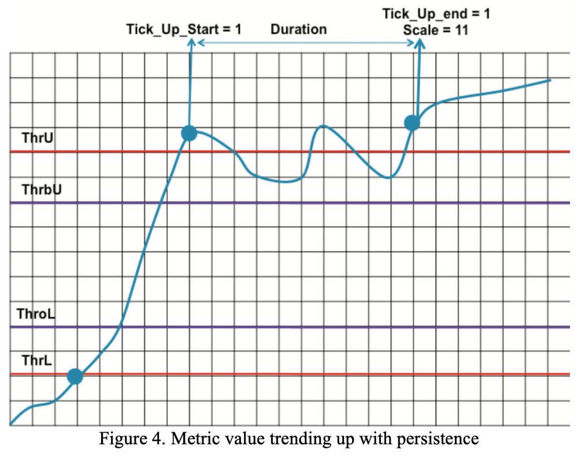

# A Review of Auto-scaling Techniques for Elastic Applications in Cloud Environments

## Introduction

自动扩缩容的目的是**根据输入的工作负载，动态地调整分配给弹性应用的资源**。它可以是针对特定应用的专用实现，也可以是由 IaaS 提供商提供的通用策略。在任何情况下，**自动扩缩容就是在满足应用的 SLA 和最小化资源成本之间的一个 tradeoff**。所以，所有动态扩缩容都会面临几个问题：

* **资源供给不足**。应用程序没有足够的资源在 SLA 规定的时间内处理所有到来请求。因此需要更多的资源，<u>但从被请求到服务可用需要一些时间</u>。在流量突然爆发的情况下，一个供应不足的应用程序可能会导致许多违反 SLA 的情况，甚至导致系统直接卡死。
* **超额配置**。在这种情况下，应用程序拥有比满足 SLA 所需的更多资源。从 SLA 的角度来看，这是正确的，但如果 VM 是空闲的或轻度负载的，客户就要付出不必要的代价。通常来说，一定程度的超额配置是可取的，这样就可以应对小波动。一般来说，无论是手动配置，还是自动分配，都不是为了让 VM 刚好 100% 运行。
* **震荡**。两种不良影响的结合。如果一个策略预测到了接下来应该执行的缩放操作，但是过快地执行它，就会发生震荡。保持一个容量缓冲区（使 VM 保持在 80% 而不是 100%），或者使用一个 cooldown period（即做完一个操作以后等一等再做下一个）是避免振荡的常见方法。

我们可以把 autoscaling 和 MAPE 循环做一个映射，分为四个阶段：**Monitring、Analyzis、Planning** 和 **Execution**。首先，M <u>监控</u>并收集关于系统和应用的信息；Auto-scaler 分为 A 和 P 两个阶段，它利用收集到的数据对未来的资源使用率和需求进行<u>分析</u>，然后<u>计划</u>一个合适的资源修改的方案，比如，删除一个 VM；最后，系统根据 auto-scaler 的方案<u>执行</u>对应的行为。以下我们就四个阶段再分别简单展开一下：

**监控**：autoscaling 依赖于有用且最新的指标数据，autoscaling 决策的有效性本质上取决于收集到的指标数据的质量、采样的粒度和获取指标的开销，通常来说会采集这些数据：

* Hardware：CPU、磁盘访问、网络访问、内存；
* OS：每个进程的 CPU 时间、Page Fault、RSS；
* Load Balancer：请求队列长度的大小、当前会话的数量、传输的数据量、拒绝请求的数量、错误的数量；
* App：总线程数、active 的线程数、已用内存、已处理的请求、待处理的请求、放弃的请求、响应时间。
* DB：活动线程数，处于特定状态（写、提交、回滚）的事务数。
* MQ：队列中 task 的平均数量，task 的排队时间。

我们假设有一个好的监控工具，收集关于系统和应用程序当前状态的不同和更新的指标，并且有一个合适的粒度。

**分析**：分析包括处理从监控系统中收集的指标，以及对未来需求的预测。有些 autoscaling 不做任何预测，只是根据目前系统状态做出反应——这种就是 **reactive**；有些则使用复杂的技术来预测未来可能发生的情况，以便以足够的预见性来安排资源——这种就是 **proactive**。预测是很重要的，因为从执行自动扩展行动（例如，增加一个物理机）到它生效（例如，分配一台物理服务器来部署一个 VM，把虚拟机镜像移到它上面，启动 OS 和应用程序，并使服务器完全运行，需要几分钟的时间）是有一个 gap 的。reactive 的系统可能无法在流量突然爆发的情况下进行扩展。因此，可能需要 proactive，以处理波动的需求，并能够提前进行扩展。

**计划**：一旦知道（或预测）当前（或未来）的状态，auto-scaler 就负责规划如何分配给应用程序资源，以便在成本和 SLA 之间找到一个 trade-off。计划是 autoscaling 方案的核心。

**执行**：从概念上讲，这是一个直接的阶段，此处略过。

本文将如何构建 aoto-scaler 的基础理论或技术作为 auto-scaler 的分类标准，分为 5 类：

1. **基于阈值的规则（rules）**；
2. **强化学习（RL）**；
3. **排队论（QT）**；
4. **控制论（CT）**；
5. **时序分析（TS）**；

## Threshold-based Rules

### Description

基于阈值的自动扩缩容策略非常流行，比如说 k8s 的 autoscaling 就是这么搞的。这些策略的简单性和直观性使它们非常有吸引力。然而，设置相应的阈值是一项以应用为粒度大小的任务，设置者需要对工作负载趋势有深入的了解。从 MAPE 循环来看，规则属于 Planning。分配给目标应用的资源量将根据一组规则而变化，通常是两条：一条用于扩大规模，一条用于缩小规模。规则的结构像这样：
$$
在\ durU\ 的时间段内，如果\ x_1 > thrU_1 \ 且/或\ x_2>thrU_2 \ 且/或 ... \\
那么\ n=n+s\ 且在接下来的\ inU\ 时间段内啥都不做 \\
在\ durL\ 的时间段内，如果\ x_1 < thrL_1 \ 且/或\ x_2<thrL_2 \ 且/或 ... \\
那么\ n=n-s\ 且在接下来的\ inL\ 时间段内啥都不做
$$
每个规则都有两个部分：**条件是啥以及满足条件时要执行的行为**。条件使用一个或多个性能指标 $x_1$ 、$x_2$ 等，比如 CPU 负载或平均响应时间。每个性能指标都有上限值和下限值。如果在给定的时间内满足条件，相应的行动将被触发。在执行一个动作后，auto-scaler 要在一个小的冷却期内“抑制”自己做下一个决策。举个例子：当平均 CPU 使用率超过 70% 且超过 5 分钟时，增加 2 个实例，然后，接下来的 10 分钟内 do nothing。

TR 构成了一种易于部署和使用的机制，然而，规则的创建却是一件比较困难的事情，**需要选择合适的性能指标或指标的逻辑组合，还需要选择参数值（主要是阈值）**。这里给出一些结论供参考：*[Dynamic Business Metrics-driven Resource Provisioning in Cloud Environments](https://link.springer.com/chapter/10.1007/978-3-642-31500-8_18)* 这篇文章的实验就表明，<u>使用特定于应用的指标（如队列中的平均等待时间，请求的数量）可以获得比特定于系统的指标（如CPU负载）更好的性能</u>。TR 还需要为指标变量（如CPU负载）设置相应的上限（如 70%）和下限（如 30%），特别是，为了避免系统振荡，需要对阈值进行仔细调整。为了防止这个问题，最好是设置一个冷静期，在这段时间内，一旦执行了扩缩容行为，就不再进行决策。

规则中的条件通常基于**一个或最多两个性能指标**，最受欢迎的指标是虚拟机的平均 CPU 负载、响应时间或请求率。一些工作喜欢使用多个维度（计算、存储和网络）的性能指标，还会将其中几个纬度关联。

对于 TR 来说，选择正确的性能指标集和相应的阈值是比较困难的，因为这些阈值很大程度取决于工作负载的变化，而且可能需要随时调整。为了解决静态阈值的问题，就有人引入了动态阈值的概念：初始值一开始被设置，但它们会根据观察到的违反 SLA 的情况自动修改。

### Finer Threshold

大多数工作对每个指标只使用两个阈值，*[Integrated and autonomic cloud resource scaling](https://ieeexplore.ieee.org/abstract/document/6212070/)* 这篇文章则使用一组四个阈值和两个持续时间。ThrU（上限值）、ThrbU（略低于上限值）、ThrL（下限值）、ThroL（略高于下限值），从而确定性能指标的趋势，然后进行更精细的自动缩放决策。

这篇文章将自己的算法称为 IACRS 算法（Integrated and Autonomic Cloud Resource Scaler），为了避免不必要的偏差，定义一下这里用到的术语：

* **Resource**：比如 VM、网络带宽、LB、交换机等，或者一些子资源，比如 VM1.CPU1；
* **Performance Metrics**：比如 CPU 负载、网络负载、响应时间、抖动等；
* **Groups**：Resource 和 Performance Metrics 可以划分在一个 Group 内，这样就可以控制这个 Group 下的扩缩容策略，比如，某种资源的几个指标（一个 VM 的 CPU 负载和内存负载）、某种类型的资源（一组 VM）、具有联系的资源（一组由某个 LB 负责的资源）等；

除了四个阈值，该算法额外定义了一个 **duration** 参数用来判定指标数据值是否稳定在 ThrU 和 ThrbU 区间（或 ThrL 和 ThrbL 区间）。然后约定，要监测的性能指标在算法中称作 PMT，它的值就是 **PMT_value**，然后定义一个用来决定何时自动扩缩容的变量，叫 **Scale**，初始值为 00。接下来来看会出现的情况：

1. **指标数据的值呈上升趋势并稳定在一个区间**：

* 当 PMT_value 第一次大于 ThrU，duration 时钟开始计时，设置 Tick_Up_Start 为 1，即：

$$
If \ \ Tick\_Up\_Start == 0\ \ \&\&\ \ first\_time(PMT\_Value>ThrU),\ \ Tick\_Up\_Start=1.
$$

* 在 duration （比如 5 分钟）的时间段内，当 PMT_value 始终大于 ThrU 或者它虽然振荡但仍高于 ThrbU，停止时钟计时然后设置 Tick_Up_End 为 1，即：

$$
If\ \ Tick\_Up\_Start == 1\ \ \&\&\ \ (PMT\_Value > ThrU\ \ or\ \ PMT\_Value > ThrbU) \\
\&\&\ \ duration == <specified\ \ duration>,\ \ Tick\_Up\_End = 1
$$

* 如果 PMT_Value 在 duration 内始终高于 ThrU 或在区间保持稳定，并且 Scale 的当前值为 00 或 01（01 的值会在后面解释），设置 Scale 为 11，即：

$$
If\ \ (Scale == 00\ \ or\ \ Scale == 01)\ \ \&\&\ \ Tick\_Up\_Start == 1\ \ \&\&\ \ Tick\_Up\_End == 1,\ \ Scale = 11
$$

2. **指标数据的值呈现从上到下的趋势**：这种情况下 PMT_Value 行为如下图所示，这里当 PMT_Value 第一次低于 ThrbU 并且曾高于 ThrU 时，计时器开始计时，如果值在指定的 duration 内保持在 ThrbU 以下，那么变量 Scale 设置为 01，即：

$$
If\ \ (Tick\_Up\_Start == 1\ \ or\ \ Tick\_Up\_End == 1)\ \ \&\&\ \ first\_time (PMT\_Value < ThrbU)\\
\&\&\ \ duration == <specified\ \ duration>, Scale = 01;\ \ Tick\_Up\_Start = 0;\ \ Tick\_Up\_end = 0
$$

3. **指标数据的值呈下降趋势并稳定在一个区间**：这种情况和第一种情况类似，只不过针对的是 ThrL 和 ThrbL，并且 Scale 的值是从 11 或 01 设置为 00。

4. **非指标值行为**：下图两种情况都不会改变 Scale 的值。

那么 IACRS 算法是怎么做到呢，很简单：
$$
If\ \ Scale == 11\ \ for\ ALL\ in\ a\ group,\ apply\ all\ Scale\ Up\ in\ the\ group.\\
If\ \ Scale == 00\ \ for\ ALL\ in\ a\ group,\ apply\ all\ Scale\ Down\ in\ the\ group.\\
If\ \ Scale == 01\ \ for\ 50\%\ (this\ value\ is\ configurable)\ of\ a\ group,\ apply\ 50\%\ Scale\ Up.
$$
IACRS 是基于这样的概念：通过将多个指标和相互关联的资源分组，可以防止虚假的自动扩缩容；通过设置四个阈值指标，可以进行更精细化的扩缩容策略。

### RightScale’s Auto-scaling Algorithm

[RightScale’s Auto-scaling Algorithm](http://support.rightscale.com/12-Guides/RightScale_101/System_Architecture/RightScale_Alert_System/Alerts_based_on_Voting_Tags/Understanding_the_Voting_Process/index.html) 这个算法将扩缩容和投票做了个结合，如果大多数 VM 同意某个决策，就进行相关行为，否则不采取任何措施。举个例子，假设这个算法下某个集群的自动扩缩容策略如下：

- Nickname: MyArray
- Decision Threshold: 51%
- Choose voters by tag (Voter Tag): [x] default to nickname (e.g. MyArray)
- Resize Up by 2; Resize Down by 1; Resize Calm Time: 15 (minutes)

一开始有 3 台 VM，每台 VM 的默认 voter tag 为 `rs_vote:MyArray=none`，然后这时候有两台 VM 触发了扩容，那么这时候集群就会从 3 台 VM 扩容成 5 台 VM：

同理，缩容过程也满足大多数原则：

RightScale 的 voting 是基于规则的，它继承了 TR 的主要缺点：该技术高度依赖于阈值，同时也依赖于工作负载本身。

## Reinforcement Learning

### Description

强化学习（RL）是在没有任何先验知识的情况下，能够在给定输入的 workload 的情况下，为每个应用的 state 确定最合适的自动扩缩容决策。RL 的重点就是 agent（这里就是 auto-scaler）和它的 environment（比如应用程序）之间的互动学习，**agent（使用术语 agent 替代 auto-scaler） 从经验中学习（即试错法），根据集群应用当前的状态（输入的工作负载、性能或其他的变量）进行扩缩容决策。在执行完一个 action 后，agent 通过 reward（比如性能得到了提升）来说明这个 action 有多好，从而驱使 agent 执行高 reward 的决策**。

agent 的目标就是找到一个策略 π，将每个 state s 映射到 agent 应该选择的最佳 action a，agent 的目标就是在系统运行的过程中最大化 discounted rewards：
$$
R_t = r_t+1 +γr_{t+2} +γ^2r_{t+3} +... = \sum_0^∞γ^kr_{t+k+1}
$$
其中 $r_{t+1}$ 就是时刻 $t+1$ 的 reward，$γ$ 是 discount 因子。而这里的策略就是基于一个 value function $Q(s,a)$，在强化学习中被叫做 Q 函数，每个 Q 函数就是计算在状态 s 下执行 action a 会带来的累积 reward，Q 函数可以被定义为：
$$
Q(s,a)=E_π\left\{ ∑_{k=0}^∞γ^kr_{t+k+1}\ |\ s_t =s,\ a_t =a \right\}
$$
Q-learning 是比较常用的 Q 函数，它把 $Q(s, a)$ 的值存储在一个查找表中，它将所有系统 state s 映射到它们的最佳 action a，以及相应的 Q 值。Q-learning 算法的过程大致如下：

1. 初始化 Q 值表，$Q(s,a)$；
2. 观察当前的 state，s；
3. 无限循环步骤 4 ～7：
4. 根据 action 的选择策略为给定的 state s 选择一个 action a，通常来说这个策略是 $ε-greedy$；
5. 执行 action a，观察 reward r 和此时的 state s'；
6. 使用观察到的 reward r 和下一个 state s' 可能的最大 reward 更新 Q 值，对应的公式为：

$$
Q(s,a)=Q(s,a)+α[r+γmax_{a'}Q(s′,a′)−Q(s,a)]
$$

7. 将 state s 设置为 s'。

该算法的第四步涉及为给定的 state 选择一个 action。在现有的 action 选择政策中，$ε-greedy$ 通常是文献中选择的一种。大多数时候（概率为 $1-ε$），具有最佳 reward 的 action 将被执行；而一个随机 action 以较低的概率 $ε$ 被选择。一旦 action 被执行，相应的 Q 值就会被更新（第六步），其中包括获得的奖励 r 和下一个 state s' 可能的最大 reward $max_{a'}Q(s′,a′)$。参数 $γ$ 是调整未来 reward 重要性的 discount 因子，第六步的更新公式还包括一个参数 $α$，它决定了学习率。它可以对所有的 $(state,action)$ 都是一样的，也可以根据每个 state 被访问的次数做一定的调整。

本质上，agent 学到的策略是在每个 state 下使 Q 值最大化的 action，而 Q-learning 算法是能够收敛的，如果每对 $(state, action)$ 被访问了无限次，那么 Q 值表就会收敛到一组唯一的值 $Q(s,a)=Q^*(s,a)$，从而有了一个确定性的最优策略。但是，autoscaling 是一个持续的任务而非静止的，因此 Q-learning 必须无限的学习并适应工作负载的变化。

由于 autoscaling 达到的效果需要一些时间来对应产生影响，reward 也是在一定的延迟之后才会出现的，RL 使用当前的信息（应用状态）来对未来的 reward（比如响应时间）来做决策，因此 RL 的方法都具有 proactive 的特性。使用 RL 的方法会包括 MAPE 过程的两个阶段：A 和 P。首先，应用和 reward 的信息被存储在一个查询表中，用来分析（A）；然后在计划阶段（P），这些信息被用来决定接下来的扩缩容决策。

### Proposals

要将这个 RL 应用到 autoscaling，我们就要考虑怎么定义 action set A、state space S 和 reward function R。前两个要素和扩展类型（水平/垂直扩展）相关，奖励函数就和获得资源的成本（VM，带宽的花费）和违反 SLA 的惩罚成本相关。

水平扩展的情况下，S 通常是用输入的工作负载以及 VM 的数量定规的，比如 [*A Hybrid Reinforcement Learning Approach to Autonomic Resource Allocation*](https://citeseerx.ist.psu.edu/viewdoc/download?doi=10.1.1.305.246&rep=rep1&type=pdf) 这篇文章使用 $(w, u_{t-1},u_t)$ 来定义 S，其中 $w$ 代表每个时间段内接受的用户请求的数量，$u_{t-1}$ 和 $u_t$ 代表当前时间段和前一个时间段分配给应用程序的虚拟机数量；*[Using reinforcement learning for autonomic resource allocation in clouds: towards a fully automated workflow](https://www.cl.cam.ac.uk/~ey204/teaching/ACS/R244_2019_2020/papers/dutreilh_icas_2011.pdf)* 使用 $(w, u, p)$ 定义 S，分别表示某时间段内用户请求的数量、VM 的数量以及请求平均响应时间的性能表现。水平扩展下，A 通常有三个：增加/减少一个 VM 或者 do nothing。

垂直扩展要考虑的 S 就是具体分配到每个 VM 的资源量（主要是 CPU 和内存），*[Vconf: a reinforcement learning approach to virtual machines auto-configuration](https://dl.acm.org/doi/abs/10.1145/1555228.1555263)* 将 S 定义为 $(mem_1, time_1, vcpu_1,...,mem_u,time_u,vcpu_u)$，分别表示第 i 个 VM 的内存大小、调度 credit（占用物理 CPU 时间）和 vCPU 数量，可以对 S 里面的变量增加/减少/不变。A 就是对这几个变量修改的组合，比如配置内存为每次增加\减少 256 MB，调度 credit 的时间每次增加/减少 256，vCPU 每次增加/减少 1 个。

使用 Q-learning 也存在一些问题：

* <u>初始化时间很慢，训练时间很长</u>。在找到足够好的解决方案之前，无论是训练过程的最初还是在期间，在线训练中获得的集群性能可能是很糟糕的。这种问题的主要原因是探索过程的随机性和集群初始信息的缺失。相关的解决方案有类似定义一个启发式算法来约束探索过程、每次 action 访问几种 s' 来加速收敛的过程或者是前期采用一些其他模型来控制集群，RL 模型进行离线训练。
* <u>state space S 太大</u>。S 的数量随着 s 变量的增加指数级增长，造成了一些可扩展性的问题。Q 值表为每个可能的 $(state,action)$ 存储一个值，随着表的规模增加，访问表的开销越来越大，表的更新和 action 的选择也会越来越慢。相关的解决方案有类似并行查找 Q 值表或者是定义一些其他的数据结构来替代 Q 值表等。
* <u>环境会发生变化</u>。假设通过 Q-learning 找到一个最佳策略，环境（比如工作负载）可能就变了，这时候策略就需要被更新。RL 算法为此就需要进行一些探索式的 action，此时可能就会造成性能变差。

上述问题的解决方案的细节超出了本人的~~能力~~领域，在此不做展开。

RL 算法的有趣的点在于即使没有任何先验知识，也可以得到一些最佳自动扩缩容策略。运维人员不需要为应用程序定义一个特定的模型，而是在线学习，并随时调整。RL 技术可能是解决一般应用自动扩缩容的一个不错的方法，但是这个领域目前还不够成熟，不能落地。

## Queueing Theory & Control Theory

### Queuing Theory

### Control Theory

Controller 的目标就是对目标系统进行自动化管理，controller 通过调整可操作的变量 $u$（VM 的数量）来使得期望变量 $y$ （比如 CPU 负载）达到期望的等级或者 set point $y_{ref}$。有三种常见的控制系统：

* Open-loop Controller：只使用当前状态和系统模型来计算目标系统的 $u$，至于 $y$ 是否达到了预期的目标 $y_{ref}$ 它不管；
* Feedback Controller：会根据系统输出 $y$，并纠正与期望值的偏差，如下图；
* Feed-forward Controller：Feed-forward Controller 会试图对输出中的错误进行预测，它一般使用一个模型进行预测，在错误实际发生之前做出反应。预测可能会失败，因此，它通常和 feedback controller 结合在一起。

一般 autoscaling 的相关研究都聚焦在 feedback controller。

