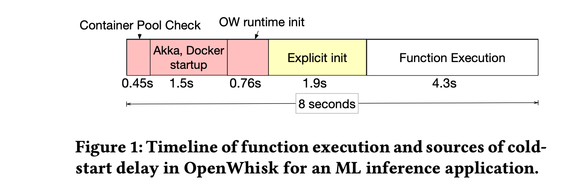
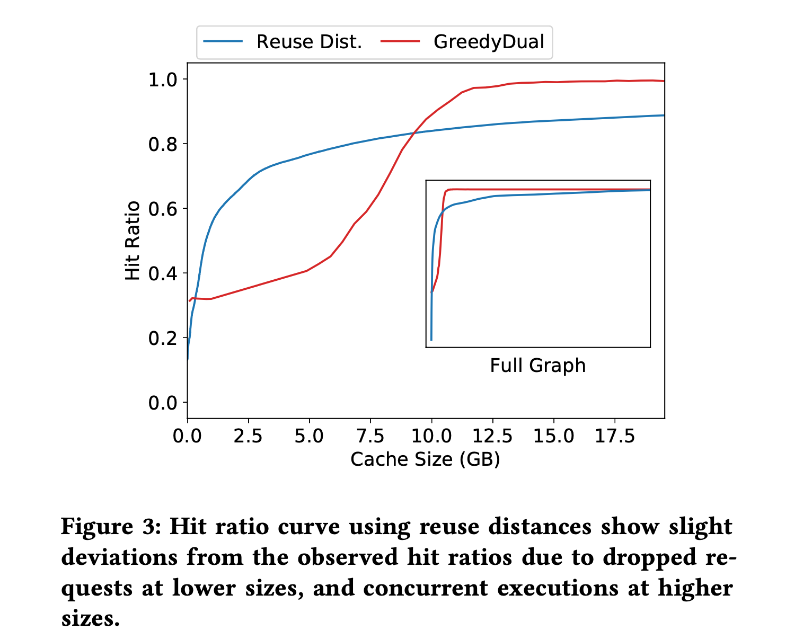

# FaasCache

这篇 paper 将 serverless 中的 keep-alive 问题等价成 caching。受 cache 启发提出了一种 Greedy-Dual keep-alive 策略减少冷启动的开销；cache 中类似 reuse distance 和 hit-ratio curve 的概念也应用到了容器资源配置，减少资源开销。

## Keep-alive Trade-offs

Keep-alive 的关键思想在于一个 warm function 在短期能很可能被再次调用。理想情况 keep-alive 的长短应当和函数本身的特征强绑定，但是这实际上还是有一定难度的，因为每个 function 的初始化开销，资源 footprint（比如内存和 CPU 的开销）以及请求频率是完全不同的，因此目前所有厂商的做法是提供一个固定的存活时间。

为了继续开展下去 `Keep-alive`，我们需要分析一下一个函数从启动到运行所有的开销，如下图：

从图中可以看出，大约花费了 2.5 秒来 loading 所有 runtime 依赖（红色部分）；黄色部分代表解决用户代码依赖所花费的时间。这说明，如果保持请求执行完后 alive，红色部分和黄色部分的开销都可以消除。

Keep alive 策略的主要目标是**通过让不同特征的函数保持不同的 alive time 来减少初始化和冷启动的开销**。

由于使用 FaaS 平台的应用高度多样化，Keep-alive 的策略设计并非易事。使用 FaaS 的应用既包括了一些 Web 服务，也包括一些科学计算，ML 等高内存占用重初始化开销的应用。此外，FaaS 的 Function 具有高动态性和周期性，峰值往往超过平均值的两倍，一些函数的调用频率远远高过其他函数。论文使用以下几个指标去制定策略：

1. **Initialization Time**：初始化时间根据函数的代码和数据依赖性而变化，一个 ML 的函数可能需要几秒钟的初始化；
2. **Total Running Time**：总运行时间包括初始化时间和实际函数执行时间，实际函数执行时间变化范围很大，从几毫秒到几秒都有可能；
3. **Resource Footprint**：包括 CPU，内存和 I/O 使用，不同类型的应用变化很大；
4. **Frequency**：一些函数一秒可能被调用几次，一些函数可能偶尔才调用。

资源是有限的，根据上述特点，可以判定一个函数应该 keep alive 多久。一个偶尔才被调用，不太可能在不久将来再次被调用的函数，keep alive 不仅没什么好处，而且还占内存；保持那些 large-footprint 的代价要比一些小函数高昂的多，那么那些小函数可以存活更长的时间；函数可以根据初始化开销进行优先排序，因为初始化开销实际上消耗了计算。

目前的 FaaS 使用原始的 keep-alive 策略，这些策略的设计没有考虑到函数本身的多样性和动态性。比如 OpenWhisk，将所有函数保持在一个恒定的时间段（10分钟）。

## Caching-based Keep-alive Policy

这篇论文的一大亮点在于它证明了 ”keeping functions alive is equivalent to keeping objects in a cache“：

* **保持函数存活可以减少函数响应延迟** 等价于 **将一个对象缓存后可以减少访问延迟**；
* **当所有服务器资源都占满了，驱逐哪一个 alive 的函数** 等价于 **从 cache 中驱逐哪一个对象**。

### GDFS Algorithm

GDSF 算法（Greedy-Dual-Size- Frequency，贪婪双尺寸频率缓存替换算法）算法是一种基于 Web 缓存的缓存算法。

该算法的基本思想是是使用某个目标保存价值函数来计算出缓存中所有缓存对象的保存价值 H，当缓存剩余空间不足以保存新的对象时，根据这个 H 值将缓存对象由高到低进行排序，优先将缓存中保存价值 H 最低的对象替换出去。目标函数为：
$$
H(i) = L +F_r(i)\times \frac{V(i)}{S(i)}
$$
$H(i)$ 表示第 $i$ 个缓存对象的缓存价值，$V(i)$ 表示将 Web 对象 $i$ 引入到缓存中的所需要付出的代价，如带宽、网络延迟等。$L$ 为膨胀因子，初值为 0， 每当有 Web 对象替换出去时，$L$ 都会被重新赋值为那个被替换出去的对象的 $H(i)$ 。$F(i)$ 为 Web 对象 $i$ 的访问次数。

### Greedy-Dual Keep-Alive Policy

回到本文的 keep-alive 策略，它就是基于 GDFS 设计的一个算法，它的核心思想是只要服务器资源够，进程中的函数资源尽可能的保持 warm，这其实和之前那些 FaaS 的做法是截然不同的，恒定时间的生存策略意味着即使有资源可以让它们生存更长时间，也会被终止。Greedy-Dual Keep-Alive Policy 更多是作为一种驱逐策略，如果要启动一个新的容器，并且没有足够的资源可用，那么我们要终止哪个容器。显然，容器的总数（warm + running）受服务器物理资源（CPU 和内存）限制，这篇论文就根据函数冷启动的开销和资源占用情况为每一个容器计算一个优先级，并终止优先级最低的容器。

**优先级计算**：对于每一个容器，它都有一个自己的 keep-alive 优先级，主要基于函数调用频率，运行时间，函数大小：
$$
Priority = Clock + \frac{Freq \times Cost}{Size}
$$
当一个 Warm 函数被重用了，就相当于发生了一次 “cache hit”，接下来将重点解释这几个参数的含义：

* **Clock**：Clock 用来记录函数的实效性，每个 server 会维护一个逻辑时钟，在每次发生驱逐时更新。每次一个容器被使用的时候，它的 Clock 就会被更新，因此，最近没有使用的容器会有较小的 Clock。当没有足够资源启动新的容器，现有的 warm 容器无法被使用时，一个容器就会被终止。具体来说，如果一个容器 J 被终止了，那么 J 一定是最小优先级，那么 $Clock = Priority_j$，此后被使用的容器在更新自身 Clcok 值时就会使用改值；

* **Frequency**：Frequency 是指一个给定函数被调用的次数。一个函数可以被多个容器执行，Frequency 表示其所有容器中函数调用的总次数。当一个函数的所有容器被终止时，Frequency 被设置为零。优先级与频率成正比，因此，更频繁执行的函数会保持更长的时间；

* **Cost**：Cost 代表终止成本，它等于总的初始化时间，这体现了保持容器 alive 的好处以及冷启动的成本。因此，优先级和初始化开销成正比；

* **Size**：Size 是容器的 resource footprint，在大多数情况下，可以运行的容器数量受物理内存可用性的限制，因为 CPU 很容易被复用但是内存交换会导致严重的性能下降，因此这里的 Size 考虑的是容器内存的使用。

  当然 Size 也可以用多维向量表示，一种常见的方法是假设每台物理机资源为 $a$，那么 $size=\sum_{j} \frac{d_j}{a_j}$，$d_j$ 代表对应机器下该容器某种类型的资源占用。

### Other Caching-Based Policies

上述算法也有一些更简单的策略，比如如果只使用 Clock 作为优先级，就是一个简单的 LRU 算法；如果只使用 Frequency 就可以得到 LFU 算法；如果只使用 1/size 作为优先级，可以得到一个 size 敏感的 keep-alive 策略，这在内存 size 很重要的时候很有用。

论文还实现了一种 LAND-LORD 算法，它是 Greedy-Dual 策略的变种。LAND-LOARD 也考虑了函数的 frequency， size 和 initialization time。当 server 资源吃紧要驱逐容器的时候，就会根据每个 function 的 size 和 initialization 的成本向其收取“租金”（具体而言，$rent = min \frac{initialization\,cost}{size}$，而函数被调用的时候，也会获取一定的“信用”，最后，信用最低的函数会被驱逐。

## SERVER PROVISIONING POLICIES

资源配置问题也是 serverless 中一个基本问题，本文同样根据函数负责的特点去设计了一套为 function 分配合适资源的技术。资源的配置同样必须考虑 function 的调用频率，footprint 和两个函数调用之前的时间差。

从性能和资源分配的角度来说，为 keep-alive 缓存提供更多资源显然可以减少冷启动提供性能，但是过度资源提供同样意味着浪费和利用不足。此外，函数的工作负载可能是动态的，因此资源配置必须是弹性的，能够根据负载动态的增加或减少。因此，本文提出了一个静态配置策略，用来确定一个给定函数的内存大小；一个动态配置策略，用来弹性扩展处理工作负载随时间的动态变化。

这里重点介绍静态配置策略。

论文希望提出一种静态配置策略来优化资源配置，避免过度分配或分配不足，这分别对应成本和性能。在前文中，我们做了 keep-alive policy 和 cache eviction 的类比，下文做更进一步的类比。

论文声称，serverless 函数的性能和资源可用性的权衡可以通过 cache 命中率曲线来理解和建模。人们常常利用命中率曲线来确定 cache 的大小，命中率曲线的斜率也可以帮助理解缓存的边际效用（即每新增一个单位带来的收益），这就需要选择一个能使边际效用最大化的缓存大小，即命中曲线的拐点。

类比到 serverless 函数中，论文使用函数命中率曲线来确定不同服务器内存大小下的 “cache hit” 的比率，命中率曲线通过 reuse distance 来构建。

在计算机中，reuse distance（复用距离）用来表示串行程序运行中前后两次访问同一数据元素之间所访问的不同数据元素的数目，在 serverless 的场景下，复用距离则被定义为在连续调用同一个函数之间调用的不同函数的总内存大小。比如，假设某个调用顺序为 ABCBBCA，那么函数 A 的复用距离为函数 B 的内存大小加上函数 C 的内存大小。这些复用距离可以帮助人们对所需缓存大小进行分析。如果 cache 的大小大于 reuse distance，那么就不会有 cache miss（因为所有函数调用都在 cache 中）。这可以被概括为当 cache size 为 c 的时候缓存命中率：
$$
Hit\,ratio(c) =\sum^c_{x=0} 𝑃(Reuse\,distance = 𝑥),
$$
其中，reuse distance 的概率是通过扫描所有函数工作负载，分析其中包含的重用序列得到的。文章得到了一个如下图的结果（蓝线）：

可以看到，命中率随着缓存大小的增加而陡然增加，直到一个拐点，之后收益递减。

上图说明了我们可以使用 reuse distance 来构建命中率曲线，然后根据拐点来确定 server 内存大小。或者可以设定一个目标命中率（比如 90%），以此来确定 server 的最小内存大小。但是，要跟踪整个 reuse distance 需要大约  O(NM) 的时间，N 为调用次数，M 为 unique 函数的数量。因此，论文使用类似 SHARDS 这样的抽样技术来降低时间代价。

但是，<u>这种缓存类比存在一个局限性，它并不完全适用于 FaaS</u>。这个主要是函数并发执行的限制导致的，cache 处理的 Obejct 是唯一的，但是一个函数可以有多个容器。当 cache 较小的时候，大量的 “cache miss” 会导致较高的服务压力，从而导致一些请求直接就丢弃了，这是使用 reuse distance 无法捕捉到的细节。此外，如果一个函数所有 warm container 处于 running，那么新请求就会导致冷启动，这理应算作一次 “cache miss”，但是实际算作 “cache hit”。因此，实际的命中率会和理想指产生偏差。这种粗粒度的分配仍然会导致轻微的资源不足或者过度供应。因此，使用了一种简单的动态分配策略来减少这些错误，这里不再详细介绍。

