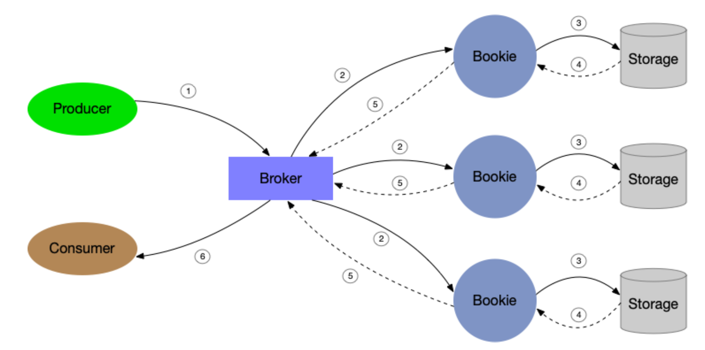

# *Le Taureau*: Deconstructing the Serverless Landscape & A Look Forward

这篇文章将从以下几个角度介绍 serverless：

* 推动 Serverless 的第一代应用程序；
* Serverless 平台的最新技术以及 Serverless 中使用 Stateful 的经验教训；
* 利用 Serverless 进行分析与机器学习；
* 前景与机遇。

## TODAY’S SERVERLESS APPLICATIONS

Serverless 主要的特点在于易于使用，需求驱动的执行已经成本效率。

有三种流行的 serverless 用例：

* Web 应用程序；
* Data Processing：ETL（Extract，Transform 和 Load）是 serverless 中另一种典型用例，从 serverless 数据存储中读取数据，然后使用 serverless function 对数据进行处理后写回到 serverless 数据存储，可以是 event-driven 或是 scheduled；
* IoT。

这三种流行用例都有这几个典型特点：

* 资源弹性支持：负载随时间变化，可能是平均值的几倍，也可能为 0；
* 开销低：尽管负载变化很大，依旧希望按需付费；
* stateless：function 之间无需共享或者交换状态。

我们可以对 serverless 设计模式进行 6 个分类：

* 周期性调用；
* 事件驱动；
* data transformation；
* data streaming；
* 状态机；
* bundled pattern。

可以从 5 个纬度进行阐明：执行什么，如何执行；如何找到 executable，如何建模以及何时执行。

## Serverless Platforms

可以把 Serverless 分为 FaaS 以及 BaaS。

对于 FaaS 而言，具有使用高阶编程语言，stateless，有限执行时间以及细粒度计费的特点。最近，诸如 Ripple 的编程架构可以将为单机执行而编写的应用程序利用 Serverless 的特点进行任务并行；Cloudburst 是一个 stateful 的 FaaS 平台，提供 Python 编程以及低延迟的 mutable state 和通信。

BaaS 提供一些更为 specialized 的方面，包括存储平台，数据库平台以及为了应对低效工作负载的专用计算平台（比如 AWS Glue for ETL workloads，Amazon Athena， Google BigQuery 和 Azure Stream Analytics for analytic workloads 等等）

### Apache Pulsar

消息传递系统通常用于实时流分析中。 Apache Pulsar 是一个企业级消息传递系统，Pulsar 通过一个统一的消息传递 API 推广了传统的消息传递模型 — 排队和发布订阅。 Pulsar 的其他一些关键功能包括支持地理复制，多租户，分层存储和故障恢复。 在 Pulsar 中，生产者将消息发布到 topic，而消费者则订阅一个或多个 topic 来接收消息。 Pulsar 旨在以任何规模运行（topic 的数据范围可以从几兆字节到几 TB）。 Pulsa r支持 partitioned topic，以便通过称为 broker 的进程支持大数据量。 Pulsar 群集中的每个节点都运行一个 broker 。

一个 Pulsar 集群由一组 broker 和 bookie 以及一个用于协调和配置管理的 ZooKeeper 组成。 Pulsar 代理是接收，存储和传递消息的组件。这些 bookies 来自 Apach BookKeeper，它们为消息提供持久的流存储，直到消息被消耗为止。

Broker。 Pulsar 代理是 stateless 组件，其任务是接收和发送消息，同时使用 bookie 作为消息的持久存储，直到消息被消耗为止。该代理程序主要运行两个不同的组件：一个 HTTP 服务，该服务提供用于 topic 查找和管理任务的REST接口，以及本机调度程序，它是通过用于所有数据传输的自定义二进制协议的异步 TCP 服务器。

Bookie。 Pulsar 的存储节点称为 bookies，其基于 Apache Bookkeeper（一种提供持久存储的分布式预写日志系统）。使用 Bookkeeper 的应用程序可以创建许多独立的日志，称为 ledger。Ledger 是一个仅追加数据结构，具有分配给多个 bookies 的单个 writer，并且其条目被复制到多个 bookie 节点。Ledger 的语义非常简单：一个流程可以创建 Ledger，append entries 并关闭 Ledger。关闭 Ledger 后，无论是显式关闭还是由于 writer 进程崩溃，都只能以只读模式打开。最后，当不再需要 Ledger 中包含的条目时，可以从系统中删除整个 Ledger。

**Pulsar Functions**。Pulsar Functions 允许用户部署和管理 stateless function，这些 function 能消费来自 Pulsar Topic 的消息并且发布到 Pulsar Topic。Pulsar Function 还提供了一种方法支持 serverless 的实时数据流分析，会在后文举例说明。许多数据分析算法本质是 stateful 的，这会限制 serverless 框架的使用。同样，composable and/or concurrent data sketches 要求在不同的 sketch 之间传递临时数据，这在 serverless 中也无法支持。对此，有人提出了 Jiffy 来存储和管理临时状态。

### Jiffy