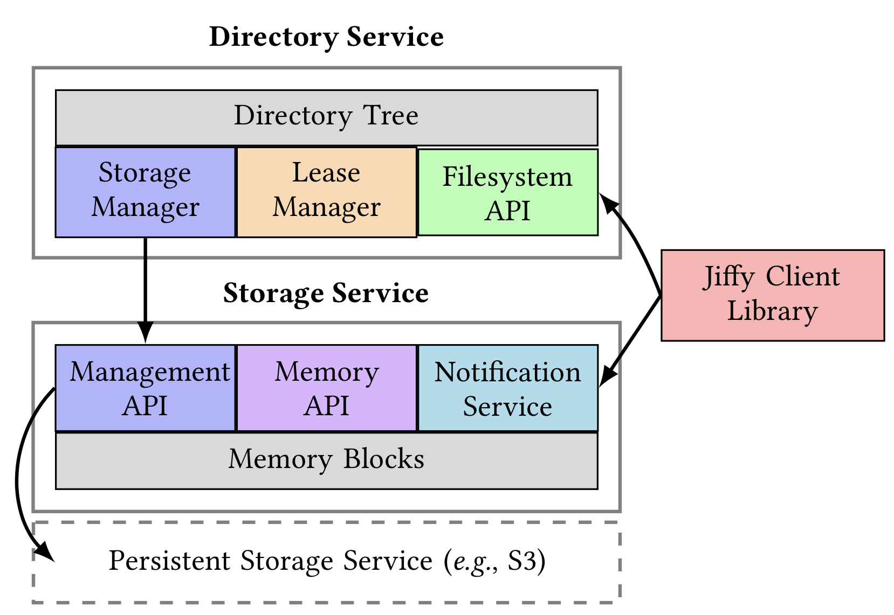

# *Le Taureau*: Deconstructing the Serverless Landscape & A Look Forward

这篇文章将从以下几个角度介绍 serverless：

* 推动 Serverless 的第一代应用程序；
* Serverless 平台的最新技术以及 Serverless 中使用 Stateful 的经验教训；
* 利用 Serverless 进行分析与机器学习；
* 前景与机遇。

## TODAY’S SERVERLESS APPLICATIONS

Serverless 主要的特点在于易于使用，需求驱动的执行已经成本效率。

有三种流行的 serverless 用例：

* Web 应用程序；
* Data Processing：ETL（Extract，Transform 和 Load）是 serverless 中另一种典型用例，从 serverless 数据存储中读取数据，然后使用 serverless function 对数据进行处理后写回到 serverless 数据存储，可以是 event-driven 或是 scheduled；
* IoT。

这三种流行用例都有这几个典型特点：

* 资源弹性支持：负载随时间变化，可能是平均值的几倍，也可能为 0；
* 开销低：尽管负载变化很大，依旧希望按需付费；
* stateless：function 之间无需共享或者交换状态。

我们可以对 serverless 设计模式进行 6 个分类：

* 周期性调用；
* 事件驱动；
* data transformation；
* data streaming；
* 状态机；
* bundled pattern。

可以从 5 个纬度进行阐明：执行什么，如何执行；如何找到 executable，如何建模以及何时执行。

## Serverless Platforms

可以把 Serverless 分为 FaaS 以及 BaaS。

对于 FaaS 而言，具有使用高阶编程语言，stateless，有限执行时间以及细粒度计费的特点。最近，诸如 Ripple 的编程架构可以将为单机执行而编写的应用程序利用 Serverless 的特点进行任务并行；Cloudburst 是一个 stateful 的 FaaS 平台，提供 Python 编程以及低延迟的 mutable state 和通信。

BaaS 提供一些更为 specialized 的方面，包括存储平台，数据库平台以及为了应对低效工作负载的专用计算平台（比如 AWS Glue for ETL workloads，Amazon Athena， Google BigQuery 和 Azure Stream Analytics for analytic workloads 等等）

### Apache Pulsar

消息传递系统通常用于实时流分析中。 Apache Pulsar 是一个企业级消息传递系统，Pulsar 通过一个统一的消息传递 API 推广了传统的消息传递模型 — 排队和发布订阅。 Pulsar 的其他一些关键功能包括支持地理复制，多租户，分层存储和故障恢复。 在 Pulsar 中，生产者将消息发布到 topic，而消费者则订阅一个或多个 topic 来接收消息。 Pulsar 旨在以任何规模运行（topic 的数据范围可以从几兆字节到几 TB）。 Pulsa r支持 partitioned topic，以便通过称为 broker 的进程支持大数据量。 Pulsar 群集中的每个节点都运行一个 broker 。

一个 Pulsar 集群由一组 broker 和 bookie 以及一个用于协调和配置管理的 ZooKeeper 组成。 Pulsar 代理是接收，存储和传递消息的组件。这些 bookies 来自 Apach BookKeeper，它们为消息提供持久的流存储，直到消息被消耗为止。

Broker。 Pulsar 代理是 stateless 组件，其任务是接收和发送消息，同时使用 bookie 作为消息的持久存储，直到消息被消耗为止。该代理程序主要运行两个不同的组件：一个 HTTP 服务，该服务提供用于 topic 查找和管理任务的REST接口，以及本机调度程序，它是通过用于所有数据传输的自定义二进制协议的异步 TCP 服务器。

Bookie。 Pulsar 的存储节点称为 bookies，其基于 Apache Bookkeeper（一种提供持久存储的分布式预写日志系统）。使用 Bookkeeper 的应用程序可以创建许多独立的日志，称为 ledger。Ledger 是一个仅追加数据结构，具有分配给多个 bookies 的单个 writer，并且其条目被复制到多个 bookie 节点。Ledger 的语义非常简单：一个流程可以创建 Ledger，append entries 并关闭 Ledger。关闭 Ledger 后，无论是显式关闭还是由于 writer 进程崩溃，都只能以只读模式打开。最后，当不再需要 Ledger 中包含的条目时，可以从系统中删除整个 Ledger。

**Pulsar Functions**。Pulsar Functions 允许用户部署和管理 stateless function，这些 function 能消费来自 Pulsar Topic 的消息并且发布到 Pulsar Topic。Pulsar Function 还提供了一种方法支持 serverless 的实时数据流分析，会在后文举例说明。许多数据分析算法本质是 stateful 的，这会限制 serverless 框架的使用。同样，composable and/or concurrent data sketches 要求在不同的 sketch 之间传递临时数据，这在 serverless 中也无法支持。对此，有人提出了 Jiffy 来存储和管理临时状态。

### *Jiffy

执行许多分布式应用程序的必要组件是跨其组件任务（或功能）的数据共享交换。由于其短暂的性质，此类数据被称为短暂状态。此类应用的示例包括数据流程序，图分析，视频处理，机器学习和 AI 到流处理。

Serverless 框架不能满足临时应用程序状态的有效存储和交换，架构的三个属性为实现此目标提出了新挑战，这使现有存储系统对有状态应用程序无效：

* **不支持直接通信**：由于应用程序无法控制单个任务的放置和调度，因此任务间状态交换必须求助于外部存储，而不是使用直接通信。**现有的持久性存储无法提供这种交换所需的性能**；
* **弹性和隔离是一流公民**：临时状态存储需要提供透明的资源扩展，同时提供隔离，即为一个应用程序扩展/缩减临时存储资源不应影响其他并行的应用程序。现有方法要么仅提供粗粒度的资源弹性而没有隔离，要么需要事先知道并发任务的数量和短暂状态的大小，这违反了 serverless 的初衷；
* **生命周期管理具有挑战性**：Serverless 平台将状态的生命周期与其生产者任务的寿命紧密地结合在一起。但是，在大多数应用程序中，共享状态的生命周期可能比生产者任务的生命周期长得多：共享状态的生命周期与消耗数据的时间有关。今天的数据存储不提供 state lifetime 管理。

Jiffy，一个虚拟内存系统，可为 Serverless 应用程序提供存储和管理临时状态，它建立在这三条洞见上：

* 尽管很难为任何单个应用程序准确地配置容量，但可以利用 Serverless 任务的短寿民特性来有效地跨应用程序复用可用的内存容量；
* 一个全局的地址空间无法在多租户设置中扩展内存资源的隔离保证，因为为应用程序添加/删除内存资源需要对整个地址空间进行数据重新分区 。 这样的设置需要打破单个全局地址空间的设计；
* 细粒度的内存弹性和隔离的内存资源共享正是传统操作系统已经通过虚拟内存抽象解决的问题。 在 Serverless 环境中解决这些问题应建立在这些系统的设计之上。

Jiffy 使用两种方法将上述三点洞见整合到系统中：1）跨共享内存节点池的块级内存分配（类似于 OS 的页分配）；2）一个 Serverless 的内存管理抽象——层级 namespace（类似抽象地址空间）。分层名称空间以及用于子任务的子命名空间，允许捕获应用程序任务之间的短暂状态依赖性。块粒度的容量分配和取消分配使 Jiffy 可以有效地跨应用程序复用可用的内存容量。块粒度的容量分配和取消分配使Jiffy可以有效地跨应用程序复用可用的内存容量。此外，向任务的子命名空间添加/删除块需要仅对该子命名空间进行数据重新分区，从而确保效率和隔离性，以实现弹性扩展内存资源。最后，namespace 天然可以使用命名空间粒度租赁机制启用生命周期管理，并在相关状态准备好时使用一种**按命名空间通知机制（per-namespace notification）**向应用程序发出信号。下图显示了 Jiffy 的高级体系结构。

## Serverless for Data Insights

### Analytics

* **Video**：根据思科在 2019 年发布的VNI报告，到 2022 年，全球 IP 视频流量将占所有 IP 流量的 82％。鉴于以上所述，已经出现了基于广泛视频分析的新应用程序，包括视频编辑，场景理解，对象识别和分类以及合成。考虑到应用程序的**计算密集型和低延迟特性**，Serverless 的利用可以实现所需的扩展。

  ExCamera 是一个视频处理的 Serverless 框架，可促进 AWS Lambda 上视频编码的细粒度并行性。 Sprocket 是一种 Serverless 的视频处理框架，它利用视频内并行性来实现低延迟。

* **Graph Processing**：在社交网络，流量工程，生物信息学等应用领域中，电信图形处理在提供可行见解方面发挥着核心作用。为此，多年来已经开发了几个框架。

  最近，Toader 等人提出了一种 Serverless 的图形处理方法。它采用 Pregel 计算模型作为执行模型，并使用存储引擎（作为分布式 Redis 实例集的抽象）来存储图形处理期间的中间状态。

* **Sequence comparison**：Determining similarity between protein sequences is often a prerequisite to clustering sequences into related families or functional groups. Niu et al. [150] illustrate the use of serverless to carry out an all-to-all pairwise comparison among all unique human proteins.Other tasks from bioinformatics amenable to serverless [129] include, for example, sequence alignment [109], protein folding, visualization of DNA sequences [131].

* **Matrix Multiplication**：随着深度学习在各种模式（即文本，音频，图像和视频）中无处不在，MATECC 和 MATMTUL3 的重要性已经超越了 HPC 应用程序。上述内容的分布式执行需要支持临时存储中间结果。 Werne 说明了在 Serverless 环境中用于MATMTUL 的 Strassen 算法的分布式执行。

* **ETL**：Fingler等提出了一种基于 unikernel 的设计，称为 USETL，专门用于 Serverless ETL 工作负载。鉴于 ETL 工作负载与网络和存储的交互作用有限，因此作者建议在运行时库接口处虚拟化 I/O，以减少内存和 CPU 开销。

Besides the use cases discussed above, there’s a rich family of data sketches – sampling, filtering, quantiles, cardinality, frequent elements, clustering, moments, wavelets, graph sketches, matrix sketching – that can benefit from the properties of serverless discussed earlier in §2. Figure 3 illustrates how the data sketch Count-Min (to estimate event frequency) [86] can be implemented as a Pulsar function (§4.3).

The reader is referred to [123] for other examples of how other commonly used data sketches can be implemented using Pulsar Functions. Further, sketching can be used to augment the speed of training of ML models [146]. A more comprehensive overview of prior work on algorithms for mining insights from streaming data can be found in [66, 85, 102, 144, 148, 153, 162], and in the tutorial by Kejariwal et al. [120]. Open-source software on data sketches [2, 11] can potentially also be adapted to the serverless context.

近年来，已经提出了几种用于 Serverless 数据分析的框架[15、114、122、158]。 PyWren [114]是在 AWS Lambda 上运行的 Serverless 数据分析引擎。[158] 提出了 PyWren 的扩展，以运行更广泛的 MapReduce 工作。 García-López 等 [100] 提供了 Serverless 数据分析的权衡和挑战的讨论。

### Machine Learning

如今，机器学习模型的复杂性和容量不断增长；同样，训练这些模型的数据量也大大增加。快速的模型训练对于能够快速迭代至关重要。同样，快速模型推断是获得良好用户体验的关键——无论是等待时间还是电池寿命（后者是在联合学习]的背景下发挥作用的，其中 ML 模型在用户的设备）。

* **Training**：Serverless 是在模型培训期间利用数据并行性的自然方法。具体而言，将数据集划分为多个子集，然后使用每个子集在独立的 serverless 实例上并行训练给定模型。由所有实例计算的梯度更新由参数服务器收集，然后参数服务器将更新网络参数。Feng 等 [94] 提出了参数服务器的分层更新和重用，以最大程度地减少与跟新实例相关的等待时间。Zhang 等  [186] 提出了一个训练以及超参数调整的系统。特别是，系统同时为指定的超参数的所有组合调用函数，并返回导致获得最佳分数的配置。

  模型训练通常被视为优化问题。在这方面，常用算法本质上是迭代的，因此是有状态的。因此，Aytekin 和 Johansson 提出了一套用于 serverless 模型训练的主干节点（以及调度程序）[73]。同样，Gupta等人提出了一种基于 Hessian 的随机优化算法来解决 serverless 系统中的大规模 convex 优化问题[104]。该算法支持针对 serverless 特有的 straggler 的内置弹性。这是基于纠错码以创建冗余计算而实现的[132]。

  鉴于模型训练中的许多任务都是有状态的，因此使用临时存储（例如Jiffy（第4.4节））可以帮助推动进一步采用 serverless 进行模型训练。

* **Inference**：快速推论在当今机器学习驱动的应用中至关重要，例如，驱动股票交易中的买/卖决策[183]，广告中的实时出价[78，188]，实时语音合成[72、91、154]，异常检测[189]，实时视频分析[99、138]等

  Ishakian 等的经验表明，warm serverless execution 在可接受的延迟范围内，而冷启动会增加大量开销 [112]。 Dakkak 等 [88] 提出了一种方法，该方法包括跨 GPU，CPU，本地存储和云存储层次结构的持久模型存储，以及提供隔离的资源管理层，以解决冷启动延迟问题。 Bhattacharjee等 [75] 提出了一个系统，以最大程度地减少总成本，同时以合理的精度确保有限的预测延迟（通过水平和垂直缩放）。该系统具有内置支持，可预测资源需求的变化（例如，可能由于传入流量的突然增加而引起变化），并做出有效和主动的资源分配决策。

## CONCLUSIONS AND LOOKING AHEAD

在本教程的结尾，我们将描述当今 serverless 基础架构中缺少的部分，并讨论未来的研究和开发可以解决这些问题的方法。

* 安全。现有的 serverless 共同居所的增加而容易受到通过旁渠道的安全漏洞的影响[115]。此外，由于外部存储访问[8，43]，FaaS平台导致网络通信增加，从而将更多信息泄漏给网络对手。作为另一个例子，不同租户的功能可能在相同的物理硬件上运行，从而增加了像Rowhammer [159]这样的传统边信道攻击的可能性。

  最近的研究集中在通过安全容器[29、38、44、49、143]在共享硬件上的功能之间进行轻量级隔离。这可能会扩展到硬件层的隔离。越来越多的网络通信激发了对安全原语的探索，这些安全原语例如使用ORAM [101、169]或匿名通信[130、175]在云中隐藏了网络访问模式。

* SLA 保证。更高的资源共享还导致 serverless 框架中的性能可预测性降低：可变性部分源于分配和调度延迟，冷启动等待时间等。

  提供性能隔离也可以在serverless 堆栈的较低层实现。例如，在容器设计[121，160]中以及在硬件级别。未来的研究可能会探索基于 bin的打包技术，这些技术基于确保性能隔离的启发式算法将不同的功能“打包”在一起，例如，通过将具有互补性能目标（例如，吞吐量/延迟）或资源需求（例如，CPU / GPU）的功能打包在一起/ TPU），确保它们不会互相竞争。

* 硬件异质性。现有平台主要满足具有通用计算需求的用户，但在很大程度上忽略了依赖诸如 GPU，TPU 和 FPGA 之类的专用计算资源的用户。尽管云提供商提供了可以访问 GPU [6、35、50]，FPGA [5] 和 TPU [37] 的 VM，但 serverless 平台尚未采用它们。但是，serverless 生态系统中缺少这些资源并不是根本原因；不断增长的用户需求将推动云提供商逐步提供服务。

* Serverless 是未来。尽管上面概述了缺少的部分，但社区中的普遍共识是 serverless 是云的未来[106，115]。关键的驱动因素是 serverless 框架为所有参与的参与者提供了强有力的激励：（1）用户由于细粒度的计费而节省了成本； （2）云服务提供商受益于更高程度的资源复用和更高的资源利用率所带来的成本节省； （3）开发人员可能会从易于编程中受益最多。我们相信，这些强有力的激励措施将使云提供商在不久的将来解决以上（如果不是全部）上述大多数问题。