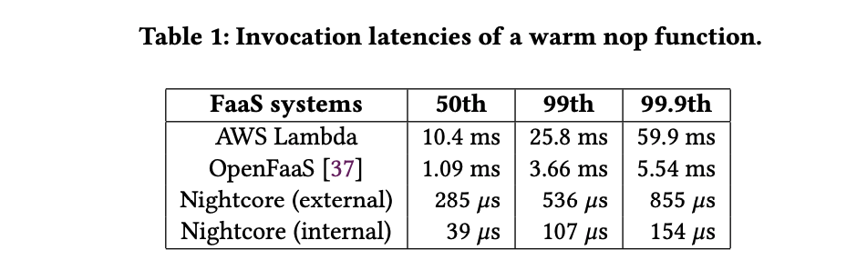
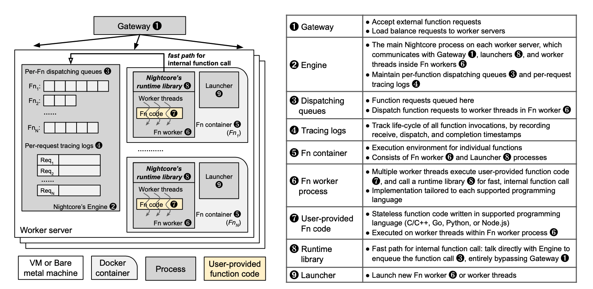
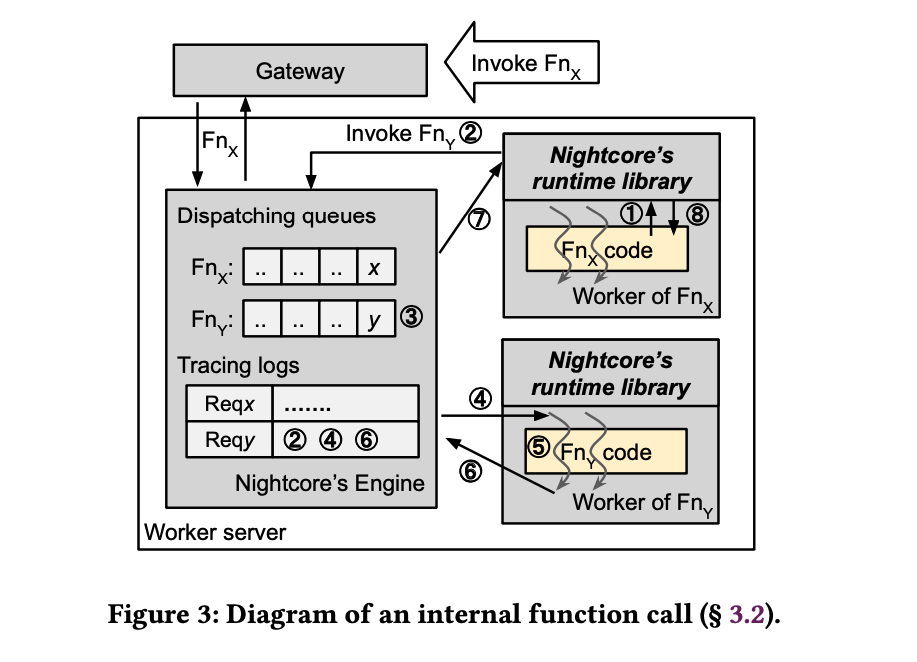
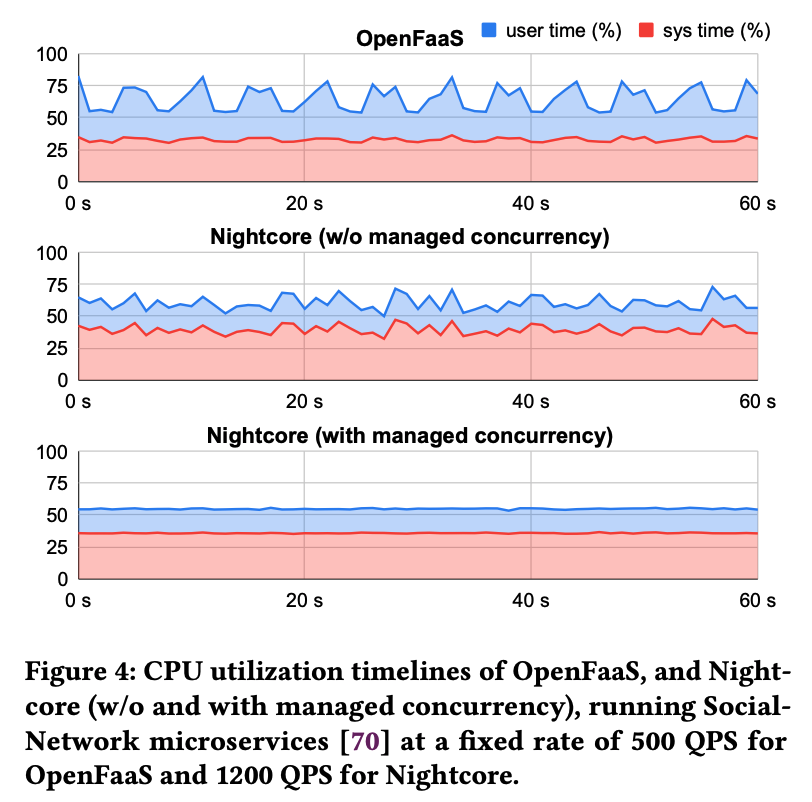
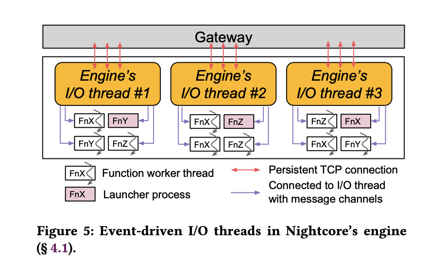
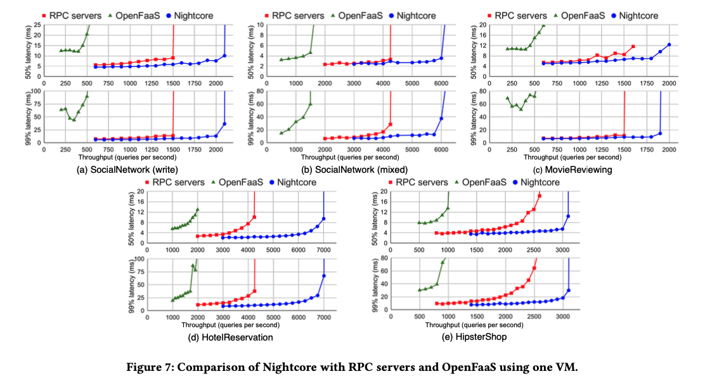
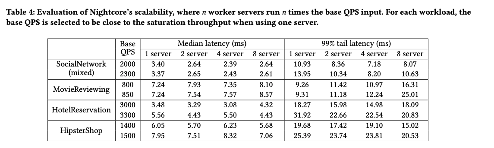
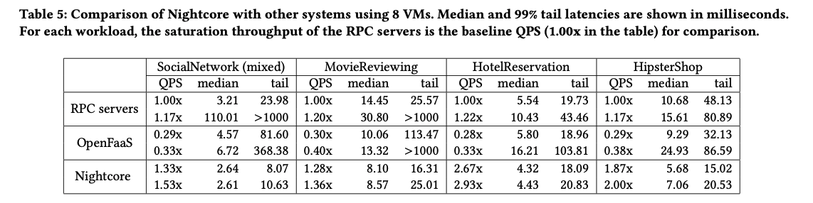

# Nightcore

## Introduction

Serverless 提出的模型使得 FaaS 系统具有较高的调用延迟开销，如下表展示了在排去冷启动影响下调用 nop 函数的延迟：

本文提出了现有 FaaS 系统目前还没达成的两个性能目标：

1. 调用延迟基本小于 100 毫秒；
2. 调用率可以达到 100K/s 的同时 CPU 使用率不高。

早前的一些研究，比如 [Faasm](https://www.usenix.org/conference/atc20/presentation/shillaker)， 通过利用了 software-based fault isolation（SFI），做到了 FaaS 的 runtime 开销达到毫秒规模，但是这个降低了函数间的隔离保证。本文提出的 Nightcore 在做到了类似 OpenFaaS 和 OpenWhisk 一样的容器隔离级别的同时达到上述性能目标。

以目前开源的 FaaS 系统 OpenFaaS 和 OpenWhisk 来举例，尽管数据中心的网络性能在提升，同一个 AWS region 下的两台 VM 的 RTT（round-trip time） 耗时大约在 101 毫秒到 237 毫秒【[1](https://github.com/firecracker-microvm/firecracker/blob/main/docs/network-performance.md)】。因此，Nightcore 提出了使用内部函数调用的办法，Nightcore 将会有链式调用的函数放置在同一台机器上，消除了和 gateway 的通信开销，降低延迟。

使用这种策略意味着大多数通信都是本地的，意味着 IPC 通信必须高效。类似 gRPC 这样的库同样适用 IPC 通信（Unix sockets），但是 gRPC 协议大约带来了额外 10 毫秒的开销【[2](https://dl.acm.org/doi/10.1145/3015146)】。Nightcore 设计了一种自己的 message channels 用来 IPC 通信，它建立在 OS pipes 之上，并且传输固定 1KB 大小的消息，实验证明，Nightcore 的 message channel 发送 1KB 数据需要 3.4 毫秒，而 gRPC 的发送 1Kb 的 payload 需要 13 毫秒。

为了能够支持 100K 每秒的调用，Nightcore engine 使用 Event-based Concurrency，通过较少的系统线程 handle 大量并发 I/O 事件，实验证明大约 4 个 OS 线程就可以 handle 这样的需求。

总的来说，Nightcore，睡一个具有微秒级别开销的 serverless function runtime，同时提供了基于容器的函数间的隔离。Nightcore 的设计仔细考虑了具有微秒级开销的各种因素，包括 function 请求的调度、通信原语、I/O 线程模型和并发函数执行。当运行对延迟敏感的交互式微服务时，Nightcore 实现了 1.36 倍到 2.93 倍的高吞吐量和减少了约 69% 的尾延迟。

## Design

### Architecture

整体的架构可以用下图非常清晰的表述：

强调两点：

1. Nightcore 会尽可能的调度同一个函数在同一台机子上，使其近似于单体设计，同时它还保证了微服务上的逻辑隔离并且运行在不同的机子上，这势必带来整体资源上的不平衡。如果一台机子上的资源占满了，剩下的资源就会退化到跨 server 通信；
2. Engine 是最核心组件，engine 采用事件驱动的思想，通过较少数量的 OS 线程管理上百个 message channels，它还管理着图中标号为 3 和 4 的组件；

### Processing Function Requests

上图描述了函数调用的例子，假设 FnX 调用 FnY，整体流程如下：

1. FnY 通过 runtime library API 调用；
2. runtime library 生成一个 unique ID 并发送 ReqY 给 Engine，Engine 收到后将 recieve timestamp 写入请求 ReqY；
3. ReqY 被放置到 ReqY 的队列中；
4. 当有一个 FnY 的空闲线程时，将 reqY 发送到对应线程，并且记录 dispatch timestamp；
5. 执行函数 FnY；
6. 将结果返回给 engine，engine 记录 completion timestamp；
7. 将输出发送给 FnX；
8. FnX 处理剩余逻辑。

### Managing Concurrency for Function Executions

Nightcore 维护了一个 worker 线程池进行并发执行函数，但是线程池的大小是一个问题。一种明显的解决办法是每当需要就创建一个线程，从而最大化并发度。但是这种方法对于微服务来说是有问题的，一个函数可以被执行多次，这种方法很容易导致服务器超负载。

Nightcore 使用一个自适应的手段管理函数执行数量，保证高并发并防止过载。根据 Little's Law，理想并发度可以估算为平均请求率和平均处理时间的乘积。对于一个注册的函数 Fn，用 𝜆 表述调用率，用 𝑡 表示处理时间，那么并发度就是 𝜆𝑡，用 𝜏 表示。当收到 Fn 的请求时，只有当前 Fn 的并发执行少于 𝜏 时，engine 才会派发该请求，否则，请求排队，等待函数执行完成。

注意这里的“自适应”， 𝜏 是由 𝜆 和 𝑡 计算出来，而这两个值会随着时间发生变化，为了达到预期的并发水平，Nightcore 必须维护一个至少有 𝜏 的线程池，但是 𝜏 的动态性质使其值通常变化迅速，频繁的创建和终止线程是不可行的，为了调节 𝜏 的动态值，Nightcore 允许线程池中超过 𝜏  的线程，但只使用其中的 𝜏，当线程超过 2𝜏 时，终止额外的线程。下图展示了使用了这种方法带来的好处：

## Engine Implementation

下图展示了 Engine 的事件驱动设计：

每个 I/O 线程保持固定数量到网关的持久性 TCP 连接，用于收发请求，message channel 以轮询的方式分配到 I/O 线程，共享数据结构（包括队列和 tracing） 通过 mutex 保护。

**Event-Driven IO Threads**：Nightcore 使用了 [libuv](https://github.com/libuv/libuv)，它是建立在 `epoll` 之上从而实现其事件驱动的设计。 libuv 提供了用于观察 fd 的事件和为这些事件注册 handler 的 API。Engine 的每个 IO 线程都会运行一个 libuv 事件循环，它对 fd 事件进行轮询并执行注册的 handler。

**Message Channels**：Message Channels 由两个 Linux pipe 实现，它们反向相反，从而形成一个全双工连接，同时，当内联有效载荷缓冲区不足以满足函数输入或输出时，共享内存缓冲区被使用。尽管共享内存允许 IPC，但它缺乏一种有效的机制来通知消费者线程何时有数据可用。

Nightcore 对 pipe 和共享内存的使用得到了两方面的好处。它允许消费者通过管道上的阻塞读取得到通知，同时，在传输大型消息有效载荷时，它提供了共享内存的低延迟和高吞吐量。

Nightcore在容器之间挂载一个共享的 tmpfs 目录，以帮助设置 pipe 和共享内存缓冲区。Nightcore 在共享的 tmpfs 中创建了 nameed pipe，允许 worker 进行连接。共享内存缓冲区是通过在 tmpfs 中创建文件来实现的，engine 和 worker 都会用 `MAP_SHARED` 标志对这些文件进行映射。Docker 本身就支持容器之间共享 IPC 命名空间，但对于 Docker 的集群模式来说，这种设置是很困难的。Nightcore 的方法从效果的角度上与 IPC 命名空间是相同的，Linux System V shared memory 内部是由 tmpfs 实现的。

**Computing Concurrency Hints**：为了有效地调节并发函数的执行量，Nightcore Engine 为每个函数维护 𝜆 和 𝑡 。调用率的样本计算 `𝜆 = 1/(连续 Fn 调用之间的间隔)`，而处理时间计算为 `𝑡 = 调度和完成时间戳之间的间隔`，该间隔不包括排队延迟（即接收和调度时间戳之间的间隔）。

## Evaluation

可以用下面三张图展示评测部分，具体细节见论文：

上图为不同场景下函数调用的延迟。

## Reference

1. Firecracker/network-performance.md at master · firecracker-microvm/firecracker. https://github.com/firecracker-microvm/firecracker/blob/main/docs/network-performance.md
2. Luiz Barroso, Mike Marty, David Patterson, and Parthasarathy Ranganathan. 2017. Attack of the Killer Microseconds. Commun. ACM 60, 4 (March 2017), 48ś54. https://doi.org/10.1145/3015146