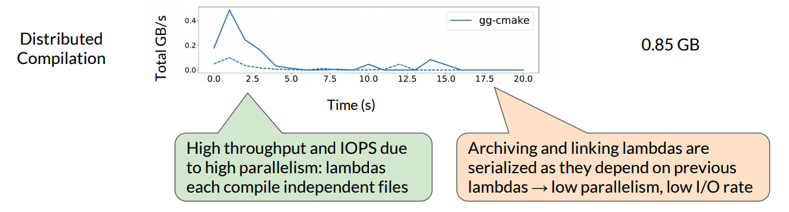
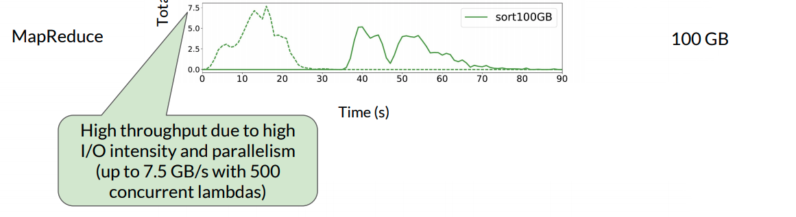
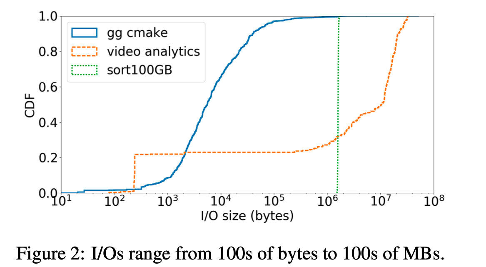
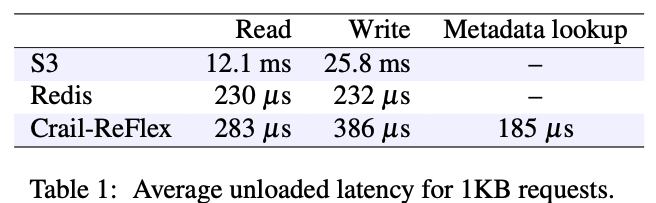
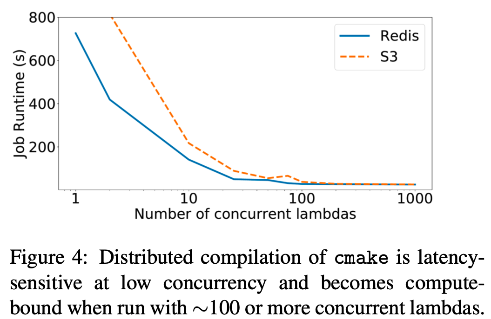
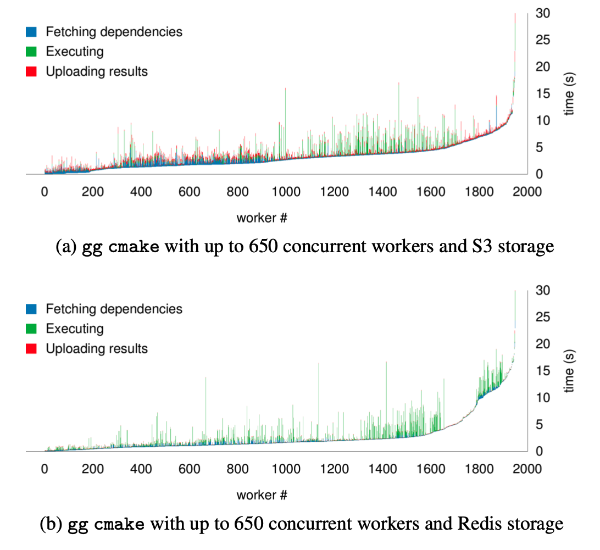
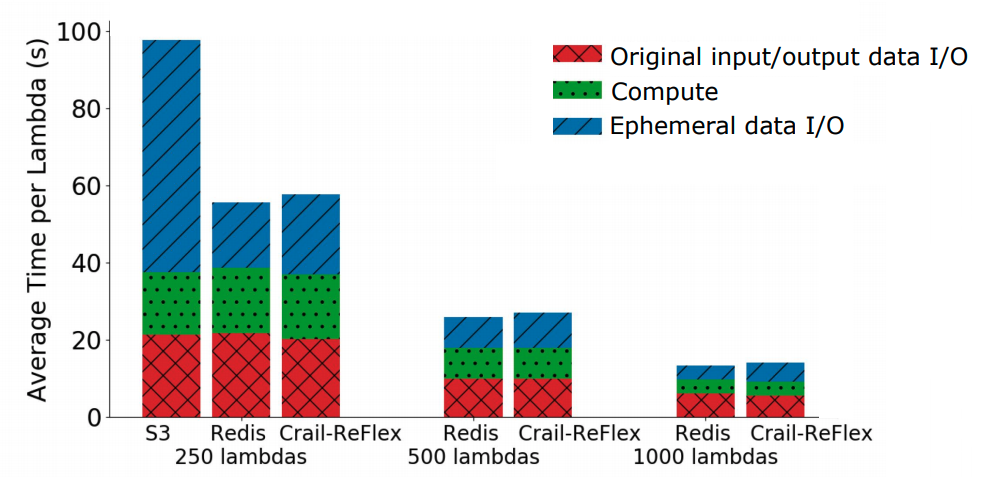
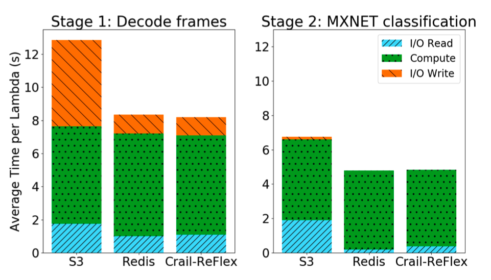
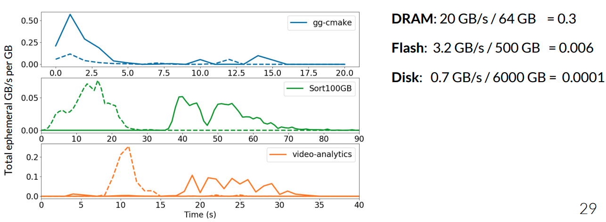

# Understanding Ephemeral Storage for Serverless Analytics

## Review: Why Need Ephemeral Storage

在一些传统的分析框架（例如 Spark，Hadoop）中，缓冲本地存储中的中间数据，并直接通过网络在 task 之间交换数据。相比之下，Serverless computing 要求 task 无状态来实现高弹性和可扩展性。换句话说，task 的本地文件系统和子进程仅限于 task 本身的生命周期。此外，Serverless 平台不公开对 task 的调度和放置控制，因此难以直接在 task 之间进行通信。于是，解决 task 间通信的法是将中间数据存储在**公共的远程存储服务**中，并将这种 task 之间临时数据的存储称为 Ephemeral Storage，**短暂存储**。

有多种存储选择可用于这种临时数据，当然不同选项都提供不同的成本，性能和可扩展性权衡。 像 Amazon S3（Simple Storage Service）这样的对象存储服务提供了按需使用的容量和带宽，虽然它主要用于长期数据存储，但也可用于短暂数据。 而像 Redis 和 Memcached 这样的内存键值对存储以 DRAM 的高成本来提供高性能。

关于临时存储关注三个核心问题：

1. What are the ephemeral I/O characteristics of serverless analytics applications? （Serverless 应用的临时 I/O 有什么特点？）
2. How do applications perform using existing systems (e.g., S3, Redis) for ephemeral I/O? （使用现有系统的效果如何？）
3. What storage media (DRAM, Flash, HDD) satisfies I/O requirements at the lowest cost? （什么存储介质能够以最低的成本满足 I/O 需求？）

## What are the ephemeral I/O characteristics of serverless analytics applications?

为了能够讲清楚这件事，论文研究了三种不同 serverless 应用程序（图中实线和虚线代表不同阶段的 lambda）：

第一种是分布式编译：

- 使用了一个名为 `gg` 的框架来自动合成软件构建系统的依赖树，并协调 lambda 调用以进行分布式编译；
- 每个 lambda 从短暂存储中获取其依赖关系，计算（即根据阶段编译，存档或链接），并写入输出文件；
- 编译阶段 lambda 读取源文件，通常最多10 个KB。 虽然 55％ 的文件只读取一次（由一个 lambda 读取），但其他文件读取数百次（并行读取多个 lambda），例如 `glibc` 库文件；
- Lambdas archive 或 link 读取对象的大小最多10个MB。 使用 `gg` 来编译具有 850MB 短暂数据的`cmake`。

第二种是使用 MapReduce 排序：

- Mapping lambdas 从 S3 获取输入文件并将中间文件写入短暂存储。 Reduce lambdas 从 S3 读取中间数据进行排序，并将输出文件写入 S3；
- 排序是 I/O密集型的。 例如，当使用 500 lambda 排序 100 GB 时，吞吐量最多 7.5 GB/s。 每个中间文件只写入和读取一次，其大小与数据集大小成正比，与 worker 数量成反比。

视频分析：

- 使用 Thousand Island Scanner（THIS）在 lambdas 上运行分布式视频处理；
- 输入是编码视频，分为批次并上传到存储。 第一阶段 lambdas 从短暂存储中读取一批编码视频帧并写回解码视频帧。 然后，每个 lambda 启动第二阶段 lambda，其从存储中读取一组解码帧，计算 MXNET 深度学习分类算法并输出分类结果。 总的存储容量为 6 GB。

下图展示了这三种应用程序 100 秒的时间里 I/O 的变化：

因此，一个**临时存储系统应该能够支持高吞吐量以及低延迟**。

## How do applications perform using existing systems for ephemeral I/O? 

为了搞清楚现有系统的表现情况，论文使用了三种不同类型的存储系统来分析应用程序性能：

- 基于磁盘的托管对象存储服务（Amazon S3）
- 基于内存的键值存储（ElastiCache Redis）
- 基于 Flash 的分布式存储系统（带有 ReFlex Flash 后端的 Apache Crail ）

下图显示了这三种存储系统的延迟：

### Latency Sensitivity

对延迟敏感的任务来说，三种应用程序中，只有 `gg` 显示对存储延迟的一些敏感性，因为访问的大多数文件都低于 100 KB。下图展现了实验结果，在任务相同并发数相同的前提下，runtime 越高，意味着延迟越高。实验结果表明， 与 S3 相比，Redis 存储的延迟更低，最多可达 100 个并发 lambda。但是随着增加并发性，S3 和 Redis 会收敛，因为作业最终会受到 AWS Lambda 的计算限制。

### The impact of application parallelism

虽然 serverless 平台允许用户通过启动许多并发 lambda 来利用高应用程序并行性，但是有些作业天然就带有并发数的限制（例如，由于 lambda 之间的依赖性），因此这些作业可能遇到的是 lambda 资源瓶颈（例如，内存，计算，网络带宽）而不是存储瓶颈。还是以 `gg cmake` 作为例子，构建过程的第一阶段具有高并行性，因为每个文件都可以独立地进行预处理，编译和组装。但是，后续 archive 和 link 文件的 lambda 取决于早期阶段的输出。

下图展示了并发度最高为 650 的 lambda 执行作业时的表现，横坐标表示已经执行的 lambda 数量（因此后续的 lambda 执行时间不断上升，因为后续的 lambda 需要等待前面的 lambda 执行完以后才能开始执行）：

使用 Redis 和使用 S3 相比，能将 lambda 在 I/O 上花费的平均时间从 51％ 减少到 11％。但是，无论存储系统如何，作业大约需要 30 秒才能完成。**这是因为瓶颈主要在于数据依赖**。

### High I/O intensity

I/O 密集型的应用程序，以 MapReduce 排序和视频分析作为实验对象，首先是 MapReduce Sorting，它对 I/O 的要求比较高：

由图得到几个结论：

* S3 吞吐量一般，并发数为 500 和 1000 的时候没有 S3 是因为那个并发量下 S3 直接报错；
* 而 Flash 和 DRAM 的性能差不多。

然后是对 CPU 和 I/O 要求都高的视频分析：

可以得到和 MapReduce 类似的结论。

### What storage media satisfies I/O requirements at the lowest cost?

最后论文分析了不同的应用程序应该选哪种类型的介质存储，它通过一个比例模型 `Throughout/Capacity` 来计算 DRAM，Flash 和 DISK 的比率，再将三种应用做同样的计算，然后进行比较：

可以看到，排序应用程序适合用于基于 Flash 的短暂存储。 gg-cmake 和视频分析工作更适合 DRAM。

## Putting it All Together...

将之前的全部实验内容整合起来，可以得到以下结论：

* Ephemeral storage wishlist for serverless analytics:
  *  High throughput and IOPS;
  * Low latency, particularly important for small requests;
  * Fine-grain, elastic scaling to adapt to elastic application load;
  * Automatic rightsizing of resource allocations;
  * Low cost, pay-what-you-use;
* Existing systems provide some but not all of these properties.

## Summary

* Our analysis motivates the design of an ephemeral storage service that supports automatic, fine-grain storage capacity and throughput allocation
* Ephemeral I/O requirements depend on a job’s latency sensitivity, inherent parallelism and its I/O vs. compute intensity
* Flash is an appealing storage media for ephemeral I/O performance-cost requirements

