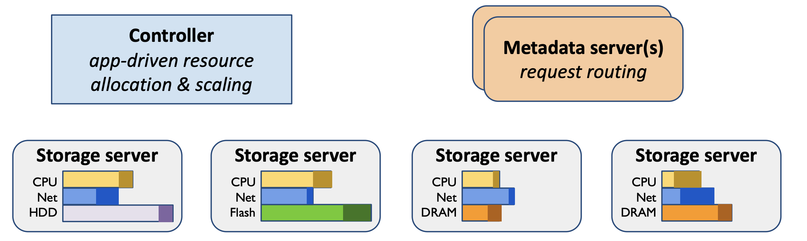
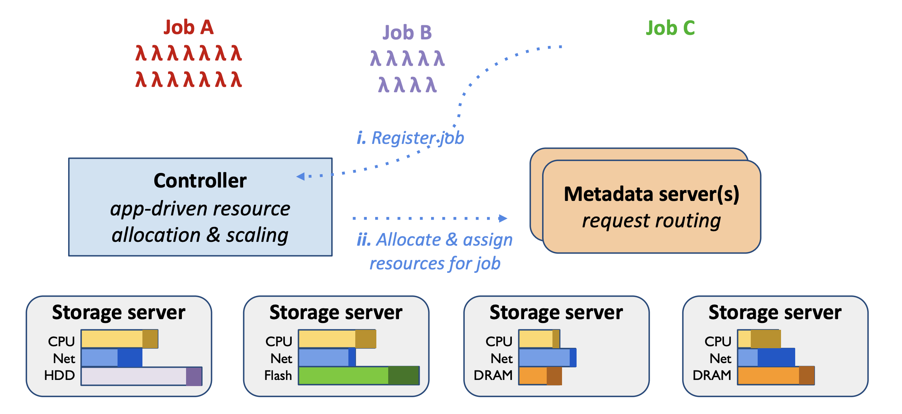
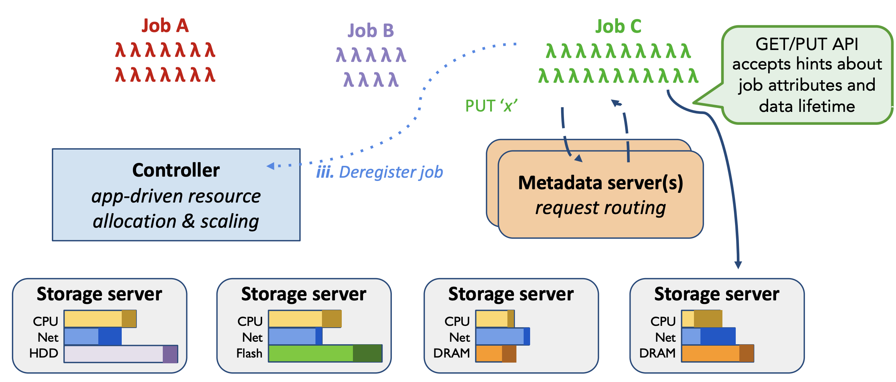
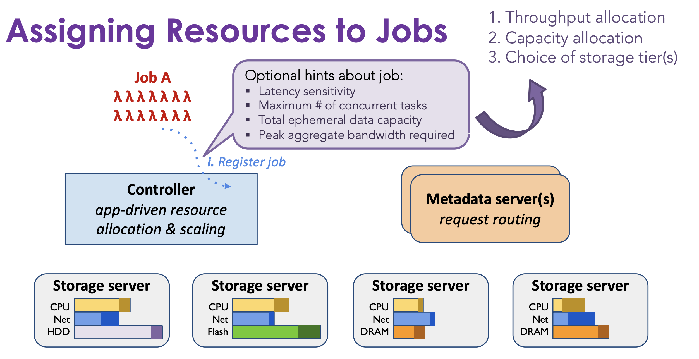
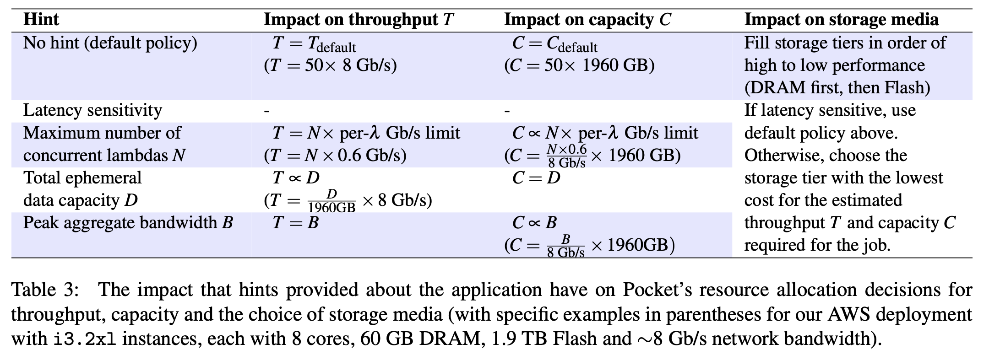
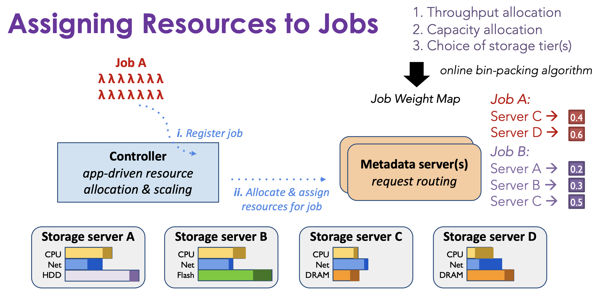
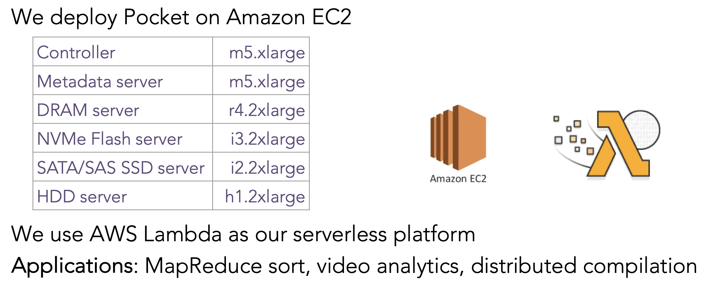
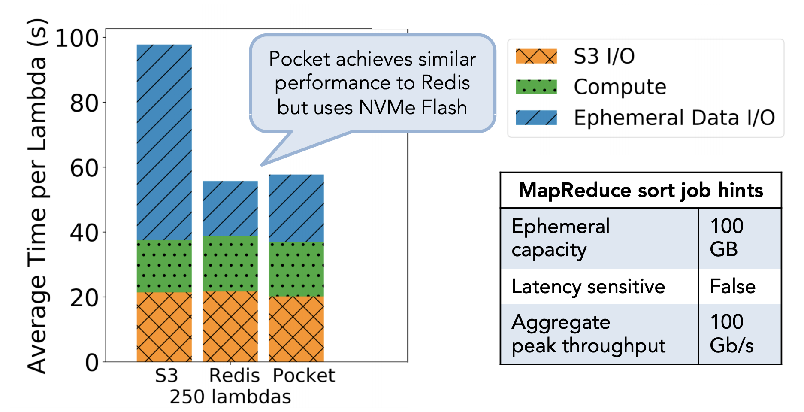
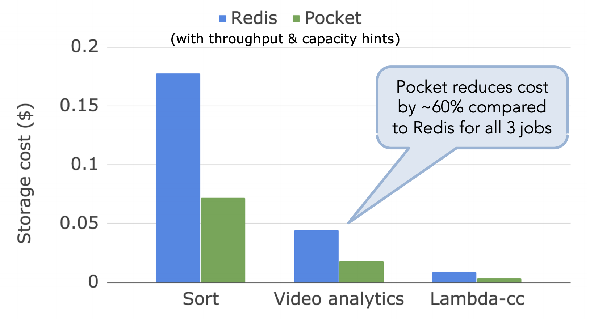
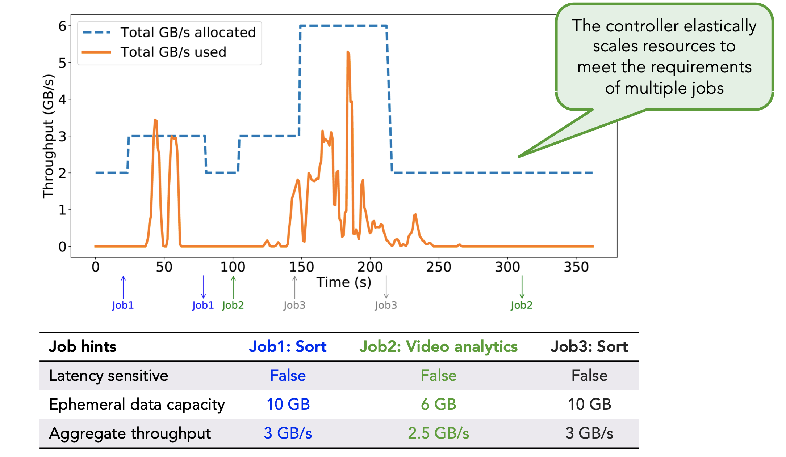

# Pocket: Elastic Ephemeral Storage for Serverless Analytics

## Background

在 [**Understanding Ephemeral Storage for Serverless Analytics**](lab.md) 中，我们已经具体分析了期望的 serverless ephemeral 属性，现在具体分析一下：

* 首先，要**针对各种大小的 Object 都能提供高性能**：在之前的实验中已经看到，使用 500 lambda 排序 100 GB 需要高达 7.5GB/s 的吞吐量，而类似 `gg cmake` 则涉及大量的小 Object 的访问，因此低延迟很重要。总之，Ephemeral Storage 需要具备高吞吐量，低延迟；
* **低成本**：低成本代表需要提供细粒度的用户收费。Serverless 可能会并发启动数千个短期任务，负载又可能在短时间消散，Ephemeral Storage 必须能够针对这种情况 autoscaling，既满足需求又能够降低成本。另外，在前面的实验中已经看到，不同类型的应用适用不同的存储媒介，因此为不同的应用选择一个合适的存储媒介也是重要的，同样能够提高性能和降低成本；
* **~~容错~~**：最后，考虑一下容错在 Ephemeral Storage System 中的必要性，短暂数据仅在作业执行期间有价值，并且可以轻松地重新生成。*因此，它不必像传统存储系统那样提供高容错性*。

这篇论文提出了 Pocket，具有以下几个特点：

* 一个弹性的分布式数据存储，用于短暂数据共享；
* Pocket 通过以下方式实现高性能和高成本效益：
  * 利用多种存储技术；
  * 对应用程序的资源分配进行适当调整（如何分配，存储媒介是什么）；
  * 根据使用情况自动缩放集群中的存储资源。

论文表明使用 Pocket 可以达到和 Redis 相当的性能并且能够节省大约 60% 的成本。

## Pocket Architecture

Pocket 的设计如下图：

Pocket 由一个 Controller，一个或多个 Metadata Server 和多个数据平面 Storage Server 组成（彩色条显示集群中所有作业的已使用和已分配资源）。

Controller 为作业分配存储资源，并随着作业数量及其要求随时间变化动态扩展 Metadata Server 和 Storage Server。 Controller 还为作业做 Data placement 的决定。Metadata Server 通过将客户端请求引导到适当的 Storage Server 来进行数据放置。 

通过将它们分成三个切面的单位资源，Pocket 可以根据不同的 bottleneck 的情况进行 autoscaling。

### Using Pocket

下面来看一下如何使用 Pocket：

为了使用 Pocket，一个 Job 首先要注册一个 job，Controller 会为这个 Job 分配相应的资源，这一部分分配的逻辑会在后文介绍。Controller 会将这个信息（包括 Storage Server 的 ip 地址， 存储的放置策略，）告诉给 Metadata Server，后续 Metadata Server 负责引导客户端进行数据存储。

注册完成后，Job 将启动 lambda：

Lambda 首先连接到其分配的 Metadata Server，这个 IP 地址由 job 注册时的 Controller 提供的。 Lambda 客户端通过联系  Metadata Server 获得 Storage Server 的 IP 地址和块地址来写入数据。 

默认情况下，当 Job 完成后，Job 会向 Controller 发起一个取消注册的信息，Controller 就会释放 Pocket 资源。

### Assigning Resources to Jobs

前文介绍了，Controller 注册 Job 的时候，会为这个 Job 分配相应的资源，一个重要的内容是如何适当的预估分配多少资源。Register Job 的时候有一个可选的参数 hint，它标记了关于这个 Job 的一些特点，比如是否延迟敏感，最大任务并发数，中间数据容量的需求，以及带宽需求。Controller 就会根据这些 hint 决定关于吞吐量的分配，容量的分配以及存储介质的选择：

一个关于这部分分配策略详细的内容如下表：

Controller 再根据得到的放置策略决策，根据 online bin-packing 算法确定一个具体的 Job Weight Map，它是一个数据存储分配表（0～1），用来表示放在该 storage server 上的数据集的比例。如果 storage server 分配了 1 的权重，它将存储 job 的所有数据。

### Autoscaling the Pocket Cluster

Pocket 使用策略自动扩展群集，该策略旨在维护目标范围内每种资源类型（CPU，网络带宽和每个存储层的容量）的总体利用率。可以为每种资源类型单独配置目标利用率范围，并为 Metadata Server，Storage Server 单独管理。

由于短暂的数据对象只能存活数十到数百秒，因此在添加或删除节点时迁移此数据以重新分配负载会产生很高的开销。 相反，Pocket 专注于在加入集群的处于活跃状态下的新存储服务器上进行的数据转向。 Pocket 通过为每个 Job Weight Map 分配特定权重来控制数据转向。 为了平衡负载，Controller 会为未充分利用的 Storage Server 分配更高的权重。

## Evaluation

参数如下图：

对于 MapReduce 作业而言，可以看到性能基本和 Redis 一致：

而在成本方面，Pocket 节约达 60%：

最后，Pocket 在 autoscaling 方面证明了有较好的表现：

## Conclusion

Pocket is a distributed ephemeral storage system that:

* Leverages multiple storage technologies
* Rightsizes resource allocations for applications
* Autoscales storage cluster resources based on usage

