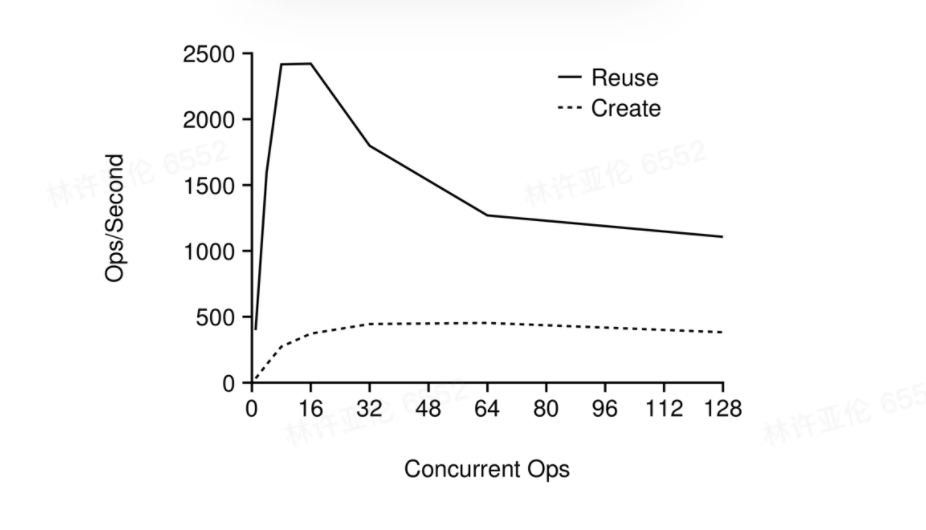

# Serverless —— 与性能为敌

>  贾家三兄弟自从拜在姚拨贡名下，便把这孟老夫子置之脑后					   --《文明小史 第十四回》

Serverless 已经成为当代软件体系结构世界中的热门话题，其计算模型重新定义了组织开发，部署和管理云原生应用程序。Serverless 模型的特点隐藏了各种分布式系统场景下的复杂情况，做出的妥协却是各种方面的性能问题，这使得一方面 Serverless 简洁的模型吸引了广大的开发者，另一方面又因为 Serverless 高昂的开销而无法完全采纳。

本文将向各位介绍的是：

- What is Serverless；
- One Step Forward, Two Steps Back；
- Related Work。

## What is Serverless

2009 年，云计算兴起之际，“A Berkeley View of Cloud Computing” 的论文就阐述了云计算所拥有的潜在优势，其中包括：

- 理论上无限的计算资源；
- 用户不需要担心服务器的运维负担
- 服务的按需付费，整体成本的降低
- 通过可视化资源管理降低服务运维操作难度
- 物理硬件资源利用率的大大提高

从 2009 年至今，文章所论述的大部分优势都已确实成为现实，然而后面两点优势仍未完全体现，抛开实际的诞生初衷不谈，我们仅从学术的角度，或者从历史的进程来看，可以认为，Serverless 的出现的契机之一就是为了解决上述挑战。

什么是 Serverless Computing，简单的说，可以用下面这句话定义：

***Serverless computing is a programming abstraction that enables users to upload programs, run them at any scale, and pay only for resources used.***

目前市场上有很多 FaaS 的平台，包括 AWS Lambda，Google Cloud Functions，OpenWhisk，Azure Functions，Alibaba Functions，同时包括一些开源的平台，比如 OpenWhisk，KNative，Fission，Kubeless，还有最近一个新的开源 FaaS 平台 OpenFunction 等。它们都有一个共同的高级抽象，你在平台上注册一些 function，这些 function 都是**无状态**的，数据来源于用户输入或者 BaaS，然后启用相关的触发器，接下来，function 的 **autoscalling** 你是无感的，你只需要**按需付费**，函数计算完成后，数据再返回给用户或者持久化到 BaaS 上。

那么这样的一个模型适用哪些场景？无状态和 autoscaling 意味着 serverless 适合执行一些并行任务，类似 ETL 这样的任务，我不需要任何协调，任务都是并行的，输出只取决于输入，完全幂等，那我们可以认为这样的模型是完美契合 serverless 的。

Serverless 其实还具有一个隐性的特点，那就是流程驱动的，这意味着它非常适合工作流编排，，下图是 Amazon AWS 中 Autodesk 的工作流示例，大约有 24 个 Lambda 函数调用，12 个 API 网关调用，8 个数据库访问和 7 个 SNS（Simple Notification Service） 通知。Lambda 在这里的作用是协调这些任务。

-20210821191036773.(null))

根据 AWS 网站的介绍，同样的功能正常的开发团队需要花费 2 周，而 Lambda 把它缩短到了 10 分钟。当然这个过分夸大了，但是很明显，Lambda 在处理这类工作负载的时候具有很大的优势。

## One Step Forward, Two Steps Back

我们概括一下从技术上来说， Serverless 具有的特点：

- Stateless；
- Autoscaling。

问题是，如果我们讨论的不是并行数据处理或者工作流程编排，很快就会陷入困境。

回到 Serverless，Serverless 的缺陷是啥？

- **标准通信模式下的高昂代价**。Serverless 供应商目前都不支持函数间直接通信， 这主要是为了能够方便云厂商自由的进行函数迁移以实现负载均衡，也能够帮助云厂商更好的处理容错。例如，我们不能仅仅打开一个端口并开始发送和接收消息，就像部署 Web 服务器时所做的那样。但是随之而来的代价就是函数间通信成本高；

- IO **是一个瓶颈**。例如，S3 提供了相当大的带宽，但是如果使用 Lambda，并且想利用 S3 的带宽，则必须启动大量 Lambda Function。问题是即使能够获得该带宽，延迟通常也将成为另一个问题，因为如果用户处理的是延时敏感的工作，则从 Lambda 到 S3 的延迟对于一些有超低延迟需求的应用程序是不可接受的。

AWS Lambda 宣称一切皆是 lambda，函数没有任何副作用，且完全无状态。问题是现实完全不是如此，**实际的应用确实需要共享状态**，并且以多种方式去共享状态。比如说函数组合，`f(g(x))`，想要在 AWS 实现它，需要经过一个存储系统；第二种情况是消息传递，比如说构建一个共识协议，或者构建一些实时流的应用程序，它们都会被要求低延迟的消息传递，由于没有网络连接，消息传递都无法执行，这类应用程序是很难在 AWS Lambda 上构建的；第三个是修改共享状态，假设有一个数据库，并且有一堆 lambda 同时要访问数据库，读取或者写入这个这个数据库的某个数据，那么你就必须要担心你的一致性模型是什么，它的性能如何？

这三个问题看起来都不难，但是在如今 FaaS 基础架构下进行操作，这个问题变得非常困难，归根结底在于目前的 FaaS 就不适合执行这几种任务。

接下来我们看一个量化的数据，去更清楚的描述这个问题：

一个例子：我们要“查询一个用户的观看历史记录并预测他接下来的观看内容”，这是一个很简单的 function，可以用 `f(g(x))` 简单表示。AWS Lambda，作为一个一流的解决方案，它没有很自然的把这两个函数连接在一起，而是必须将第一个函数的结果写入 DynamoDB 或是 S3 之类的 BaaS 中，然后第二个函数从 DynamoDB 或者 S3 之间读取结果，进行计算并返回给用户。

-20210821191035578.(null))

可以看到，真的贼慢。如上图，Lambda 加 S3 和 Lambda 加 DynamoDB 的延迟都高达 200 毫秒，高延迟的背后意味着慢存储。解决办法之一自然是我直接把第二个 function 直接硬编码到第一个中，这就消除了通过存储的延迟带来的损失，这显然从软件工程的思想上来说并不好，但是如上图所示，延迟变得好了许多，但是仍然有点慢，80 毫秒左右。最后一个，AWS Step Fns 专门用来负责编排服务的，但是它的表现反而更糟，达到 500 ms 以上。需要知道的是，同样的函数本地运行，可能只要几毫秒，要比上面这些服务快几个数量级。运行 lambda **需要付出相当可观的性能损失**。

除了通信和存储的问题，Serverless 还有一个先天性疾病，**冷启动****过长。**

Serverless 的一个关键问题是冷启动，为了更好的调度资源以及保证函数间的隔离性，现有云厂商的做法一般为当一个新的请求来临时，云厂商根据配置需求启动一个新的容器，部署函数，等服务完全准备好后，响应请求，该阶段称为**冷启动****阶段**。当请求处理完成后，容器不会马上被终止，后续请求到来时直接由该容器服务处理，该阶段称为热启动阶段。

对于简单的函数而言， 冷启动的代价甚至比函数自己执行的时间还要高的多，以 Nodejs 构建的函数为例，在 AWS Lambda 平台上，一 个 128MB 内存的函数冷启动平均时间为 265 毫秒。在 Azure Functions 平台上，50% 的函数平均执行时间不超过 1 秒，75% 的函数最大执行时间不超过 10 秒，因此，冷启动开销是一个不可忽视的问题，**加速****冷启动****是至关重要的**。 

减少冷启动代价另一种折中的办法就是尽可能考虑减少冷启动阶段的次数，即**保持函数的存活**。大部分主流 FaaS 平台 Keep-alive 时间大约在 30 min，但是这实际上是一个拍脑袋来的数字，并没有太多的数据支撑，所以 Keep-alive 实际上是一个表面简单实际很难的问题。如果有一个平台在启动一个函数后永不 kill 它，那么这个平台也不需要考虑加速冷启动了（解决冷启动问题的终极方案找到了）。

可以看到，Serverless 的诸多问题本质上是性能问题，这个问题是多年来分布式系统研究的最关键问题，在不给用户 surprise 的前提下尽可能提升性能，而 Serverless 选择直接忽视它。几大云厂商自从拜在 Serverless 名下，便把这性能问题置之脑后。因此，这些年来，我们可以在各种的操作系统会议上见到关于 Serverless 的论文，大家希望能够在保证模型简单的同时尽可能提升性能。

## Related Work

目前，对于 serverless 的性能优化方案多种多样，本节将回介绍一些 serverless 的相关工作。

### 建立函数资源池

对于云厂商来说，让用户感觉不到冷启动一个最简单的想法是弄一个容器池，其中放置一些处于 running 状态的容器。

容器池的做法并没有真正解决冷启动问题，只是从用户的角度隐藏了创建容器的开销，这意味着厂商必须准备好一些已经启动的容器，来为随时可能到来的请求服务。

维持一个容器池的做法带来的问题是 FaaS 需要长期维持一个容器池，带来难以估计资源浪费。 一个函数可能一个月才跑一次，但是为了让用户感知不到冷启动问题，厂商整整一个月都让容器处于 running 状态，还不收你钱。这是不切实际的。

### 替换 Runtime

减少冷启动的一种方式可以是替换启动函数的 runtime，不少论文直接使用进程来替换 container，这是降低了隔离性的保证来兑换更高的性能。

一些工作不希望在隔离性上作妥协，而是转而将目光转向一些更轻量级同时又有安全性保证的虚拟化技术，比如说基于 wasm 和 unikernel 构建的 function。

以 unikernel 为例子，Unikernel 是专用的，单地址空间的，使用 library OS 构建出来的镜像。它没有用户空间与内核空间之分，只有一个连续的地址空间。这样使得 Unikernel 中只能运行一个应用，而且对于运行的应用而言，没有硬件抽象可言，所有的逻辑，包括应用逻辑和操作硬件的逻辑，都在一个地址空间中。那这样有啥好呢，为啥要放弃 Linux 而去使用这么一个看上去像是阉割版的内核呢？好处就在：

- 小：一个镜像才几百 KB；
- 快：因为足够小，启动它只需要几毫秒；
- 安全：没有什么多余的东西，没什么攻击的空间。

Unikernel 目前并不成熟，但是相关研究一直不少，比如说 Eurosys'21 最佳论文是 Unikraft，它就是一个帮助用户非常方便构建 unikernel 应用的工具，而随着不少公司采用一些专用的 runtime 和对应的 sandbox 系统来专门运行 FaaS 中的 function（比方说 AWS 的 Firecracker，蚂蚁金服的 Catalyzer），我们或许很快就会看到一个基于 unikernel 作为 runtime 的 Serverless 平台。

### SOCK: Rapid task provisioning with serverless-optimized containers 

一种比较自然的优化手段就是优化冷启动操作，SOCK 是 USENIXATC'18 的一篇论文，它的一项工作就是优化了容器创建时间。 

以 python 为例子，创建一个容器需要花费的时间如下：

)

如上图，我们可以看到，创建一个 docker container 需要花费的时间大约是 400ms，那么这 400ms 都是由哪些部分构成的？怎么去优化它？能否使用更轻量级的 isolation 原语，降低创建 container 的开销呢？

要创建一个容器，最重要的是：**一个专属的文件系统，一个自己的独立空间**。

从文件系统角度的考虑来说，Docker 采用的 AUFS 这种联合挂载，将不同目录挂载到同一个目录下面，只有最上层是可读可写，下层都是只读层。而论文选取了另一种指令，`mount -o bind`。它的作用是将当前文件系统的一个文件/目录挂载在另一个目录下。相同并发数操作下内，Bind 相比 AUFS 的效率要高上许多，如下图。而考虑到在 severless 场景，handlers 可能仅依赖于一个或少量的基础镜像，所以 union 文件系统的弹性叠加特性并不是必须的，倾向于使用开销更小的 bind 挂载方式。因此 SOCK 使用 bind 来替代 AUFS。

-20210821191035677.(null))

从独立空间考虑的角度来说，实际上考虑的就是 namespaces（包括 Mount，Network，User，UTS，IPC，PID，Cgroup）。SOCK 分析了各个 namespace，并且进行了性能评测找到了其中几个影响比较大的 namespace。

首先是 mount namespace，mount 的主要作用就是切换根目录并不访问其他主机文件数据。下图展示了已有 mount namespace 的数量对新创建以及删除 namesapce 的影响。

-20210821191035762.(null))

随系统已有 namespace 数量增加，ops 趋近于0，可以看到 mount namespace 的扩展性差。而在 Linux 上，还有一种修改容器文件系统的指令，叫做 `chroot`，它可以针对某个进程，使用指定目录作为新的根目录，在新根下访问不到旧系统的根目录结构和文件，而 `chroot` 带来的开销几乎可以忽略不计，整个过程延迟都小于 1 微秒，因此，SOCK 使用 `chroot` 来替换 mount namespace。

再看一下其他类型的 namespace，，下图展示了几个比较关键的性能开销：

-20210821191035310.(null))

可以看到，这里 net namespace 的创建和销毁开销最大，主要是因为不同 net ns 间共享了一把全局锁。创建时，Linux 需要持有这把全局锁，然后遍历已有的 net ns。所以，系统已有的 net ns 越多，开销越大。销毁时，net ns 还需要等待一个 RCU（Read-Copy Update，一种同步机制），理论上会更慢。但是这里的实验使用了 batch 操作，所以平摊后的开销反而较小。

既然这个 net nampespace 影响这么大，SOCK 就继续做了一些测量工作，如下图，无任何优化时的吞吐是 200c/s (containers/second)。通过disable IPv6 以及移除比较耗时的广播逻辑，吞吐可达400c/s；如果完全不使用 net ns，吞吐可达900c/s。

-20210821191036117.(null))

由于 Serverless 平台跑的并非后端服务，端口静态绑定并非是必选项，我只要可以进程间通信就可以了，而跨节点的通信交给其他服务来维护，所以 net namespace 就可以直接不使用了。

最后，Cgroup 为容器提供了资源隔离，目前 Docker 采用的是直接 create Cgroup 资源，但是 Cgroup 是可以复用的，如下图，reuse 比 create 性能要好很多，因此，SOCK 就使用了 Cgroup reuse 来替换 Cgroup create。

总结一下，SOCK 干的事情实际上就是把那些对用户来说更灵活，更昂贵的开销都干掉，而使用更简单，更 cheap 的机制作为替代，从而达到降低冷启动的效果（总体大约达到了 18 倍的优化）。

### Serverless in the Wild: Characterizing and Optimizing the Serverless Workload at a Large Cloud Provider 

降低冷启动的方式除了减少冷启动的时间，一个变相的方法是减少冷启动发生的次数，即通过增加每个函数的 warm start 的次数来减少总体冷启动的平均开销。但是这里面存在一个至关重要的问题，keep alive 该设置多长？

来看 USENIXATC'20 中 Azure 团队的工作，他们收集并观察运行在平台上的函数，数据来源自整个 Azure FaaS 大约两周的数据，并通过这些数据来帮助他们决策 keep alive 的时间。**简单地说，他们为每个函数都制定了一个 pre-warming 和 keep-alive 的时间，每个函数能够在合适的时机卸载和预启动，从而减少每个函数的****冷启动****的次数。**但是这其实是一件非常困难的事，Azure 团队观察到两点：

- 绝大多数应用程序的调用频率很低，81% 的应用程序平均每分钟最多调用一次。同时，只有不到 20% 的应用程序对 99.6%的调用负责。因此，就内存占用而言，让那些不经常被调用的应用程序 keep alive 时间很长肯定非常不划算；

- 其次，许多 function 的 IAT（Interval Arrive Time）变化性很大，其中 40% 的 IAT 的 CV 值（CV 为标准偏差除以平均值）高于 1，因此预测下一次调用的任务很难，特别是对于不经常调用的应用程序。

来看看他们的思路。假设我们拍脑袋一想，将 keep alive 设置为 10 分钟，下面这种调用情况可以让它一直保持 warm

-20210821191035743.(null))

但是如果调用周期刚好是 11 分钟的周期，那么这种方法每次都调用都会有冷启动。

对此，他们提出了一个混合直方图策略，这个策略定义了两个窗口：

- Pre-warming window：自上次调用后，策略期待下一次调用的等待时间；

- Keep-alive window：函数被创建后，存活的时间。

混合直方图策略的宏观思想是，每个 function，都有一个自己的 pre-warming window 和 keep-alive window。**当一个函数被调用后，立即卸载这个函数**。然后，根据 pre-warming window 的时间等待一段时间后启动这个函数，然后这个函数处于一直等待调用的状态，直到等待时间超过 keep-alive window 或者函数被调用。

举个例子，如下图：

-20210821191035886.(null))

- 顶部的情况为 pre-warm 为 0，函数调用后，函数不被卸载，继续保持，因此后续调用都是 warm start；

- 中间为一个理想的情况，在经过 pre-warm 这段时间后，函数被启动，然后这中间发生了调用，是一次 warm-start，函数执行完后被卸载，同时开始新的 pre-warm 计数；

- 底部为一个反面例子，函数在 pre-warm 期间发生了调用，是一次冷启动。函数执行完后重新开始计时 pre-warm，然后 keep-alive。keep-alive 期间没有发生调用，函数被卸载，重新进入 pre-warm 计时，但是此处又发生了调用，再次触发冷启动。

那么这两个 window 是怎么得到的呢？实际上论文是一种混合策略，包含了各种 corner case，但是这里只针对核心 general 的部分。

-20210821191035955.(null))

如图，根据每次调用的间隔，生成一个直方图，然后其中 5% 的部分，计算所得时间为 pre-warm，而 99% 的时间则计算为 keep-alive。

### FaasCache: Keeping Serverless Computing Alive with Greedy-Dual Caching

Keep-alive 方面还有一项很有意思的工作，FaasCache 是 ASPLOS'21 的一篇论文，它把 keep-alive 的问题等价于这个 OS 中的 Caching，从而提出了一种 Greedy-Dual keep-alive 策略减少冷启动的开销。

对于用户启动一个 function，哪些指标是重要的呢？

1. **Initialization Time**：初始化时间根据函数的代码和数据依赖性而变化，一个 ML 的函数可能需要几秒钟的初始化；
2. **Total Running Time**：总运行时间包括初始化时间和实际函数执行时间，实际函数执行时间变化范围很大，从几毫秒到几秒都有可能；
3. **Resource Footprint**：包括 CPU，内存和 I/O 使用，不同类型的应用变化很大；
4. **Frequency**：一些函数一秒可能被调用几次，一些函数可能偶尔才调用。

这篇论文的一大亮点在于它证明了 “keeping functions alive is equivalent to keeping objects in a cache”：

- **保持函数存活可以减少函数响应延迟** 等价于 **将一个对象缓存后可以减少访问延迟**；

- **当所有服务器资源都占满了，驱逐哪一个 alive 的函数** 等价于 **从 cache 中驱逐哪一个对象**。

基于上述证明，它的 keep-alive 策略是一个基于 GDFS 设计的算法，它的核心思想是只要服务器资源够，进程中的函数资源尽可能的保持 warm，这其实和之前那些 FaaS 的做法是截然不同的，恒定时间的keep-alive 策略意味着即使有当前机子上有资源可以让它们存活更长时间，也会被干掉。而 Greedy-Dual Keep-Alive Policy 更多是作为一种驱逐策略，如果要启动一个新的容器，并且没有足够的资源可用，那么我们要终止哪个容器。显然，容器的总数（warm + running）受服务器物理资源（CPU 和内存）限制，**这篇论文就根据函数****冷启动****的开销和资源占用情况为每一个容器计算一个优先级，并终止优先级最低的容器**。

对于每一个容器，它都有一个自己的 keep-alive 优先级，主要基于函数调用频率，运行时间，函数大小：

-20210821191036055.(null))

当一个 Warm 函数被重用了，就相当于发生了一次 “cache hit”，接下来将解释这几个参数的含义：

- **Clock**：Clock 用来记录函数的实效性，每个 server 会维护一个逻辑时钟，在每次发生驱逐时更新。每次一个容器被使用的时候，它的 Clock 就会被更新，因此，最近没有使用的容器会有较小的 Clock。当没有足够资源启动新的容器，现有的 warm 容器无法被使用时，一个容器就会被终止。如果一个容器 J 被终止了，那么 J 一定是最小优先级，那么 Clock = Priority J，此后被使用的容器在更新自身 Clcok 值时就会使用改值；

- **Frequency**：Frequency 是指一个给定函数被调用的次数。一个函数可以被多个容器执行，Frequency 表示其所有容器中函数调用的总次数。当一个函数的所有容器被终止时，Frequency 被设置为零。优先级与频率成正比，因此，更频繁执行的函数会保持更长的时间；

- **Cost**：Cost 代表终止成本，它等于总的初始化时间，这体现了保持容器 alive 的好处以及冷启动的成本。因此，优先级和初始化开销成正比；

- **Size**：Size 是容器的 resource footprint，在大多数情况下，可以运行的容器数量受物理内存可用性的限制，因为 CPU 很容易被复用但是内存交换会导致严重的性能下降，因此这里的 Size 考虑的是容器内存的使用。

### Pocket: Elastic Ephemeral Storage for Serverless Analytics

 一些研究人员则将目光转向了 BaaS 上，Serverless 函数间生成的中间数据具有**高临时性，吞吐量，低延迟，成本效益高**的需求 ，而现有的数据库性能无法 很好的满足以上特性。Pocket 是一个专门针对 Serverless 临时数据存储所设计 的一个数据库系统，它能利用多种存储技术，使其面对不同应用程序的资源分配进行适当调整，并具备动态扩缩容存储资源的能力。Pocket 的设计如下图：

-20210821191036139.(null))

Pocket 由一个 Controller，一个或多个 Metadata Server 和多个数据平面 Storage Server 组成（彩色条显示集群中所有 function 的已使用和已分配资源）。

Controller 为 function 分配存储资源，并随着 function 数量及其要求随时间变化动态扩展 Metadata Server 和 Storage Server。 Controller 还为 function 做数据放置的决定。Metadata Server 通过将客户端请求引导到适当的 Storage Server 来进行数据放置。

通过将它们分成三个切面的单位资源，Pocket 可以根据不同的 bottleneck 的情况进行 autoscaling。

Pocket 做到了在性能和 Redis 相近的同时成本降低了约 60%。 

### Cloudburst: Stateful FaaS

除了上述这些比较具体的点的优化之外，一些工作选择建立一个新的 FaaS 平台，达成整体的联动，从而实现全方面的优化。FaaS 平台相关的工作众多，这里介绍一篇比较 novel 的论文，cloudburst。

Cloudburst 是一个 FaaS 平台，它底层数据的持久化使用了他们实验室自研的 Anna，它比其他类似的数据库比如 Redis 以及 Cassandra 快上 10 倍，而比 DynamoDB 这样的数据库快上 500 倍。

Anna 使用的 Actor Model，既然使用了这样一个无锁的 no-coordinate 模型，那么 actor 模型间的数据一致性怎么保证的呢，这就不得不提 Anna 所使用的数据结构 Lattice。

Lattice 是 CALM 理论下满足最终一致性的一种数据结构，它满足以下三条定律：

- 结合律：(a+b)+c=a+(b+c)，消息之间可以任意顺序结合，最终结果等价；

- 交换律：a+b=b+a，消息的顺序不再重要；

- 幂等律：a+a=a，重发的消息不影响结果律。

打个比方，我们把数据源头和数据最终的计算结果都比喻成一个点。集群的所有 server 在这两个点之间，构成一张数据流动的网，那么只要源头发送来数据，**不论这股数据被分成几个部分、发送到几个 server 上分别处理、处理的中间结果又如何结合成新的中间结果，最终的计算结果都是一样的**。这是 Anna 能使用 actor model 并且可以不加任何锁结构的原因，因为只要你的数据符合 lattice 的这个特性就行。

仅用 Anna 代替 S3 这样的慢速存储显然是不够的，因为尽管 Anna 比 S3 快几个数量级，但函数为了与 Anna 进行通信，它仍然必须越过这个网络边界，并且越过这个网络边界对于某些确实需要超低延迟的应用程序来说，仍然是无法忍受的开销。解决的核心是 cache，函数本身和本机的 cache 打交道，而 cache 通过在 Anna 使用 *get* 和 *put* 方法在 FaaS 传递数据来实现通信和函数组合。万一发生某些机器故障或网络故障，仍然可以通过 Anna 进行数据通信，只是会增加网络往返开销。

Cloudburst 整体架构如下：

-20210821191037011.(null))

在 Cloudburst 中，Function Executor 运行在一个单独的进程中，多个 Function Executor 被放置在一个 VM 中，一个 VM 有一个 local cache，所有 Function Executor 不会直接和 Anna 交互，而是通过这个 local cache 作为交通。

为了保证 Cache 数据足够新，每个 local cache 会定期的把自己的数据快照发送给 Anna，Anna 会根据收到的数据快照逐步构建一个索引，索引的就是一个 key 对应的 cache 存储的具体位置，然后 Anna 利用这个 index 周期性的将 Key 的更新传播到每个 local cache 中。

**问题是 Caching 的添加虽然解决了网络开销方面的烦恼，但是完全没有解决一致性问题**。现在在存储层和计算层都有了缓存的数据，那如何在这些不同的存储位置之间保持一致性呢？

关键是利用 Anna 本身的特点。首先是**最终一致性**的保证，Cloudburst 利用了 Anna 的一致性机制，通过将 Function 的状态封装到之前介绍过的 Lattice 数据结构中来提供一致性模型。给定一组不同的更新，无论它们到达 Lattice 的顺序如何，其结束状态始终将收敛相同的值。由于这种特性，Lattice 可以帮助实现副本的最终收敛。其次，论文又在 Lattice 的基础之上加上一些协议使 Cloudburst 能够实现各种更强的隔离级别，其中包括 Causal Consistency（利用 vector clock 实现），并且不需要同步协调。做到了强一致性的同时保证了性能。

## Conclusion

近年来，越来越多的会议都可以看到 serverless 的身影，本文主要介绍了 serverless 是什么，其本身模型的缺点以及最近几年 serverless 性能问题上的一些优化方案，serverless 在学术界还算是一个比较新的话题，由于其模型的特点，经常可以看到一些观点比较 novel 的论文，非常推荐各位阅读。