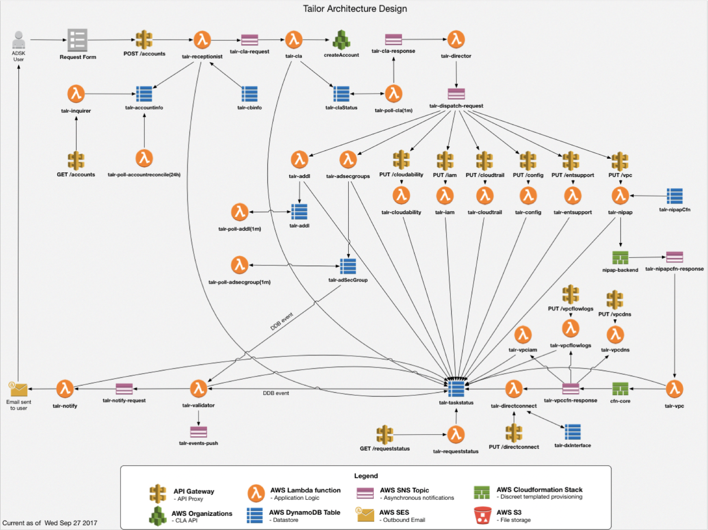
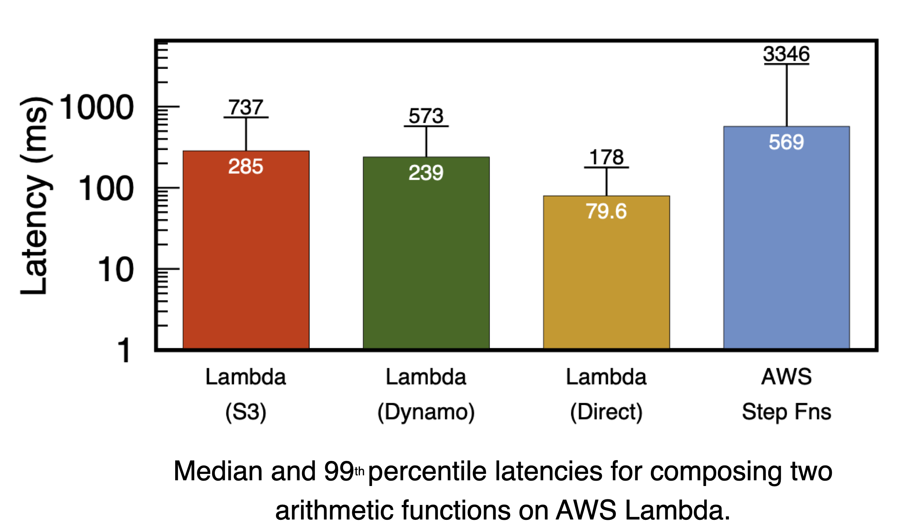
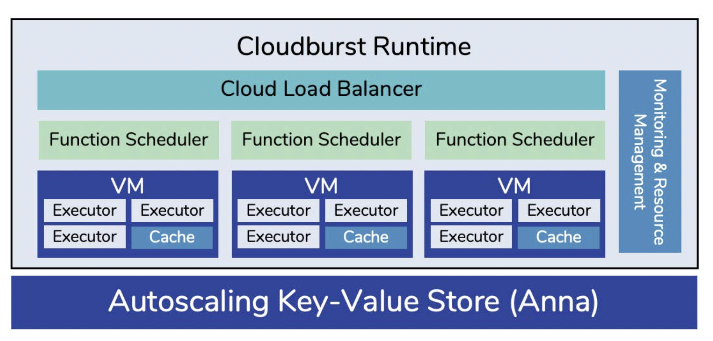
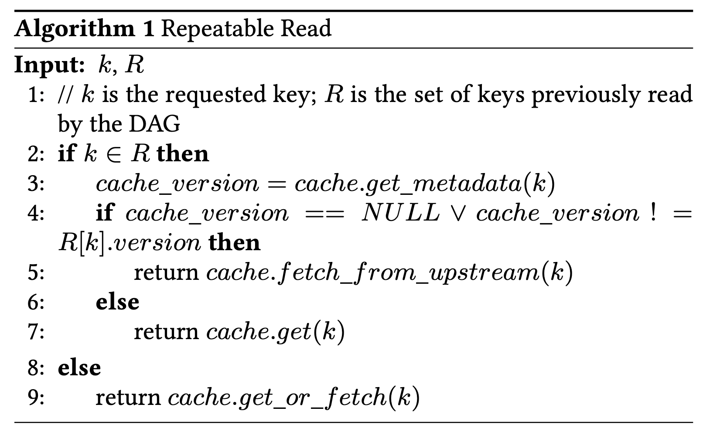

# The State of Serverless Art

## Background

什么是 Serverless Computing，简单的说，可以用下面这句话定义：***Serverless computing is a programming abstraction that enables users to upload programs, run them at any scale, and pay only for resources used.***

目前市场上有很多 FaaS 的平台，包括 AWS Lambda，Google Cloud Functions，OpenWhisk，Azure Functions，Alibaba Functions，同时包括一些开源的平台，比如 kNative，Fission，Kubeless 等。它们都有一个共同的高级抽象，你在平台上注册一些 function，然后启用相关的触发器，接下来，function 的 autoscalling 你是无感的，你只需要按需付费。

Serverless 好在哪？首先是**执行并行任务**，考虑类似图像处理，视频处理以及 ETL 这样的任务，基本上不需要协调任何任务，任务都是并行的，输出只取决于数据，完全幂等。另一种是**工作流程的编排**，下图是 Amazon AWS 中 Autodesk 的工作流示例，大约有 24 个 Lambda 函数调用，12 个 API 网关调用，8 个数据库访问和 7 个 SNS（Socail Network Service） 通知。Lambda 在这里的作用是协调这些任务。

根据 AWS 网站的介绍，同样的功能正常的开发团队需要花费 2 周，而 Lambda 把它缩短到了 10 分钟。当然这个过分夸大了，但是很明显，Lambda 在处理这类工作负载的时候具有很大的优势。

问题是，如果我们讨论的不是并行数据处理或者工作流程编排，很快就会陷入困境。当然的确有其他类型的 serverless 服务，比如说 Google Cloud Dataflow 或 AWS Athena 等，但是这里我们更多是从通用性的角度去看待这个问题。

回到 FaaS，FaaS 不能做什么？

* 首先是**有限的执行生命周期**，在 Lambda 中，函数执行时间上限是 15 分钟，而在其他一些云提供商中，大约需要 9 或 10 分钟，存在限制；
* **没有入站网络连接**。例如，我们不能仅仅打开一个端口并开始发送和接收消息，就像部署 Web 服务器时所做的那样；
* IO **是一个瓶颈**。例如，我们都知道 S3 提供了相当大的带宽，但是如果使用 Lambda，并且想利用 S3 的带宽，则必须启动大量Lambda 客户端。问题是即使能够获得该带宽，延迟通常也将成为另一个问题，因为如果正在处理任何延时敏感的工作负载，则从 Lambda 到 S3 的延迟通常对于确实需要一些超低延迟的应用程序是不可接受的；
* 最后，**没有专门的硬件支持**。

对于第一个和最后一个问题，云厂商肯定都能解决，前者是配置问题，后者是成本问题，我们重点看中间两个问题。

Lambda 宣称一切皆是 lambda，人如其名，函数没有任何副作用，且完全无状态。问题是现实完全不是如此，**实际的应用确实需要共享状态**，并且以多种方式去共享状态。比如说函数组合，$f(g(x))$，想要在 AWS 实现它，必须经过一个存储系统（如 S3）；第二种情况是消息传递，比如说构建一个共识协议，或者构建一些实时流应用程序，它们都会被要求低延迟的消息传递，由于没有网络连接，消息传递都无法执行，这类应用程序是很难在 AWS Lambda 上构建的；第三个是修改共享状态，假设有一个数据库，并且有一堆 lambda 同时要访问数据库，读取或者写入这个这个数据库的某个数据，那么你就必须要担心一致性模型是什么，它的性能如何？这三个问题看起来都不难，但是在如今 FaaS 基础架构下进行操作，这个问题变得非常困难，归根结底在于目前的 FaaS 就不适合执行这几种任务。

## Quantifying The Pain of FaaS

接下来将更清楚的去量化描述这个问题，以说明当今 FaaS 在应用程序上的痛点。

一个例子：我们要查询一个用户的观看历史记录并预测他接下来的观看内容，这是一个很简单的 function，可以用 $f(g(x))$ 简单表示。AWS Lambda，作为一个一流的解决方案，它没有很自然的把这两个函数连接在一起，而是必须将第一个函数的结果写入 DynamoDB 或是 S3 之类的存储系统中，然后第二个函数从 DynamoDB 或者 S3 之间读取结果，进行计算并返回给用户。

可以想像，它真的很慢。如上图，Lambda 加 S3 和 Lambda 家 DynamoDB 的延迟都高达 200 毫秒，高延迟的背后意味着缓慢的存储。解决办法之一自然是我直接把第二个 function 直接硬编码到第一个中，这就消除了通过存储的延迟带来的损失，这显然从函数规模上来说并不好，但是如上图所示，延迟变得好了许多，但是仍然有点慢，80 毫秒左右。最后一个，AWS Step Fns 专门用来负责编排服务的，但是它的表现反而更糟，达到 500 ms 以上。需要知道的是，同样的函数本地运行，要比上面这些服务快几个数量级。当然，一次性更大量的数据以及计算密集型的操作可能会掩盖掉 Lambda 的开销，但是它同样会引入其他问题，比如说数据局部性和数据移动开销。总而言之，运行 lambda **需要付出相当可观的性能损失**。

正如之前所描述的那样，现实中的 function 很多都是有状态的，这在其他方面上给现有的 FaaS 提出了挑战。

### Shared Mutable State

正如之前描述的那样，当前的 FaaS 产品是无状态的。为了使这些应用程序正常工作，它们必须使用单独的存储引擎来管理状态。如今，每个云提供商都提供了十几种不同的存储产品，并且每种产品在性能，一致性和自动扩展能力方面都具有不同的权衡。

我们希望能够找到至少一种适合**自动伸缩**和**低延迟**的 serverless 理想的存储服务。问题是当我们使用这些服务时，我们发现似乎在自动缩放和低延迟之间做 tradeoff。例如，无论多小的数据，诸如 S3 或 DynamoDB 之类的自动扩展存储系统也会造成高达数十毫秒的延迟损失。另一方面，低延迟系统（例如 Redis 和 Memcached 的托管版本）却不是很灵活，因为它们需要手动配置才能扩展系统。当然，总可以预见峰值负载，但这是非常反 serverless 的，并且会花费很多钱。基本上，需要忽略任何不能进行 autoscalling 的任何系统，因为它们会造成性能瓶颈。

### (In)Consistency Guarantees

另外，当今的 autoscalling 系统倾向于提供相当差的或受限制的一致性保证。例如，乍一看，维护诸如 Shared Counter 之类的东西应该是一件微不足道的任务。但是实际上维护正确性有时会很困难。例如，如果我在 S3 中存储一个共享计数器，并且多个人试图同时读取该计数器并进行一些本地增量操作并将其写回，则某些更新将被其他更新覆盖，从而导致不一致。S3 根本无法做这个层面的一致性保证。

顺便说一句，当今确实存在既可以自动扩展又可以提供更强大保证的服务。例如，如今 DynamoDB 拥有事务处理模式，它可以为您提供更强的隔离级别，但价格为 1 美元，延迟比较大。总而言之，当今还没有一种云存储产品可以同时解决提供高性能，高一致性且同时自动扩展的问题。

### No Inbound Network Connections

最后，我们当前的 FaaS 产品不允许函数相互通信。比如说没有入站网络连接，它确实有一些好处。例如，它使云提供商可以进行 process 迁移以实现负载平衡，还可以轻松实现 fault tolerance，这些都是不错的属性。

问题是，如果我们想在 FaaS 之上构建真正的分布式应用程序，函数间通信很重要。由于直接通信被禁用，因此它们必须再次通过存储系统。正如我之前提到的，这极其缓慢，而现实世界中的高性能分布式应用程序有时甚至无法忍受如此高的延迟。使用当前的 FaaS 产品以及慢速存储，我们基本上将整个分布式计算教科书都扔掉了。

希望到目前为止，你已经了解，距离人们完全运行有状态 serverless 应用程序还有很长的路要走。

## Cloudburst: Stateful FaaS

### Background: Anna

Todo

### Cloudburst: FaaS over Anna

我们的设计目标是首先保留有关当前 FaaS 产品的所有优势，尤其是计算和存储的分离，这意味着这两层可以独立扩展。

诸如 AWS Lambda 的 FaaS 系统率先提出了这种分解架构，它有很多好处。首先，从用户的角度来看，它降低了成本并实现了计算层和存储曾的简单且独立的扩展，这非常好。其次，从云提供商的角度来看，它实际上可以对计算和存储资源使用一些比较直接的 bin packing 算法，从而提高资源的使用率。

除了所有这些，我们还想解决前文列出的所有限制，以支持有状态的 serverless 应用程序。实现这一目标的关键是将 Anna 用于存储和通信。

仅用 Anna 代替 S3 这样的慢速存储显然是不够的，因为尽管 Anna 比 S3 快几个数量级，但为了与 Anna 进行通信，它仍然必须越过这个网络边界，并且越过这个网络边界对于某些确实需要超低延迟的应用程序来说，仍然是无法忍受的开销。

### Logical disaggregation with physical colocation

解决此问题的关键见解是，存储的逻辑解隔离不应该排除物理主机代管。从逻辑上讲，仍可以将此计算和存储视为两个可以完全独立扩展的完全独立的层。在实践中，当我们实现这两层时，我们可以发挥一些技术来将数据共置在靠近计算节点的位置上，实际上，理想情况是将它们共置在同一台计算机中以完全消除此网络延迟。

最简单的方法是通过缓存。然后，可以通过在 Anna 使用 *get* 和 *put* 方法在 FaaS 传递数据来实现通信和函数组合。万一发生某些机器故障或网络故障，仍然可以通过 Anna 进行数据通信，只是会增加网络往返开销。所以我们得到的 Cloudburst 架构如下图：

在 Cloudburst 中，Function Executor 运行在一个单独的进程中，多个 Function Executor 被放置在一个 VM 中，一个 VM 有一个 local cache，所有 Function Executor 不会直接和 Anna 交互，而是通过这个 local cache 作为交通。

为了保证 Cache 数据的新鲜程度，每个 local cache 会定期的把自己的数据快照发送给 Anna，Anna 会根据收到的数据快照逐步构建一个索引，索引的就是一个 key 对应的 cache 存储的具体位置，然后 Anna 利用这个 index 周期性的将 Key 的更新传播到每个 local cache 中。

还有一个值得一提的点是，Cloudburst 支持 DAG，DAG 意味着涉及多个 Function Executor 的调用。理想情况下这些 Function Executor 应该在同一台 VM 上，但是为了能够让 Cloudburst 可能灵活的调度函数，DAG 被设计为可以完全跨 VM 执行。比如说一个有三个 Function 的 DAG，其对应的 Function Executor 可以在三个完全不同的 VM 上。

**问题是 Caching 的添加虽然解决了网络开销方面的烦恼，但是完全没有解决一致性问题**。现在在存储层和计算层都有了缓存的数据，那如何在这些不同的存储位置之间保持一致性呢？事实证明，这是一个非常棘手的技术问题。

### Eventual Consistency: Lattice

首先是**最终一致性**的保证，Cloudburst 利用了 Anna 的一致性机制，通过将 Function 的状态封装到之前介绍过的 Lattice 数据结构中来提供一致性模型。给定一组不同的更新，无论它们到达 Lattice 的顺序如何，其结束状态始终将收敛相同的值。由于这种特性，Lattice 可以帮助实现副本的最终收敛。

问题是，有时仅有最终的一致性有时是不够的，在这种保证下，从应用程序的角度来看，写入可能会乱序进行，有人可能仍会覆盖其他写入，唯一的保证用户最终得到的是它们将收敛到某种状态。这是一个相当薄弱的保证。

通过将 Lattice 加上一些协议使 Cloudburst 能够实现各种更强的隔离级别，其中包括 Causal Consistency，并且不需要同步协调，从而为 DAG 这样的工作负载提供更强的一致性保证。

### Cache Consistency: Distributed Session Protocols

#### Distributed Session Repeatable Read

为了实现可重复的读取，每个节点上的 Cloudburst Cache 在第一次读取时都会为每个 local cache 的对象创建 snapshot，并且会在 DAG 的生存期内存储它们。当 DAG 调用下游函数时，Function 会传播到目前为止所看到的 snapshot 所有 key 的缓存地址和版本时间戳的列表。

为了保证 Repeatable Read，下游执行程序需要读取与上游执行程序读取的变量相同的版本。上图的算法显示了下游执行者为了确保这一点而执行的过程的伪代码。当 DAG 中的此类执行程序收到对 key k 的读取请求时，它会将其先前 snapshot 的快照元数据包括进对 cache 的请求中（算法 1 中的 R）。如果先前已读取 k 且确切的版本未存储在本地，cache 查询存储正确版本的上游缓存（算法 1 中的第 5 行）。如果确切的版本存储在本地（第 7 行），将其直接返回给用户。最后，如果到目前为止尚未读取 key，将任何可用的版本返回给客户端（第 9 行）。如果上游缓存失败，从头开始重新启动 DAG。最后，DAG 中的最后一个执行程序（sink）将 DAG 完成通知所有上游缓存，从而可以删去那个版本快照。

## Reference

* [The State of Serverless Computing](https://www.infoq.com/presentations/state-serverless-computing/)
* [Actor 模型 / CSP模型 / 共享内存模型](https://www.cnblogs.com/lizhensheng/p/11117459.html)

* [关于并发模型 Actor 和 CSP](https://blog.csdn.net/hotdust/article/details/72475630)
* [分布式系统：向量时钟](https://juejin.im/post/6844903777883914247)
* [分布式系统：一致性模型](https://juejin.im/post/6844903794526912519)
* [分布式系统一致性学习笔记（一）：从操作购物车说起](https://zhuanlan.zhihu.com/p/51236822)
* [分布式系统一致性学习笔记（二）：伯克利的 Anna](https://zhuanlan.zhihu.com/p/51609694)
* [分布式系统一致性学习笔记（三）：Anna 总结篇](https://zhuanlan.zhihu.com/p/52356807)

### 5.3

