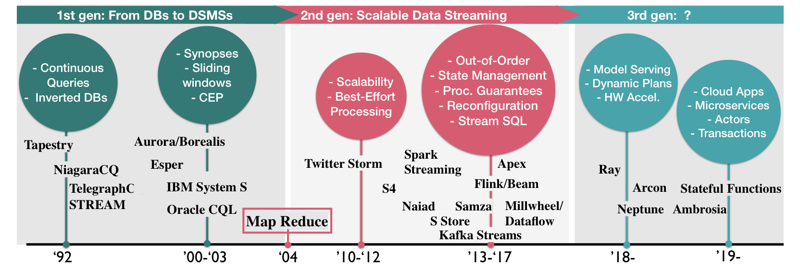

# A Survey on the Evolution of Stream Processing Systems

这篇文章翻译自 [A Survey on the Evolution of Stream Processing Systems](https://arxiv.org/abs/2008.00842)，作为 2020 年流处理的一篇综述性文章，提供了流处理系统的基本概述及其在**乱序数据管理（out-of-order data management），状态管理（state management），容错（fault tolerance），高可用性（high availability），负载管理（load management），弹性（elasticity）和重新配置（reconfiguration）**等功能领域中的演变的全面概述。 文章回顾了过去的重要研究成果，概述了早期（00-10）和现代（11-18）流系统之间的异同，并讨论了近期的趋势和未解决的问题。

## 1. Introduction

现代流处理系统是在 MapReduce 引入和云计算的普及之后开始的研究成果。 重点已转向商品硬件上的分布式，数据并行处理引擎和无共享架构。由于缺少明确定义的语义和适当的查询语言，诸如 Millwheel，Storm，Spark Streaming 和 Apache Flink 之类的系统首先公开了用于将流计算表示为数据流图的原语处理分布式集群上的数据并行执行。 Google Dataflow 模型的影响很大，提出了用于流和批处理计算的统一并行处理模型。 这个时代的**流处理系统正朝着容错的，大规模的无序流的横向扩展处理过渡**。

上图展示了将有影响力的流处理系统分为三代，并重点介绍了每个时代的关注领域。尽管流处理的基础多年来一直未变，但流处理系统已转变为复杂且可伸缩的引擎，在出现故障时可产生正确的结果。早期的系统和语言被设计为关系执行引擎的扩展，并增加了 Windows。现代流传输系统以其对**完整性和有序性**进行推理的方式进行了演进（例如，无序计算），并见证了架构范式的转变，这些转变构成了处理过程保证，重新配置和状态管理的基础。在撰写本文时，我们观察到了另一种范式向通用事件驱动的体系结构，类似于 actor-like 的编程模型和微服务的转移，以及对现代硬件的使用。

这篇文章是第一个侧重于流系统的发展而不是特定时间点的现场状态的文章，也是第一次尝试理解某些早期技术和设计在现代系统中盛行而另一些却被放弃的根本原因。

本文的核心贡献在于：

* 总结了流系统设计的现有方法，并根据基本假设和机制对早期和现代流系统进行了分类；
* 将早期和现代流处理系统在乱序数据管理，状态管理，容错，高可用性，负载管理，弹性和重新配置方面进行了比较；
* 重点介绍了影响当今流系统设计的重要但被忽视的工作。

本文将在第 2 节中介绍基本元素。然后，详细说明流处理系统提供的每个重要功能：乱序数据管理（第 3 节），状态管理（第 4 节）， 容错和高可用性（第 5 节），以及负载管理，弹性和重新配置（第 6 节）。 这些部分的每一部分都包含老与新的讨论，该讨论将早期与现代方法进行了比较，并对未解决的问题进行了总结。 最后总结了主要研究成果，讨论了前景（第 7 节）。

## 2 Preliminaries

数据流是**不受限制的大量实时数据**。 因此，流处理系统既不能以**可访问的方式存储整个流，也不能控制数据的到达速率或顺序**。 与传统的数据管理基础架构相反，流系统必须**使用有限的内存来动态处理元素**。 流元素连续到达，**带有时间戳或在到达时分配一个时间戳**。

由于上述原因，流查询具有挑战性。 

* 首先，连续产生更新结果可能需要以紧凑的表示形式存储目前可以看到的有关流的历史信息，从而可以有效地查询和更新（通常称为 sketches 或者 synopses）；
* 其次，为了处理高输入速率，某些查询可能无法承受连续更新索引和实例化视图的负担；
* 第三，流处理器不能依赖于可以从关联输入重构状态的假设。 为了获得可接受的性能，流运算符需要利用增量计算。

数据流和连续查询的上述特征为流系统提供了一组**独特的要求**，除了低延迟和高吞吐量这些常规需求，还包括：

* 由于**缺乏对输入顺序的控制**，流系统在接收到乱序和延迟的数据时需要产生正确的结果（请参阅第 3 节）。 它需要实施一些机制，以估算信息流的进度以及结果完整性的原因；
* 此外，流查询的长期运行特性要求流系统管理累积的状态（请参阅第 4 节），并防止其发生故障（请参阅第5节）；
* 最后，无法控制数据输入速率要求流处理具有自适应性，以便它们可以处理工作负载变化而不会牺牲性能（参见第6节）。

## 3 Out-of-order Data Management

todo

## 4 State Management

State 有效地捕获了流计算的所有内部副作用，其中包括活动窗口，记录存储区，应用程序中使用的部分或增量聚合以及在执行流水线期间可能创建和更新的一些用户定义变量。