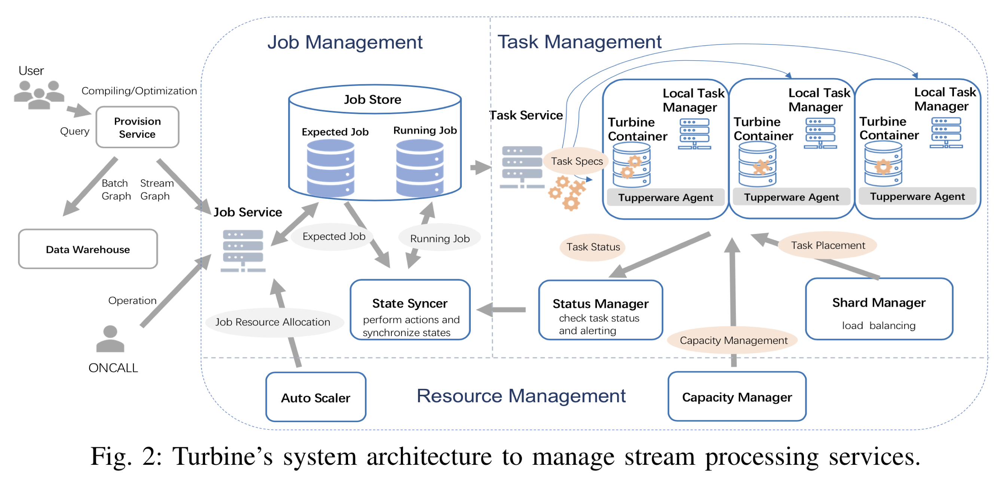

* [K8s 和 YARN 都不够好，全面解析 Facebook 自研流处理服务管理平台](infoq.cn/article/IcVkE4pKamyVVrQEU1yq)

这些年来，大规模分布式流处理得到广泛应用，并形成了多个成熟的生产系统，各自专注于不同领域的挑战，例如故障容忍（Apache Storm）、低延迟（Apache Flink、Storm），可操作性（Twitter Heron）、直观编程模型（Millwheel）、语义处理（Dataflow、Samza、Flink）、弹性伸缩（Millwheel），有效资源管理（Twitter Heron）和状态管理（Spark Streaming）等。

Facebook 也面临着同样的需求。以 Scuba Tailer 流处理应用为用例，[ Facebook Scuba ](https://research.fb.com/publications/scuba-diving-into-data-at-facebook/)提供时序数据的实时即席查询，主要适用于实时性能问题诊断、处理结构改进影响分析等场景。在一年的时间里 Scuba 的数据量翻了三翻。

Scuba 这样的应用是很有代表性的，Facebook 的许多应用采用分布式流处理，包括网站内容的低延迟分析互动、搜索效果分析和推荐系统等应用场景。为了满足这些需求，Facebook 为开发人员构建了[使用类 SQL 声明式流处理开发语言和 C++/Python/PHP 命令式开发 API 的框架](https://research.fb.com/publications/realtime-data-processing-at-facebook/)，并使用该框架构建了大量无状态和有状态的流处理应用。这些应用需要一个可扩展的流处理服务管理平台实现规划、配置和部署，并确保应用的停机时间和处理延迟等指标，即便在停机和负载波动的情况下也能满足严格的 SLO。FB 的很多流处理应用程序要求 90 秒的端到端延迟阈值。

现有的通用集群管理系统，例如 Aurora、Mesos、Borg、Tupperware 和 Kubernetes 等，虽然可以在一定程度上满足跨多种负载的通用管理要求，但并不适用于 Facebook 的流处理需求。其中，Borg 是由多个异构系统组成的生态，用户必须了解多种各不相同的配置语言和流程，才能配置系统并与其交互。Kubernetes 基于 Borg 的经验，改进了分布式服务部署和管理体验。YARN 资源管理器得到了 Flink、Samza、Spark Streaming 和 StreamScope 等流处理系统的采用。这些管理系统虽然大都实现了有效的资源隔离和执行框架，但是需要提前确定所需的处理资源才能高效运作，这在流处理场景中是很难做到的。此外，这些系统并不能很好地支持资源的自动缩放。

为了能够支持 Facebook 中类似 Scuba 这样的大量流处理应用，Facebook 开发了 Turbine，它具有如下特点：

- 调度机制使用两级调度机制，实现流处理任务的配置和管理。调度器首先使用 Facebook 的通用分片管理器将分片置于指定容器中，然后使用哈希机制将流处理任务分配给分片。每个分片会定期进行负载平衡，并且 Turbine 提供了负载平衡时重新计划流处理任务的安全调度机制。为确保故障不会导致数据损坏、丢失或重复处理，Turbine 实现了容错机制。
- 自动缩放机制可自动调整 CPU，内存，磁盘等维度上的资源分配。为达成设定的 SLO 目标，自动缩放机制估算指定流处理作业所需的资源，然后按比例放大或缩小流处理任务的数量，以及每个任务所分配的资源。自动缩放机制还可根据这些资源缩放决策和历史工作负载，对原始资源估算情况迭代地做出调整。
- 提供满足 ACIDF 的应用更新机制。对于流处理服务管理，更新机制非常重要，因为服务提供者、资源自动缩放和人工操作等处理参与者可能会同时更新同一流处理作业。系统必须确保所有更新相互隔离，并满足一致性。为此，Turbine 设计了分层作业配置架构，基于作业优先级对多个参与者的更新操作进行合并。Turbine 通过计划更新与实际更新的分离，提供了支持 ACDIF 的更新机制。更新机制使用状态同步服务，实现预期和运行作业配置间的同步，并支持更新失败时做回滚和重试。

## Architecture

Turbine 的架构如上图所示。应用开发人员使用 API 以声明式和命令式编程方式构建数据处理流水线应用，支持下至基本的过滤（filter）和投影（projection）操作、上至具有多个连接（join）和聚合（aggregation）运算的复杂图关联查询。查询在通过模式检查等合规性检查后，被编译为 Turbine 的内部表示形式，优化后发送给 Turbine 处理引擎。引擎负责生成运行时配置文件，支持以批处理和流处理两种模式执行应用。批处理模式主要适用于从数据仓库处理历史数据的应用场景，本文主要介绍流处理模式。

在 Turbine 系统的定义中，一个流处理的 Pipeline 中，可能包含多个 Job，比如说在数据 shuffle 之后进行 aggregation；而一个 Job 可以并行执行多个 Task，每个 Task 就是做数据转换（filter，projection，join 等），并且跑着互不相交的数据子集。

Turbine 流处理系统包括 Job Management、Task Management 和 Resource Management 三大主要组件，其中：

* Job Management：负责存储 Job 的配置和管理 Job 的更新；
* Task Management：负责将 Job 配置转换成具体的 Task 任务，并对它们进行调度和负载均衡；
* Resource Management：负责实时分配集群、作业和任务资源。

可以看到，这三个组件分别从三个维度干了不同的事情：

Turbine 在设计上很好地解耦了各组件间的决策关联，任何组件产生的失败均可通过处理降级模式得到解决，不会影响整体操作的继续执行。

回到刚刚 Stream Pipeline 的模型，Turbine 中很重要的一点是 Turbine Job 间的通信采用 Facebook 自研的消息持久化总线[ Scribe ](https://engineering.fb.com/data-infrastructure/scribe/)实现。每个 Task 从 Scribe 读取一到多个数据独立分区，维护自身的处理状态和检查点，然后写回到 Sribe 中。因此，失败的 task 可以通过恢复其自身的状态并继续从其自己的 checkpoint 读取 Scribe 分区来独立于其他 task 进行恢复。 **Turbine 的数据模型消除了 task 之间的依赖性**。这种数据模型设计简化了任务依赖，使得系统在任务调度、负载均衡和资源扩展中无需考虑任务间的依赖关系。

## Job Management

如上一节所述，Job Management 负责存储 Job 的配置和管理 Job 的更新，配置的更新可能来源于用户也可能来源于内部的 Turbine 服务。为了保证 Job 的更新能够做到 ACIDF，Job Management 维护了三个组件：

* Job Store：一个为每个 job 都存储了当前配置参数和 desired 配置参数的 repo；
* Job Service：确保 job 的改变能自动提交到 Job Store；
* State Syncer：执行 Job 的更新（从当前状态到 desired 状态）。

ACIDF Job 更新在保持此复杂系统的可管理性和高度分离性方面起着重要作用。 在具有成千上万个 Job 的环境中，Job 更新失败和冲突经常发生，因为更新可能来自许多服务。 系统必须能自动解决它们，并且其结果必须易于推断。 因此，Job Management 将期望更新的内容与实际操作执行分开。只有当 Job 的更新被正确提交到 Job Store 中，State Syncer 才会执行 Job 的更新。

### Hierarchical Expected Job Configuration

在 Turbine 中，可以由不同的内部服务或用户同时更新作业。 例如，一个正在执行 10 个 task 的 job。 Turbine 内部决定将 task 数目增加到 15。同时，Oncall1 和 Oncall2 决定将 task 数分别增加到 20 和 30。 这里需要解决两个问题：

* 隔离：上述三个 task 的更新无法同时执行，因为更改 Job 的 task 并行数就涉及 task checkpint 的重新调整（否则无法正常的容错恢复）， 如果执行这些操作时没有隔离，则 checkpoint 可能会损坏；
* 一致性：如何确定最终 task 的数量？很自然的想法是 FIFO，但是类似于 Oncall 这种操作来自外部用户，那肯定不希望用户干预的 task 数目修改被系统自动调整所覆盖。

为了使得 Job Management 更加灵活可扩展，Turbine 将作业组织为分层结构。配置管理使用 Thrift 实现编译时类型检查，并由 Thrift JSON 序列化协议将配置转换为 JSON 表示。这样的层次化配置结构设计，支持整合来自不同服务的任意数量的配置需求，并通过 JSON 文件的归并实现统一逻辑的层次化叠加。

具体而言，Turbine 对需执行的作业定义了一个期望配置，基于此在作业执行时生成一个运行配置。在期望配置中，包括了定义作业基本资源的基础配置、定义更新资源的预定配置、定义自动扩展资源的扩增配置，以及定义用户手工操作作业所需资源的待定配置。层次化资源定义实现了上述四类配置的相互隔离，为作业执行提供一致的状态视图。

### State Syncer

Turbine 实现了期望配置和运行配置的独立存储，并通过状态同步实现二者间的同步。每一轮 Job 执行时，状态同步按配置优先级依次归并各个层级的期望配置，并将生成配置与运行配置比较。一旦存在差异就生成新的执行计划，并提交执行。这保证了：

* Atomicity：仅在成功执行计划后才提交正在运行的 Job 配置；
* Fault-tolerance：通过中止失败的计划并在下一轮自动重新安排执行来实现容错，因为仍然可以检测到预期配置与运行配置之间的差异；
* Durability：通过确保正在运行的 Job 配置与预期的 Job 配置同步的最终一致性来实现 Durability，即使 State Syncer 本身发生故障也是如此。

在同时运行上万个任务的大规模集群中，task 出于负载均衡的考虑会在主机间迁移，上述同步操作机制可确保 job 的原子性、容错性和持久性。为提高同步操作的性能，状态同步会对基本的同步操作执行批处理，并对复杂的同步操作做并行化处理。

## Task Placement and Load Balancing

Task Management 的目标是：

1. 安排 task 而不进行重复，因为即使 Turbine 组件发生故障，系统也绝对不应具有同一 task 的两个活动实例。 也不应有 task 丢失；
2. 在主机发生故障时将故障转移到健康主机的 task；
3. 崩溃时重新启动 task；
4. 跨群集进行负载均衡 task，以实现均匀的CPU，内存和IO使用率

宏观上来说，Task 管理主要负责 task 调度、负载均衡和故障处理。Turbine 通过集成[ Facebook 自研的容器管理器 Tuppperware ](https://engineering.fb.com/data-center-engineering/tupperware/)，实现 Linux 容器的分配和编排。每个 Tupperware 都运行一个 local task manager，该 task manager 在该容器内生成流处理 task 的子集。 task 到 Tupperware 的映射以分布式方式进行。 每个  local task manager 都使用 task 服务提供的接口定期获取 Task Spec 的完整快照。 然后，它更新它负责的 task。 Task Spec 包括运行 task 所需的所有配置，例如程序包版本，参数和线程数。

### Scheduling

Turbine 使用 Facebook 的分片管理器（类似于[ Google Slicer ](https://www.usenix.org/system/files/conference/osdi16/osdi16-adya.pdf)），实现对容器的均衡资源分片。Turbine 设计了两层资源调度机制，如上图所示。资源调度将计算资源物理分配给各个容器。图中的四个分片将被指派给三个容器，每个 local task manager 从任务服务（Task Service）获取 Task Spec 的完整快照，并调度分片所指派的 task。具体的：

* **Task to Shard Mapping**：每个 Local Task Manager 会确定这个它所获取的 shard 分片和哪些 task 相关联。 Local Task Manager 会定期（60 秒）从 Task Service 获取所有 Task 的列表，并为每个 task 就算一个 MD5 哈希。这个哈希的结果会和 shard 的 id 相关联。这个关联结果会存储在 local task manager 中，之后定期从 Task Service 更新时，如果出现新的 Task 或者减少 Task 时，映射在对应更新。通过每个  local task manager 保留一份完整的 task 列表使得即使 task service 挂了，系统也可以正常的执行负载均衡和故障转移；
* **Shard Movement**：当 Shard Manager 因为各种原因（比如负载均衡）决定将一个 shard 从一个容器转移到另一个容器时，会先在源容器上的 Task Manager 发出 `DROP_SHARD` 请求。Task Manager 停止与丢弃的分片关联的 Task，从其本地结构中删除该分片，然后返回 `SUCCESS`。然后，Shard Manager 更新其分片到容器的映射，并向目标容器上的 Task Manager 发送 `ADD_SHARD` 请求。该 Task Manager 将新分片添加到其数据结构中，检索与新分片关联的 Task 列表，然后启动它们。为了避免过多的 Task 停机时间，如果 `DROP_SHARD` 或 `ADD_SHARD` 请求花费的时间太长，Turbine 会强制终止相应的任务或分别启动 Turbine 容器故障转移过程。

### Load Balancing

在任务调度完成初始的“分片 - 容器”指派后，task manager 依据该指派启动任务。在 task 运行期间，Turbine 周期性轮询分片负载情况，并根据情况由 Shard Manager 做混洗和重新分配。

具体来说，每个容器都有一个 capacity（多维度，比如 26 GB 的可用内存，3 个 CPU），每个分片都有一个 load（即内存和 CPU 的消耗）。**于是负载均衡问题就变成了如何把这些分片合理的放置到各个容器中，使其既满足 capacity 和 load 之间的约束，又保持全局资源平衡，变成了一个二维集装箱问题**。

于是这个问题的关键重要点就变成该如何合理定义每个 shard 的 load。Turbine 通过采集多种度量，综合定义多个层级的资源保障，以改进集群的整体资源使用效率。例如，对于 C/C++ 任务，系统采集固定时间窗内的平均内存使用情况；而对于使用 cgroup 管理的 JVM 任务，则采集 xmx、cgroup 限额等峰值资源需求。

每个 Local Task Manager 还会运行度量采集，使用一个后台的负载聚合线程，实现对当前资源使用情况的实时估算。每十分钟将此刷新的分片负载报告给 Shard Manager。Shard Manager 会定期使用最新的 shard 负荷值重新生成 shard 到 Turbine 容器的映射。如果这导致了新的映射，则 Shard Manager 将移动 shard。

### Failure Handling

故障处理的主要目的是降低系统运行故障对任务运行的影响，确保任务失败不会对数据本身产生破坏。为此，Turbine 在分片管理器中引入了一种基于心跳的双向故障转移协议。一旦分片管理器在设定时间（默认为 60 秒）内没有接收到来自任务管理器的心跳，就认为相应的容器已经停止工作，进而为该容器中的分片重新进行指派，并启动上面介绍的分片迁移机制。需要注意的是，网络连接故障等情况也会导致心跳停止。这时如果直接迁移分片，会导致重复的分片指派，进而导致重复的数据处理。针对此类问题，Turbine 进一步设计了一种主动超时机制。一旦连接超过了设定的超时时间（通常小于心跳时间，默认为 40 秒），那么 Turbine 容器就会重启，并在重启后重新连接分片管理器，恢复故障转移前的分片状态。

### Summary

综上，下列设计确保了 Turbine 实现 task 高性能调度和 task 的高可用性：

- 如本节图中所示的两层资源调度架构，实现了 task 调度和资源调度的分离；
- Task manager完全掌控 task 列表，这样即便在 Task Service 和 Job Manager 失效的情况下，Turbine 依然可执行负载均衡和故障迁移；
- 定期更新的 task 管理，确保 task 更新情况能及时反映给 Task Manager。在 Facebook 大规模集群的实际运行中，状态同步延迟平均维持在 1 至 2 分钟以内；
- 一旦系统出现故障，可在 60 秒内完成故障迁移。 task 的平均宕机时间控制在 2 分钟以内。

## Elastic Resource Management

资源管理根据 job，task 和集群的负载情况，对资源使用做出动态调整。资源管理一方面可确保所有 job 具有足够的资源以按时完成输入处理，另一方面确保有效利用整个集群中的资源。Turbine 资源管理在借鉴现有系统一些好的做法的同时，充分考虑了如何降低系统中无必要的资源消耗，例如避免重启不需要重启的 task。

### Reactive Auto Scaler — 1st Generation

最初，Resource Management 使用响应式机制，即通过 Symptom Detectors 和 Diagnosis Resolvers 监测 task 滞后和积压、输入不平衡、任务运行内存不足（OOM）等预设问题，并采取响应资源管理操作。具体来说：

* 对于滞后时间，滞后时间定义为引擎未读取到的字节数除以每秒可处理的字节数 $time\_lagged = total\_bytes\_lagged/processing\_late$ ；
* 输入不平衡是通过属于同一 job 的所有 task 的处理速率的标准偏差来衡量的；
* OOM 的检测取决于每个 task 的内存强制实施配置：
  * 对于在具有配置的 cgroup 限制的容器中运行的任务，杀死 OOM task 后将保留 cgroup 统计信息。重新启动此类 task 后，Turbine Task Management 将读取保留 的OOM 统计信息，并将其通过度量标准收集系统发布到 Auto Scaler Sysmtoms Detectors；
  * 对于 Java Task，JVM 被配置为在杀死有害 task 之前立即发布 OOM 度量；
  * 对于没有执行内存的 task，Turbine Task Management 会发布正在进行的内存使用量度，然后由 Auto Scaler 将其与预先配置的软内存限制进行比较，以决定是否需要进行任何内存调整。

这种机制虽然在流处理系统中普遍使用，但在 Fcebook 生产环境中出现了一些问题。首先，由于对 job 所需资源缺乏准确预估，一些时候会导致某一 job 等待特定资源而耗时过长。其次，由于缺乏对资源需求下限的判定，因此无法保证 job 每次都能健康运行，进而导致 job 积压问题。第三，缺乏对导致问题最根本原因的洞察，扩容/所容可能反而会导致问题的进一步扩大。

基于 Facebook 的运行实践，大多数固定 task 所需的资源数量通常是可预测的。只要应用的逻辑和配置不变，那么 task 的资源占用情况也是具有固定模式的。基于这一观察，Turbine 设计了一种主动预测机制。

### Proactive Auto Scaler

采用此机制的资源管理架构如下图所示。架构设计上由资源预估（Resource Estimator）、执行计划生成（Plan Generator）和模式分析（Pattern Analyzer）组成。

### Resource Estimater

Resource Estimater 的目的是对给定 Job 的资源使用情况作出预估。在 Facebook 的应用中，Job 可根据处理状态看分为两类，即过滤、投影、转换等无状态 Job，以及连接和聚合等有状态 Job。

无状态 Job 一般是 CPU 密集型操作，例如输入反序列化、数据处理和输出序列化等，CPU 的消耗情况通常与数据输入输出的规模成正比。由此，可以通过对输入输出的度量，判定单个线程的最大稳定处理率，进而预估 CPU 资源。

有状态 Job 在 CPU 资源之外，还需要预估内存和磁盘的使用情况。其中，聚合运算的内存需求与输入数据的规模成正比，而连接运算的内存和磁盘需求与输入项的笛卡尔积规模以及结果的选择率相关。

Resource Estimator 再把评估结果报告给 Plan Generator，确保最终计划具有足够的资源来运行 Task。

### Pattern Analyzer

**模式分析**：任务在动态增加、移除或重启时，其初始化通常需要耗费大量 CPU 和 I/O 资源。资源管理器必需考虑此因素，以免初始化操作造成整个集群运行不稳定。为此，Turbine 引入了模式分析，根据现有的数据情况推测资源的占用模式，防止出现可能导致集群不稳定的潜在隐患。模式分析需要记录并分析资源调整情况和历史工作负载模式，确保在资源扩展中不会发生频繁更改资源分配的情况。

**容量管理**：考虑到 Facebook 数据中心分布在全球范围，容量管理可临时授权不同的数据中心集群间进行资源交换，以达到全球范围内资源的有效使用。容量管理监测集群中作业的资源使用情况，确保在集群范围内各类型的资源得到合理分配。